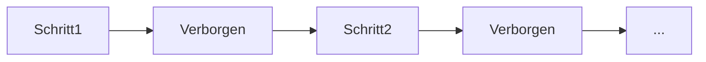

# Rekurrente neuronale Netze (RNN)

## Definition

RNNs verarbeiten Sequenzen, indem sie einen verborgenen Zustand beibehalten, der bei jedem Schritt aktualisiert wird. Sie (und Varianten wie LSTM) waren vor Transformern der Standard für Sequenzmodellierung.

Sie eignen sich natürlich für [NLP](/docs/nlp), Zeitreihen und alle geordneten Daten, bei denen der Kontext aus der Vergangenheit wichtig ist. [Transformer](/docs/transformers) haben sie in der Sprachmodellierung weitgehend ersetzt, da sie Parallelisierung und den Umgang mit langreichweitigen Abhängigkeiten ermöglichen, aber RNNs kommen noch in Streaming- oder Low-Latency-Szenarien vor.

## Funktionsweise

Bei jedem **Schritt** empfängt das Modell die aktuelle Eingabe (z. B. ein Token oder Frame) und den vorherigen **verborgenen** Zustand. Es berechnet eine Ausgabe (z. B. eine Vorhersage oder die nächste verborgene Repräsentation) und aktualisiert den verborgenen Zustand für den nächsten Schritt. Die Rekurrenz wird für das Training zeitlich entrollt (Backpropagation durch die Zeit); bei der Inferenz wird der verborgene Zustand Schritt für Schritt weitergegeben. **LSTM**- und **GRU**-Varianten fügen Gating hinzu, um verschwindende Gradienten abzumildern. Ein- und Ausgaben können eins-zu-eins, eins-zu-viele oder viele-zu-eins sein, abhängig von der Aufgabe (z. B. Sequenzkennzeichnung vs. Sequenz-zu-Sequenz).

## Anwendungsfälle

RNNs passen zu Problemen mit sequenzieller Ein- oder Ausgabe, bei denen Reihenfolge und Kontext über die Zeit wichtig sind.

- Sequenzkennzeichnung (z. B. Eigennamenerkennung, Wortarterkennung)
- Zeitreihenprognose und Anomalieerkennung
- Sprach- und Textsequenzmodellierung (bevor Transformer dominierten)

## Externe Dokumentation

- [LSTM-Netze verstehen (Olah)](https://colah.github.io/posts/2015-08-Understanding-LSTMs/)
- [PyTorch – Sequenzmodelle und RNNs](https://pytorch.org/tutorials/beginner/sequence_models_tutorial.html)

## Siehe auch

- [Transformer](/docs/transformers)
- [NLP](/docs/nlp)
