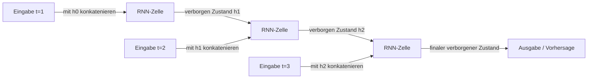

# Rekurrente neuronale Netze (RNN)

## Definition

RNNs verarbeiten Sequenzen, indem sie einen verborgenen Zustand pflegen, der bei jedem Schritt aktualisiert wird. Sie (und Varianten wie LSTM) waren der Standard für die Sequenzmodellierung vor Transformern.

Sie eignen sich natürlich für [NLP](/docs/nlp), Zeitreihen und alle geordneten Daten, bei denen Kontext aus der Vergangenheit wichtig ist. [Transformer](/docs/transformers) haben sie in der Sprachmodellierung aufgrund von Parallelisierung und Verarbeitung weitreichender Abhängigkeiten weitgehend abgelöst, aber RNNs erscheinen noch in Streaming- oder Low-Latency-Einstellungen.

Die grundlegende Idee besteht darin, Parameter über die Zeit zu teilen: Dieselben Gewichtsmatrizen werden bei jedem Schritt verwendet, was das Modell äquivariant zur Eingabelänge macht. **LSTM** (Long Short-Term Memory) und **GRU** (Gated Recurrent Unit) Varianten beheben das Problem der verschwindenden Gradienten bei einfachen RNNs mit Gating-Mechanismen, die steuern, welche Informationen gespeichert, vergessen oder weitergegeben werden. Diese Architekturen bleiben in ressourcenbeschränkten Einstellungen, Online-Lern-Szenarien und jedem Anwendungsfall konkurrenzfähig, bei dem ein kompaktes sequenzielles Modell mit begrenztem Speicher der quadratischen Attention von Transformern vorzuziehen ist.

## Funktionsweise



### Rekurrente Berechnung

Bei jedem **Schritt** empfängt das Modell die aktuelle Eingabe (z.B. ein Token oder Frame) und den vorherigen **verborgenen** Zustand. Es berechnet einen neuen verborgenen Zustand: `h_t = tanh(W_h * h_{t-1} + W_x * x_t + b)`. Der verborgene Zustand fasst alle Informationen vom Beginn der Sequenz bis zum Schritt t zusammen.

### LSTM-Gating

**LSTM** und **GRU** Varianten ersetzen die einfache tanh-Zelle durch Gating-Einheiten. Das Forget-Gate entscheidet, was aus dem Cell-State verworfen werden soll; das Input-Gate steuert, welche neuen Informationen gespeichert werden; das Output-Gate bestimmt, was als verborgener Zustand exponiert wird. Dies ermöglicht dem Netzwerk, weitreichende Abhängigkeiten zu lernen, die einfache RNNs nicht können.

### Training: Backprop Through Time

Die Rekurrenz wird für das Training in der Zeit entfaltet (**Backpropagation Through Time**, BPTT). Bei der Inferenz wird der verborgene Zustand Schritt für Schritt weitergegeben. Eingaben und Ausgaben können Eins-zu-Eins, Eins-zu-Viele oder Viele-zu-Eins sein, abhängig von der Aufgabe (z.B. Sequenz-Labeling vs. Klassifikation).

## Wann verwenden / Wann NICHT verwenden

| Szenario | RNN verwenden? | Hinweise |
|---|---|---|
| Streaming-Inferenz mit niedrigem Speicherbedarf | Ja | RNNs verarbeiten Schritt für Schritt mit begrenztem Zustand |
| Sehr lange Sequenzen mit globalem Kontext | Nein | Transformer verarbeiten das besser |
| Zeitreihen-Prognose (moderate Länge) | Ja | LSTMs sind konkurrenzfähig mit niedrigem Rechenaufwand |
| Parallelisierbares Training erforderlich | Nein | RNNs sind inhärent sequenziell |
| NLP-Aufgaben im großen Maßstab | Nein | Transformer dominieren modernes NLP |
| Eingebettete / Edge-Geräte | Ja | Kleine LSTM/GRU-Modelle sind inferenzeffizient |

## Vergleiche

| Aspekt | RNN / LSTM | CNN | Transformer |
|---|---|---|---|
| Primärer Anwendungsfall | Sequenzen, Zeitreihen | Bilder, Raster | Text, multimodal |
| Parallelisierbares Training | Nein (sequenziell) | Ja | Ja |
| Weitreichende Abhängigkeiten | Moderat (mit LSTM) | Schlecht | Ausgezeichnet |
| Speicher-Footprint (Inferenz) | Sehr niedrig (fixer Zustand) | Niedrig | Hoch (KV-Cache) |
| Streaming / Online-Inferenz | Ausgezeichnet | N/A | Schwierig |
| State-of-the-Art-NLP-Leistung | Nein | Nein | Ja |

## Vor- und Nachteile

| Vorteile | Nachteile |
|---|---|
| Natürliche Eignung für sequenzielle Daten | Kann während des Trainings nicht parallelisiert werden |
| Fixer Speicher-Footprint bei der Inferenz | Hat Schwierigkeiten mit sehr langen Abhängigkeiten |
| Effizient für Streaming / Online-Anwendungsfälle | Weitgehend von Transformern für NLP abgelöst |
| Kompakte Modelle für Edge-Deployment | Verschwindende Gradienten (gemildert durch LSTM/GRU) |

## Codebeispiele

```python
# LSTM für Sentiment-Klassifikation mit PyTorch
import torch
import torch.nn as nn

class LSTMClassifier(nn.Module):
    def __init__(self, vocab_size: int, embed_dim: int, hidden_dim: int, num_classes: int):
        super().__init__()
        self.embedding = nn.Embedding(vocab_size, embed_dim, padding_idx=0)
        self.lstm = nn.LSTM(embed_dim, hidden_dim, batch_first=True, num_layers=2, dropout=0.3)
        self.classifier = nn.Linear(hidden_dim, num_classes)

    def forward(self, token_ids: torch.Tensor) -> torch.Tensor:
        x = self.embedding(token_ids)           # (batch, seq_len, embed_dim)
        _, (h_n, _) = self.lstm(x)              # h_n: (num_layers, batch, hidden_dim)
        return self.classifier(h_n[-1])         # letzten verborgenen Zustand der letzten Schicht verwenden

# Dummy-Batch: 8 Sequenzen, jeweils 20 Tokens, Vokabular von 5000
model   = LSTMClassifier(vocab_size=5000, embed_dim=64, hidden_dim=128, num_classes=2)
tokens  = torch.randint(0, 5000, (8, 20))
logits  = model(tokens)
print(f"Ausgabeform: {logits.shape}")          # (8, 2)

n_params = sum(p.numel() for p in model.parameters() if p.requires_grad)
print(f"Trainierbare Parameter: {n_params:,}")
```

## Praktische Ressourcen

- [Understanding LSTM networks (Olah)](https://colah.github.io/posts/2015-08-Understanding-LSTMs/) — Klare visuelle Erklärung der LSTM-Gates
- [PyTorch – Sequenzmodelle und RNNs](https://pytorch.org/tutorials/beginner/sequence_models_tutorial.html) — Offizielles Tutorial mit einem POS-Tagging-Beispiel
- [The Unreasonable Effectiveness of Recurrent Neural Networks (Karpathy)](http://karpathy.github.io/2015/05/21/rnn-effectiveness/) — Klassischer Blogbeitrag mit RNN-Beispielen auf Zeichenebene

## Siehe auch

- [Transformers](/docs/transformers)
- [NLP](/docs/nlp)
- [CNN](/docs/neural-networks/cnn)
