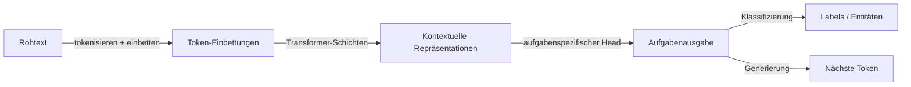

# Natürliche Sprachverarbeitung (NLP)

## Definition

Natürliche Sprachverarbeitung (NLP) ist der KI-Zweig, der sich mit der Schnittstelle von Computern und menschlicher Sprache befasst — Maschinen in die Lage zu versetzen, Text und Sprache zu lesen, zu verstehen, zu interpretieren und zu generieren. Das Feld umfasst ein breites Spektrum von Aufgaben: Textklassifizierung (Spam-Erkennung, Stimmungsanalyse), strukturierte Extraktion (Named-Entity-Erkennung, Relationsextraktion), Frage-Antwort, Zusammenfassung, Übersetzung und offene Generierung. Jede Aufgabe erfordert ein Modell, das variable natürliche Spracheingaben auf nützliche Ausgaben abbilden kann.

Modernes NLP wird von vortrainierten [Transformer](/docs/transformers)-Modellen dominiert. Das Pretraining-Fine-Tuning-Paradigma — ein großes Modell auf riesigen Korpora trainieren, um allgemeine Sprachrepräsentationen zu lernen, und es dann auf spezifische Aufgaben anzupassen — hat handkonstruierte Feature-Pipelines und aufgabenspezifische Architekturen ersetzt. Modelle wie BERT (bidirektional, gut für Klassifizierung und Extraktion) und GPT (autogressiv, gut für Generierung) repräsentieren verschiedene Enden des Transformer-Spektrums. [LLMs](/docs/llms) wie GPT-4, Claude und Llama 3 gehen noch weiter: Ein einzelnes Modell bewältigt viele Aufgaben mit dem richtigen Prompt, was den Bedarf an separaten fine-getuneden Modellen pro Aufgabe reduziert.

Eingaben in NLP-Modelle sind diskrete Token (Subwörter oder Wörter), die durch Tokenisierung erzeugt werden. Modelle lernen reichhaltige kontextuelle Einbettungen, bei denen die Repräsentation eines Worts von seinem Kontext abhängt. [RAG](/docs/rag) und [Agenten](/docs/agents) erweitern NLP-Systeme durch Hinzufügen von Retrieval und Werkzeugnutzung auf Sprachmodellen, was fundiertes Frage-Antwort und mehrstufige Aufgabenerledigung über das ermöglicht, was in ein einzelnes Kontextfenster passt.

## Funktionsweise

### Tokenisierung und Einbettung

Rohtext wird zuerst mit Algorithmen wie BPE (Byte-Pair-Encoding) oder WordPiece in Subwort-Token aufgeteilt. Jedes Token wird einem erlernten Einbettungsvektor zugeordnet. Positionskodierungen werden hinzugefügt, um die Wortreihenfolge zu erhalten. Das Ergebnis ist eine Sequenz von Vektoren, die der Transformer verarbeitet.

### Transformer-Kodierung und Task-Heads



Transformer-Schichten wenden Multi-Head-Self-Attention und Feed-Forward-Unterschichten an, um kontextuelle Repräsentationen zu erzeugen — die Einbettung jedes Tokens spiegelt jetzt seinen vollständigen Kontext wider. Ein Task-Head bildet diese Repräsentationen auf Ausgaben ab: Ein Klassifizierungs-Head fügt eine lineare Schicht über dem `[CLS]`-Token hinzu; ein Generierungs-Head sagt das nächste Token autogressiv vorher; ein Span-Head sagt Start- und Endpositionen für QA vorher.

### Vor-Training und Anpassung

Modelle werden auf großen Korpora mit selbst-überwachten Zielen vortrainiert (Masked Language Modeling für BERT-artig, Nächste-Token-Vorhersage für GPT-artig). Die Anpassung an Downstream-Aufgaben erfolgt durch Fine-Tuning (Aktualisierung aller oder einiger Gewichte auf beschrifteten Daten) oder Prompting (Bereitstellung von Anweisungen und Beispielen im Kontext ohne Gewichtsupdates). Parameter-effiziente Methoden wie LoRA ermöglichen Fine-Tuning mit deutlich weniger trainierbaren Parametern.

## Wann verwenden / Wann NICHT verwenden

| Verwenden wenn | Vermeiden wenn |
|----------|------------|
| Eingabe oder Ausgabe ist natürlicher Sprachtext in jeglichem Maßstab | Daten rein numerisch, tabellarisch oder strukturiert sind — klassisches ML kann ausreichen |
| Aufgaben Klassifizierung, Extraktion, QA, Zusammenfassung oder Generierung umfassen | Strenge Latenz- oder Speichereinschränkungen Transformer-Inferenz ausschließen |
| Vortrainierte Modelle genutzt werden sollen, um den Bedarf an beschrifteten Daten zu reduzieren | Symbolische, regelbasierte Verarbeitung benötigt wird, die 100% auditierbar sein muss |
| Chatbots, Suche oder Dokumenten-Verstehens-Pipelines erstellt werden | Domain-Vokabular so spezialisiert ist, dass vortrainierte Modelle umfangreiches Neutraining benötigen |

## Vergleiche

| Ansatz | Stärken | Einschränkungen |
|----------|-----------|-------------|
| BERT-artige Encoder | Starke Klassifizierung und Extraktion | Nicht generativ; benötigt Fine-Tuning pro Aufgabe |
| GPT-artige Decoder (LLMs) | Generalist, Few-Shot, generativ | Höhere Rechenleistung; schwerer die Ausgabe zu kontrollieren |
| Fine-getunede Aufgabenmodelle | Hohe Leistung auf spezifischen Aufgaben | Benötigt beschriftete Daten; ein Modell pro Aufgabe |
| Prompt Engineering (Zero/Few-Shot) | Schnelle Iteration, kein Training | Weniger zuverlässig für komplexe strukturierte Aufgaben |

## Vor- und Nachteile

| Vorteile | Nachteile |
|------|------|
| Vortrainierte Modelle übertragen gut über Aufgaben und Domänen | Große Modelle sind rechenintensiv zum Ausführen und Fine-Tunen |
| Ein einzelnes LLM bewältigt viele Aufgaben mit Prompting | Ausgabequalität hängt stark von Prompt-Design und Kontext ab |
| Reichhaltiges Ökosystem von Open-Source-Modellen und Tooling | Tokenisierung führt Artefakte ein und begrenzt die Handhabung seltener Wörter |
| Starke Zero-Shot- und Few-Shot-Fähigkeiten | Halluzination und Inkonsistenz bleiben Herausforderungen für Generierungsaufgaben |

## Code-Beispiele

### Textklassifizierung mit Hugging Face Transformers (Python)

```python
from transformers import pipeline

# Zero-shot classification — no fine-tuning needed
classifier = pipeline(
    "zero-shot-classification",
    model="facebook/bart-large-mnli",
)

text = "The new firmware update fixed the battery drain issue on the smartphone."
candidate_labels = ["technology", "sports", "finance", "politics"]

result = classifier(text, candidate_labels)
print(f"Text: {text}")
for label, score in zip(result["labels"], result["scores"]):
    print(f"  {label}: {score:.3f}")
```

## Praktische Ressourcen

- [Hugging Face – NLP-Kurs](https://huggingface.co/learn/nlp-course/) — Praxisorientierter Kurs zu Transformern, Fine-Tuning und Bereitstellung
- [Stanford CS224N – NLP mit Deep Learning](http://web.stanford.edu/class/cs224n/) — Universitätskurs mit Vorlesungsnotizen und Aufgaben
- [Hugging Face Model Hub](https://huggingface.co/models) — Tausende vortrainierter Modelle für jede NLP-Aufgabe
- [NLTK Buch](https://www.nltk.org/book/) — Klassische Einführung in NLP-Grundlagen
- [The Illustrated Transformer (Jay Alammar)](https://jalammar.github.io/illustrated-transformer/) — Visuelle Erklärung der Transformer-Architektur

## Siehe auch

- [Transformer](/docs/transformers)
- [LLMs](/docs/llms)
- [RAG](/docs/rag)
