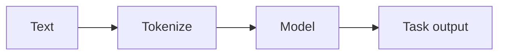

# Verarbeitung natürlicher Sprache (NLP)

## Definition

NLP umfasst Aufgaben an Text: Klassifikation, NER, QA, Zusammenfassung, Übersetzung und Generierung. Modern NLP is dominated by pretrained [transformers](/docs/transformers) (BERT, GPT, etc.) and [LLMs](/docs/llms).

Inputs sind diskret (Token); Modelle lernen aus großen Korpora und werden dann angepasst über [Feinabstimmung](/docs/llms/fine-tuning) or [prompting](/docs/llms/prompt-engineering). [RAG](/docs/rag) and [agents](/docs/agents) add Abruf and tools on top of NLP models for grounded QA and task completion.

## Funktionsweise

**Text** is **tokenized** (in Subwörter oder Wörter aufgeteilt) und optional normalized. The **model** (z. B. BERT, GPT) processes token IDs through embeddings and [transformer](/docs/transformers) layers to produce contextual representations. A **task output** head (z. B. classifier, span predictor, or next-token decoder) maps those to the final prediction. Models are vortrainiert auf large corpora (masked LM or Next-Token-Vorhersage), then feinabgestimmt or prompted für nachgelagerte Aufgaben. Pipelines often combine tokenization, embedding, and task-specific heads; [LLMs](/docs/llms) can do many tasks with ein einzelnes model and das richtige prompt.

## Anwendungsfälle

NLP gilt für any product or pipeline that needs to understand or generate text at scale.

- Machine translation, summarization, and question answering
- Named entity recognition, sentiment analysis, and text classification
- Chatbots, code generation, and document understanding

## Externe Dokumentation

- [Hugging Face – NLP course](https://huggingface.co/learn/nlp-course/)
- [Stanford CS224N – NLP with Deep Learning](http://web.stanford.edu/class/cs224n/)

## Siehe auch

- [Transformers](/docs/transformers)
- [LLMs](/docs/llms)
- [RAG](/docs/rag)
