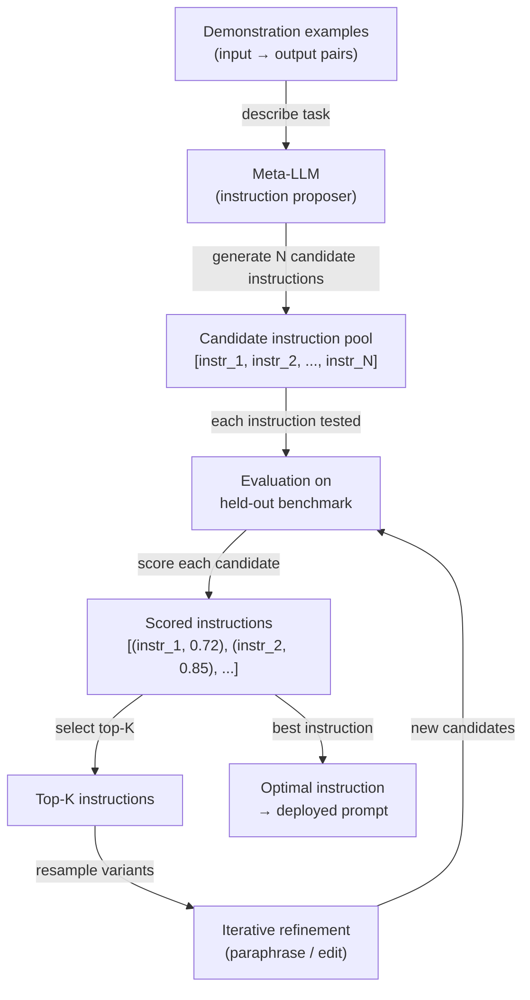

# Automatic Prompt Engineering (APE)

## Definition

Automatic Prompt Engineering (APE) ist die Praxis, ein Sprachmodell zu nutzen, um Prompt-Anweisungen zu generieren und zu optimieren, anstatt sie von Hand zu schreiben. Eingeführt von Zhou et al. (2022) im Papier *Large Language Models Are Human-Level Prompt Engineers*, formuliert APE Prompt-Design als ein Programmsynthese-Problem: Gegeben eine Reihe von Eingabe-Ausgabe-Demonstrationspaaren, finde die natürlichsprachliche Anweisung, die, wenn sie einem Prompt vorangestellt wird, die Aufgabenleistung auf einem zurückgehaltenen Evaluierungsset maximiert. Das Suchen, Bewerten und Verfeinern von Kandidatenanweisungen wird alles programmatisch durchgeführt — die Rolle des Menschen verlagert sich vom Prompt-Autor zum Aufgaben-Definierer und Metrik-Designer.

Die Motivation für die Automatisierung von Prompt-Design ist praktisch. Manuelles Prompt-Engineering ist zeitaufwändig, spröde und von den Intuitionen des menschlichen Ingenieurs darüber beeinflusst, wie Sprachmodelle Text verarbeiten. Kleine Änderungen in der Formulierung — „Think step by step" vs. „Let's think carefully step by step" — erzeugen messbare Genauigkeitsunterschiede, die ohne empirische Tests nicht vorhersagbar sind. APE ersetzt dieses Rätselraten durch systematische Suche: Generiere einen großen Pool von Kandidatenanweisungen, bewerte jede auf einem Benchmark und behalte die besten Performer. Dies ist dieselbe Designphilosophie hinter der Hyperparameter-Suche im klassischen ML — Menschen spezifizieren das Ziel, Maschinen führen die Suche durch.

APE unterscheidet sich vom Soft Prompt Tuning (das kontinuierliche Token-Embeddings durch Gradientenabstieg optimiert) und vom Fine-Tuning (das Modellgewichte aktualisiert). APE arbeitet vollständig im natürlichsprachlichen Raum unter Verwendung eingefrorener Modelle. Dies macht es modell-agnostisch, interpretierbar — man kann die gewinnende Anweisung lesen und verstehen — und deploybar ohne jegliche Trainingsinfrastruktur. Der Kompromiss besteht darin, dass der diskrete Suchraum der natürlichen Sprache riesig und nicht-differenzierbar ist, sodass APE auf Sampling, Bewertungsheuristiken und iterative Verfeinerung statt auf gradientenbasierte Optimierung setzt.

## Funktionsweise



### Kandidatengenerierung

Die APE-Schleife beginnt mit einer Reihe von Demonstrationsbeispielen — Eingabe-Ausgabe-Paare, die die Zielaufgabe illustrieren. Diese Beispiele werden einem Meta-LLM (demselben oder einem anderen Modell) mit einem Meta-Prompt übergeben, der es auffordert, die Anweisung abzuleiten, die die gegebenen Ausgaben aus den gegebenen Eingaben erzeugen würde. Typische Meta-Prompts sehen so aus: *„Hier sind Eingabe-Ausgabe-Paare. Was ist die Anweisung, die diese Ausgaben erzeugt? Generiere 10 diverse Kandidatenanweisungen."* Durch Sampling bei Temperatur > 0 erzeugt das Meta-LLM einen diversen Pool von Kandidatenanweisungen, die sich in Formulierung, Rahmen und Spezifität unterscheiden. Die Qualität und Diversität dieses anfänglichen Pools bestimmt direkt die Obergrenze der Optimierung.

### Bewertung

Jede Kandidatenanweisung wird als Präfix im Prompt (oder als Systemnachricht) instantiiert und gegen ein zurückgehaltenes Benchmark bewertet. Die Bewertungsfunktion ist aufgabenspezifisch: Genauigkeit für Klassifikation, Ausführungskorrektheit für Code-Generierung, ROUGE oder BERTScore für Zusammenfassung oder ein sekundärer LLM-Richter für offene Aufgaben. Die wichtigste Designentscheidung ist, ob der Score mit dem Meta-LLM selbst berechnet wird (unter Verwendung von Log-Wahrscheinlichkeitsschätzungen korrekter Ausgaben) oder mit einem separaten aufgabenspezifischen Evaluator. Log-Wahrscheinlichkeits-Scoring ist schneller, kann aber zur Kalibrierung des Meta-LLM überanpassen. Separate Evaluator-Bewertung ist zuverlässiger, benötigt aber beschriftete Daten.

### Iterative Verfeinerung

Nach der anfänglichen Bewertung werden die Top-K-Kandidatenanweisungen zur Verfeinerung ausgewählt. Das Meta-LLM wird aufgefordert, die besten Kandidaten zu paraphrasieren, zu erweitern oder zu kombinieren — wodurch ein neuer Pool von Varianten entsteht, die semantisch verwandt, aber textuell verschieden sind. Diese Verfeinerungsschleife läuft für eine feste Anzahl von Iterationen oder bis ein Ziel-Score-Schwellenwert erreicht ist. Jede Iteration verengt die Suche um vielversprechende Regionen des Anweisungsraums, analog zur evolutionären Suche oder zum Hill-Climbing über einer diskreten Landschaft. In der Praxis erholt sich nach einem großen anfänglichen Pool (N ≥ 50) nach einer oder zwei Verfeinerungsrunden meist der größte Teil des erreichbaren Gewinns.

## Vergleiche

| Kriterium | APE | Manuelles Prompt Engineering | Fine-Tuning |
|-----------|-----|--------------------------|-------------|
| Menschlicher Aufwand | Gering — Aufgabe und Metrik definieren | Hoch — iteratives Erstellen und Testen | Hoch — Datensammlung und Trainingsläufe |
| Benötigt beschriftete Daten | Ja — für Bewertung | Nein — kann empirisch durchgeführt werden | Ja — typischerweise Tausende von Beispielen |
| Modellgewichte aktualisiert | Nein | Nein | Ja |
| Ausgabe interpretierbar | Ja — natürlichsprachliche Anweisung | Ja | Nein — Gewichtsänderungen sind undurchsichtig |
| Verallgemeinert modellübergreifend | Ja — Suche pro Modell erneut ausführen | Teilweise | Nein — an Basismodell gebunden |
| Latenz bei Inferenz | Keine — kein Laufzeit-Overhead | Keine | Keine |
| Kosten | Mittel — N × M Evaluierungsaufrufe | Gering | Hoch — GPU-Zeit |
| Am besten für | Aufgaben mit klarer Metrik und ≥ 50 Beispielen | Neuartige Aufgaben ohne Metrik | Hochvolumige Aufgaben, bei denen Genauigkeitsgewinne das Training rechtfertigen |

## Wann verwenden / Wann NICHT verwenden

| Verwenden wenn | Vermeiden wenn |
|----------|------------|
| Ein beschriftetes Evaluierungsset vorhanden ist und eine klare Bewertungsmetrik definiert werden kann | Die Aufgabe keine zuverlässige automatisierte Metrik hat — APE kann ohne Signal nicht suchen |
| Manuelle Prompt-Iteration mehr als einen Tag dauert und die Genauigkeit immer noch stagniert | Ein sofortiges Ergebnis benötigt wird — APE erfordert mehrere LLM-API-Aufrufe für die Evaluierung |
| Derselbe Prompt an viele Benutzer deployed wird und selbst 1–2% Genauigkeitsgewinne wichtig sind | Der Demonstrationspool zu klein ist (\< 10 Beispiele) — die Bewertung wird verrauscht |
| Die beste gefundene Anweisung vor dem Deployment auf Sicherheit geprüft werden soll | Die Aufgabe Kreativität oder subjektives Urteil erfordert, wo eine einzige Metrik irreführend ist |
| DSPy oder ein ähnliches Framework verwendet wird, bei dem Prompt-Optimierung eingebaut ist | Fine-Tuning bereits geplant ist — APE optimiert Prompts, keine Gewichte |

## Code-Beispiele

### Einfache APE-Schleife mit OpenAI

```python
# Minimal APE implementation: generate instructions, score, return best
# pip install openai

import os
import re
from openai import OpenAI

client = OpenAI(api_key=os.environ["OPENAI_API_KEY"])

# ----- Task definition --------------------------------------------------------
# Demonstrations: pairs of (input, expected_output)
DEMOS = [
    ("The movie was absolutely fantastic, I loved every minute.", "positive"),
    ("Terrible film, waste of time and money.", "negative"),
    ("It was okay, nothing special but not bad either.", "neutral"),
    ("A masterpiece of modern cinema.", "positive"),
    ("I walked out after 20 minutes.", "negative"),
]

# Held-out evaluation set for scoring
EVAL_SET = [
    ("A stunning visual experience with weak writing.", "positive"),  # debatable but positive
    ("Boring, predictable, and too long.", "negative"),
    ("I enjoyed it more than I expected.", "positive"),
    ("Neither good nor bad — forgettable.", "neutral"),
    ("One of the best films of the decade.", "positive"),
]


# ----- Step 1: Generate candidate instructions --------------------------------
def generate_instructions(demos: list[tuple[str, str]], n: int = 10) -> list[str]:
    """Ask a meta-LLM to infer N candidate instructions from demo pairs."""
    demo_text = "\n".join(f'Input: "{inp}"\nOutput: "{out}"' for inp, out in demos)
    meta_prompt = (
        f"Here are input-output example pairs for a text classification task:\n\n"
        f"{demo_text}\n\n"
        f"Generate {n} diverse natural-language instructions that, when prepended to "
        f"an input text, would cause a language model to produce the correct output. "
        f"Return one instruction per line, numbered."
    )
    resp = client.chat.completions.create(
        model="gpt-4o-mini",
        messages=[{"role": "user", "content": meta_prompt}],
        temperature=0.9,
        max_tokens=800,
    )
    raw = resp.choices[0].message.content
    lines = [re.sub(r"^\d+[\.\)]\s*", "", l).strip() for l in raw.splitlines()]
    return [l for l in lines if len(l) > 20]  # filter out empty / too-short lines


# ----- Step 2: Score an instruction on the eval set --------------------------
def score_instruction(instruction: str, eval_set: list[tuple[str, str]]) -> float:
    """Return accuracy of the instruction on the eval set."""
    correct = 0
    for text, expected in eval_set:
        prompt = f"{instruction}\n\nText: {text}\nLabel:"
        resp = client.chat.completions.create(
            model="gpt-4o-mini",
            messages=[{"role": "user", "content": prompt}],
            temperature=0,
            max_tokens=5,
        )
        prediction = resp.choices[0].message.content.strip().lower()
        if expected.lower() in prediction:
            correct += 1
    return correct / len(eval_set)


# ----- Step 3: Iterative refinement of top-K instructions --------------------
def refine_instructions(top_instructions: list[str], n_variants: int = 5) -> list[str]:
    """Ask the meta-LLM to paraphrase the top instructions to get variants."""
    instr_text = "\n".join(f"- {i}" for i in top_instructions)
    refine_prompt = (
        f"Here are high-performing instructions for a sentiment classification task:\n"
        f"{instr_text}\n\n"
        f"Generate {n_variants} new instructions that paraphrase or combine the above "
        f"to potentially improve performance. Return one per line."
    )
    resp = client.chat.completions.create(
        model="gpt-4o-mini",
        messages=[{"role": "user", "content": refine_prompt}],
        temperature=0.7,
        max_tokens=500,
    )
    raw = resp.choices[0].message.content
    lines = [l.strip().lstrip("- ") for l in raw.splitlines()]
    return [l for l in lines if len(l) > 20]


# ----- APE main loop ---------------------------------------------------------
def run_ape(
    demos: list[tuple[str, str]],
    eval_set: list[tuple[str, str]],
    n_candidates: int = 10,
    top_k: int = 3,
    n_refinement_rounds: int = 1,
) -> dict:
    print("=== APE: Generating initial candidates ===")
    candidates = generate_instructions(demos, n=n_candidates)
    print(f"Generated {len(candidates)} candidates.\n")

    all_scored: list[tuple[str, float]] = []

    for round_num in range(n_refinement_rounds + 1):
        print(f"--- Round {round_num + 1}: Scoring {len(candidates)} instructions ---")
        round_scores = []
        for instr in candidates:
            score = score_instruction(instr, eval_set)
            round_scores.append((instr, score))
            print(f"  [{score:.0%}] {instr[:80]}{'...' if len(instr) > 80 else ''}")
        all_scored.extend(round_scores)

        if round_num < n_refinement_rounds:
            top = [i for i, _ in sorted(round_scores, key=lambda x: -x[1])[:top_k]]
            candidates = refine_instructions(top, n_variants=n_candidates // 2)
            print()

    best_instr, best_score = max(all_scored, key=lambda x: x[1])
    return {"instruction": best_instr, "score": best_score, "all_scored": all_scored}


if __name__ == "__main__":
    result = run_ape(DEMOS, EVAL_SET, n_candidates=8, top_k=3, n_refinement_rounds=1)
    print(f"\n=== Best instruction (accuracy {result['score']:.0%}) ===")
    print(result["instruction"])
```

### DSPy für strukturiertes APE verwenden

```python
# DSPy provides a higher-level abstraction for automatic prompt optimization.
# pip install dspy-ai

import dspy

# Configure DSPy with your LLM backend
lm = dspy.LM("openai/gpt-4o-mini", api_key=os.environ["OPENAI_API_KEY"])
dspy.configure(lm=lm)


# Define the task as a DSPy signature
class SentimentClassifier(dspy.Signature):
    """Classify the sentiment of a movie review as positive, negative, or neutral."""
    review: str = dspy.InputField(desc="A movie review text")
    sentiment: str = dspy.OutputField(desc="One of: positive, negative, neutral")


# Wrap in a module
class SentimentModule(dspy.Module):
    def __init__(self):
        self.classify = dspy.Predict(SentimentClassifier)

    def forward(self, review: str) -> dspy.Prediction:
        return self.classify(review=review)


# Training examples
trainset = [
    dspy.Example(review=inp, sentiment=out).with_inputs("review")
    for inp, out in [
        ("Absolutely loved it!", "positive"),
        ("Worst movie ever.", "negative"),
        ("It was fine, nothing memorable.", "neutral"),
    ]
]


# Use MIPROv2 optimizer to automatically engineer the prompt
def optimize_with_dspy():
    module = SentimentModule()
    optimizer = dspy.MIPROv2(metric=dspy.evaluate.answer_exact_match, auto="light")
    optimized = optimizer.compile(module, trainset=trainset)
    print(optimized.classify.extended_signature)  # shows the optimized instruction
    return optimized


if __name__ == "__main__":
    optimized_module = optimize_with_dspy()
    result = optimized_module(review="A surprisingly moving and well-acted drama.")
    print(result.sentiment)
```

## Praktische Ressourcen

- [Large Language Models Are Human-Level Prompt Engineers (Zhou et al., 2022)](https://arxiv.org/abs/2211.01910) — Das originale APE-Papier; führt die Instruction-Induction-Formulierung, die iterative Monte-Carlo-Suche und Benchmark-Ergebnisse über 24 NLP-Aufgaben ein.
- [DSPy: Compiling Declarative Language Model Calls into Self-Improving Pipelines (Khattab et al., 2023)](https://arxiv.org/abs/2310.03714) — Das Framework, das APE-ähnliche Optimierung als erstklassige Abstraktion operationalisiert; siehe auch [dspy.ai](https://dspy.ai).
- [Automatic Prompt Optimization with "Gradient Descent" and Beam Search (Pryzant et al., 2023)](https://arxiv.org/abs/2305.03495) — Erweitert APE mit einem „textuellen Gradienten"-Ansatz, der LLM-generiertes Feedback als Proxy-Gradientsignal nutzt.
- [PromptBreeder: Self-Referential Self-Improvement Via Prompt Evolution (Fernando et al., 2023)](https://arxiv.org/abs/2309.16797) — Ein evolutionärer APE-Ansatz, der auch die Meta-Prompts für die Anweisungsgenerierung weiterentwickelt.

## Siehe auch

- [Prompt Engineering](/docs/prompt-engineering)
- [Selbstevaluation und Kalibrierung](/docs/prompt-engineering/self-evaluation-calibration)
- [Fine-Tuning](/docs/llms/fine-tuning)
