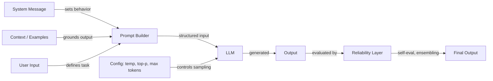

# Prompt Engineering

## Definition

Prompt Engineering ist die Praxis, Eingabetexte zu gestalten — Anweisungen, Beispiele, Einschränkungen und Kontext —, um das Verhalten großer Sprachmodelle zu steuern, ohne ihre Gewichte zu verändern. Es ist die primäre Schnittstelle zwischen menschlicher Absicht und Modellausgabe und umfasst alles von einfacher Anweisungsformulierung bis hin zu anspruchsvollen mehrstufigen Schlussfolgerstrategien.

Die Disziplin erstreckt sich über drei miteinander verbundene Bereiche. **Konfiguration** umfasst die Sampling-Parameter (Temperatur, Top-K, Top-P) und Generierungskontrollen (maximale Token, Stop-Sequenzen), die bestimmen, wie das Modell Token erzeugt. **Techniken** umfassen strukturierte Ansätze wie Chain-of-Thought, Self-Consistency, Step-Back Prompting sowie System-/Rollen-Prompting, die den Denkprozess des Modells leiten. **Zuverlässigkeit** befasst sich mit Methoden, um Ausgaben vertrauenswürdiger zu machen — Debiasing, Prompt-Ensembling und Selbstevaluation.

Da LLMs in Produktionssysteme einziehen, hat sich Prompt Engineering von ad-hoc-Experimenten zu einer systematischen Praxis entwickelt. Tools wie [DSPy](https://dspy-docs.vercel.app/) und [Automatic Prompt Engineering](/docs/prompt-engineering/automatic-prompt-engineering) automatisieren sogar Teile des Prozesses. Ob Sie einen Chatbot, einen Code-Assistenten oder eine Datenextraktionspipeline entwickeln — Prompt Engineering ist der erste und zugänglichste Hebel zur Verbesserung der Ausgabequalität.

## Funktionsweise

### Die Prompt-Pipeline

Jede Interaktion mit einem LLM beginnt mit einem Prompt — einer strukturierten Eingabe, die eine Systemnachricht, Benutzeranweisungen, Beispiele und abgerufenen Kontext enthalten kann. Das Modell verarbeitet diese Eingabe und generiert Token für Token eine Ausgabe, die sowohl durch den Prompt-Inhalt als auch durch die Sampling-Konfiguration beeinflusst wird.

### Konfiguration vs. Technik

Konfigurationsparameter (Temperatur, Top-K, Top-P, maximale Token) wirken auf der Token-Sampling-Ebene — sie beeinflussen *wie* das Modell jeden Token auswählt. Techniken (Chain-of-Thought, Self-Consistency, Step-Back) wirken auf der Prompt-Design-Ebene — sie beeinflussen *worüber* das Modell nachdenkt. Beide Ebenen interagieren: Self-Consistency erfordert hohe Temperatur, um diverse Denkketten zu erzeugen, während strukturierte Ausgabeextraktion mit niedriger Temperatur für Determinismus am besten funktioniert.

### Die Zuverlässigkeitsschicht

Erweitertes Prompt Engineering fügt eine Zuverlässigkeitsschicht über dem grundlegenden Prompting hinzu. Dazu gehört das parallele Ausführen mehrerer Prompts (Ensembling), das Lassen des Modells, seine eigene Ausgabe zu kritisieren (Selbstevaluation), und die Anwendung von Debiasing-Strategien zur Reduzierung systematischer Fehler. Diese Methoden tauschen Berechnungskosten gegen Ausgabequalität und sind besonders wichtig in hochriskanten Anwendungen.

## Praktische Ressourcen

- [OpenAI — Prompt Engineering Guide](https://platform.openai.com/docs/guides/prompt-engineering) — Umfassender Leitfaden mit Best Practices und Strategien
- [Anthropic — Prompt Design](https://docs.anthropic.com/en/docs/build-with-claude/prompt-engineering/overview) — Anthropics offizielle Prompting-Dokumentation
- [Learn Prompting](https://learnprompting.org/) — Open-Source-Kurs zu Prompt-Engineering-Techniken
- [Prompt Engineering Guide (DAIR.AI)](https://www.promptingguide.ai/) — Community-gepflegter Leitfaden mit Papieren und Techniken
- [DSPy-Dokumentation](https://dspy-docs.vercel.app/) — Framework für programmatische Prompt-Optimierung

## Siehe auch

- [Temperatur, Top-K, Top-P](/docs/prompt-engineering/temperature-top-k-top-p)
- [Max Tokens und Stop-Sequenzen](/docs/prompt-engineering/max-tokens-stop-sequences)
- [Strukturierte Ausgaben](/docs/prompt-engineering/structured-outputs)
- [System-, Rollen- und kontextuelles Prompting](/docs/prompt-engineering/system-role-contextual-prompting)
- [Self-Consistency](/docs/prompt-engineering/self-consistency)
- [Step-Back Prompting](/docs/prompt-engineering/step-back-prompting)
- [Automatic Prompt Engineering (APE)](/docs/prompt-engineering/automatic-prompt-engineering)
- [Debiasing-Techniken](/docs/prompt-engineering/debiasing-techniques)
- [Prompt Ensembling](/docs/prompt-engineering/prompt-ensembling)
- [Selbstevaluation und Kalibrierung](/docs/prompt-engineering/self-evaluation-calibration)
- [LLMs](/docs/llms)
- [Chain-of-Thought](/docs/reasoning-patterns/cot)
- [RAG](/docs/rag)
- [KI-Agenten](/docs/agents)
