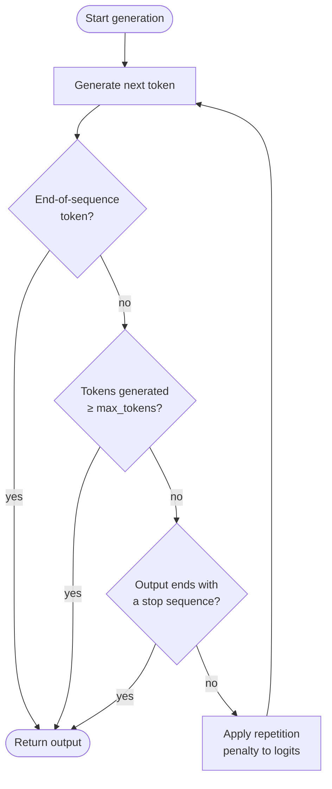

# Max Tokens und Stop-Sequenzen

## Definition

Max Tokens, Stop-Sequenzen und Wiederholungsstrafen sind Generierungssteuerungsparameter, die bestimmen, wann das Modell aufhört zu generieren und wie es wiederholte Inhalte behandelt. Während Sampling-Parameter wie Temperature *was* das Modell sagt beeinflussen, formen Generierungssteuerungsparameter *wie viel* es sagt, *wo* es stoppt und *wie vielfältig* es über den Verlauf einer langen Antwort bleibt. Jede LLM-API stellt einige Versionen dieser Steuerungen zur Verfügung, und ihr Verständnis ist für die Entwicklung zuverlässiger, kosteneffizienter Pipelines unerlässlich.

**Max Tokens** setzt eine harte Obergrenze für die Anzahl der Tokens, die das Modell in einer einzelnen Antwort generieren kann. Es fungiert als Sicherheitsdecke: Das Modell stoppt in dem Moment, in dem es ein Token ausgeben würde, das dieses Budget überschreitet. Es ist kein Ziellänge — das Modell kann früher stoppen, wenn es natürlich ein End-of-Sequence-Token generiert. Die Wahl eines angemessenen Max-Tokens-Wertes ist sowohl für die Kosten (Sie werden typischerweise pro Ausgabe-Token abgerechnet) als auch für die Korrektheit wichtig (eine abgeschnittene Antwort kann JSON-Objekte offen lassen, eine Gedankenkette mittendrin unterbrechen oder unvollständige Ergebnisse an nachgelagerte Systeme liefern).

**Stop-Sequenzen** bieten semantische Stoppbedingungen: eine oder mehrere Zeichenketten, die, wenn generiert, das Modell sofort anhalten lassen (die Stop-Zeichenkette selbst ist von der Ausgabe ausgeschlossen). Sie sind unentbehrlich für die strukturierte Generierung — das Einwickeln der LLM-Ausgabe in ein bekanntes Trennzeichen und die Verwendung des schließenden Trennzeichens als Stop-Sequenz macht die Extraktion trivial und robust. **Wiederholungsstrafen** (Frequency Penalty und Presence Penalty bei OpenAI; in der Messages-API von Anthropic nicht nativ verfügbar) reduzieren die Wahrscheinlichkeit, bereits erschienene Tokens erneut zu generieren, und entmutigen das Schleifen und Fülltext, der bei langen Generierungen entstehen kann.

## Funktionsweise



Jedes generierte Token durchläuft drei Checkpoints in Folge: End-of-Sequence-Erkennung, Max-Token-Budget-Durchsetzung und Stop-Sequenz-Abgleich. Wenn keine der Stoppbedingungen ausgelöst wird, wird die Wiederholungsstrafe auf die Logits für das nächste Token angewendet, bevor das Sampling fortgesetzt wird.

### Max Tokens

Der Parameter `max_tokens` (in älteren Anthropic-SDKs `max_tokens_to_sample` genannt, jetzt `max_tokens`) ist ein erforderliches oder stark empfohlenes Feld in den meisten LLM-APIs. Zu niedrig eingestellt riskiert abgeschnittene Ausgaben; unnötig hoch eingestellt verschwendet Rechenleistung und erhöht die Latenz bei Streaming-Endpunkten. Eine praktische Heuristik: Schätzen Sie die erwartete Ausgabelänge und setzen Sie `max_tokens` auf das 1,5- bis 2-fache dieser Schätzung als sichere Obergrenze. Für strukturierte Ausgaben wie JSON erstellen Sie ein Profil der Worst-Case-Token-Anzahl Ihres Schemas und fügen Sie einen 20%-Puffer hinzu.

### Stop-Sequenzen

Stop-Sequenzen werden als Liste von Zeichenketten definiert. Das Modell scannt seine Ausgabe nach jedem Token und hält an, sobald der generierte Text mit einem Eintrag in der Liste endet. Häufige Muster sind `["###", "\n\n", "</answer>", "```"]` für strukturierte Prompt-Vorlagen, `["\nHuman:", "\nUser:"]` für Chat-Simulatoren, die nicht die nächste Benutzerrunde generieren sollen, und schließende Trennzeichen wie `["</json>"]` für die Tag-Extraktion. Stop-Sequenzen werden mit dem rohen generierten Text abgeglichen, nicht mit tokenisierten Grenzen, sodass Multi-Token-Zeichenketten korrekt funktionieren. Ein wichtiger Fallstrick: Die Stop-Sequenz ist *nicht* im zurückgegebenen Text enthalten, also muss Ihre Parsing-Logik deren Fehlen berücksichtigen.

### Wiederholungsstrafen

Die API von OpenAI stellt zwei verschiedene Strafparameter zur Verfügung. **Frequency Penalty** (`frequency_penalty`, Bereich −2,0 bis 2,0) reduziert den Logit eines Tokens proportional dazu, wie oft es bereits im generierten Text aufgetaucht ist — entmutigt die Wiederholung häufig verwendeter Wörter. **Presence Penalty** (`presence_penalty`, Bereich −2,0 bis 2,0) wendet eine flache Logit-Reduktion auf jedes Token an, das mindestens einmal aufgetaucht ist, unabhängig von der Häufigkeit — entmutigt die Wiederverwendung bereits gesehener Tokens. Positive Werte reduzieren Wiederholungen; negative Werte fördern sie. Werte im Bereich 0,1–0,5 sind typischerweise ausreichend, um Schleifen zu unterdrücken, ohne die Ausgabequalität erheblich zu beeinträchtigen. Werte über 1,0 können dazu führen, dass das Modell nützliche Verbindungswörter vermeidet und die Kohärenz beeinträchtigt.

## Wann verwenden / Wann NICHT verwenden

| Szenario | Empfohlene Einstellungen | Vermeiden |
|----------|--------------------------|-----------|
| Kurze sachliche Antworten oder Klassifikationen | `max_tokens=50–150`; keine Stop-Sequenzen nötig | Sehr hohes `max_tokens`; verschwendet Budget und kann Auffüllung einladen |
| Strukturierte JSON- oder Tag-Extraktion | Stop auf schließendem Trennzeichen (z.B. `["</json>"]`); `max_tokens` auf Worst-Case-Schema ausgelegt | Auslassen von Stop-Sequenzen; Modell kann nach der schließenden Klammer Prosa anhängen |
| Multi-Turn Chat-Simulation | Stop-Sequenzen `["\nHuman:", "\nUser:"]` um zu verhindern, dass das Modell die nächste Benutzerrunde generiert | Keine Stop-Sequenzen; Modell halluziniert die nächste Gesprächsrunde |
| Langform-Generierung (Essays, Berichte) | Hohes `max_tokens` (2048–4096+); milder `frequency_penalty=0,2` zur Vermeidung repetitiver Formulierungen | `frequency_penalty > 1,0`; unterbricht stilistische Kohärenz und vermeidet legitime wiederholte Begriffe |
| Code-Generierung | Stop auf sprachgerechten Trennzeichen (z.B. dreifachem Backtick); `max_tokens` auf Funktionslänge ausgelegt | `presence_penalty > 0,5`; Variablennamen und Schlüsselwörter müssen sich wiederholen — Strafen beeinträchtigen die Korrektheit |
| Kostenempfindliche Batch-Inferenz | `max_tokens` eng auf das 95. Perzentil der erwarteten Ausgabelänge setzen | `max_tokens` auf API-Maximum belassen (z.B. 4096), wenn die typische Ausgabe 100 Tokens beträgt |

## Code-Beispiele

### OpenAI — max_tokens, stop und frequency_penalty

```python
# OpenAI SDK: max_tokens, stop sequences, and repetition penalties
# pip install openai

import os
from openai import OpenAI

client = OpenAI(api_key=os.environ["OPENAI_API_KEY"])


def extract_with_controls(
    text: str,
    max_tokens: int = 512,
    stop: list[str] | None = None,
    frequency_penalty: float = 0.0,
    presence_penalty: float = 0.0,
) -> str:
    """Call the chat API with full generation-control parameters."""
    response = client.chat.completions.create(
        model="gpt-4o",
        messages=[
            {
                "role": "system",
                "content": (
                    "You are a structured data extractor. "
                    "Output only valid JSON between <json> and </json> tags."
                ),
            },
            {"role": "user", "content": f"Extract key facts from:\n\n{text}"},
        ],
        max_tokens=max_tokens,
        stop=stop or ["</json>"],
        frequency_penalty=frequency_penalty,
        presence_penalty=presence_penalty,
        temperature=0,
    )
    raw = response.choices[0].message.content
    # Strip the opening tag; closing tag was consumed by stop sequence
    return raw.replace("<json>", "").strip()


if __name__ == "__main__":
    article = (
        "SpaceX launched its Starship rocket on March 14, 2024. "
        "The vehicle reached an altitude of 210 km before completing a controlled reentry. "
        "It was the third integrated flight test of the system."
    )

    # Tight budget extraction
    result = extract_with_controls(
        article,
        max_tokens=256,
        stop=["</json>"],
        frequency_penalty=0.1,
    )
    print(result)

    # Long-form summary with anti-repetition penalty
    summary_resp = client.chat.completions.create(
        model="gpt-4o",
        messages=[{"role": "user", "content": f"Write a 3-paragraph summary of: {article}"}],
        max_tokens=600,
        frequency_penalty=0.4,
        presence_penalty=0.1,
        temperature=0.6,
    )
    print(summary_resp.choices[0].message.content)
```

### Anthropic — max_tokens und stop_sequences

```python
# Anthropic SDK: max_tokens and stop_sequences
# pip install anthropic

import os
import anthropic

client = anthropic.Anthropic(api_key=os.environ["ANTHROPIC_API_KEY"])


def generate_with_controls(
    prompt: str,
    max_tokens: int = 512,
    stop_sequences: list[str] | None = None,
) -> tuple[str, str]:
    """
    Returns (text_content, stop_reason).
    stop_reason is 'end_turn', 'max_tokens', or 'stop_sequence'.
    """
    message = client.messages.create(
        model="claude-opus-4-5",
        max_tokens=max_tokens,
        stop_sequences=stop_sequences or [],
        messages=[{"role": "user", "content": prompt}],
        temperature=0,
    )
    text = "".join(block.text for block in message.content if hasattr(block, "text"))
    return text, message.stop_reason


if __name__ == "__main__":
    # JSON extraction with stop sequence on closing delimiter
    json_prompt = (
        "Extract the event name, date, and location from the following text as JSON "
        "between <json> and </json> tags:\n\n"
        "The annual PyCon US conference will be held in Pittsburgh, PA on May 14-22, 2025."
    )
    output, reason = generate_with_controls(
        json_prompt,
        max_tokens=256,
        stop_sequences=["</json>"],
    )
    print(f"Stop reason: {reason}")
    print(output)

    # Constrained generation — stop before model generates a second answer
    answer_prompt = "Answer in one sentence: What is gradient descent?"
    answer, reason = generate_with_controls(
        answer_prompt,
        max_tokens=100,
        stop_sequences=["\n\n"],
    )
    print(f"Stop reason: {reason}")
    print(answer)
```

## Praktische Ressourcen

- [OpenAI — API-Referenz: Chat Completions](https://platform.openai.com/docs/api-reference/chat/create) — Vollständige Parameterreferenz für `max_tokens`, `stop`, `frequency_penalty` und `presence_penalty`
- [Anthropic — API-Referenz: Messages](https://docs.anthropic.com/en/api/messages) — Referenz für `max_tokens` und `stop_sequences` in der Messages-API
- [OpenAI — Token-Verwaltung](https://platform.openai.com/docs/guides/text-generation/managing-tokens) — Leitfaden zum Zählen von Tokens, Verstehen von Kontextfenstern und angemessenen `max_tokens`-Größen
- [Hugging Face — Textgenerierung steuern](https://huggingface.co/docs/transformers/main_classes/text_generation) — Low-Level-Dokumentation zu `max_new_tokens`, `eos_token_id`, `repetition_penalty` und verwandten Parametern in der Transformers-Bibliothek
- [tiktoken (OpenAI-Tokenizer)](https://github.com/openai/tiktoken) — Token-Zählbibliothek zur Schätzung von Ausgabe-Token-Budgets vor API-Aufrufen

## Siehe auch

- [Prompt Engineering](/docs/prompt-engineering)
- [Temperature, Top-K, Top-P](/docs/prompt-engineering/temperature-top-k-top-p)
- [Strukturierte Ausgaben](/docs/prompt-engineering/structured-outputs)
- [Self-Consistency](/docs/prompt-engineering/self-consistency)
- [LLMs](/docs/llms)
- [Chain-of-Thought](/docs/reasoning-patterns/cot)
