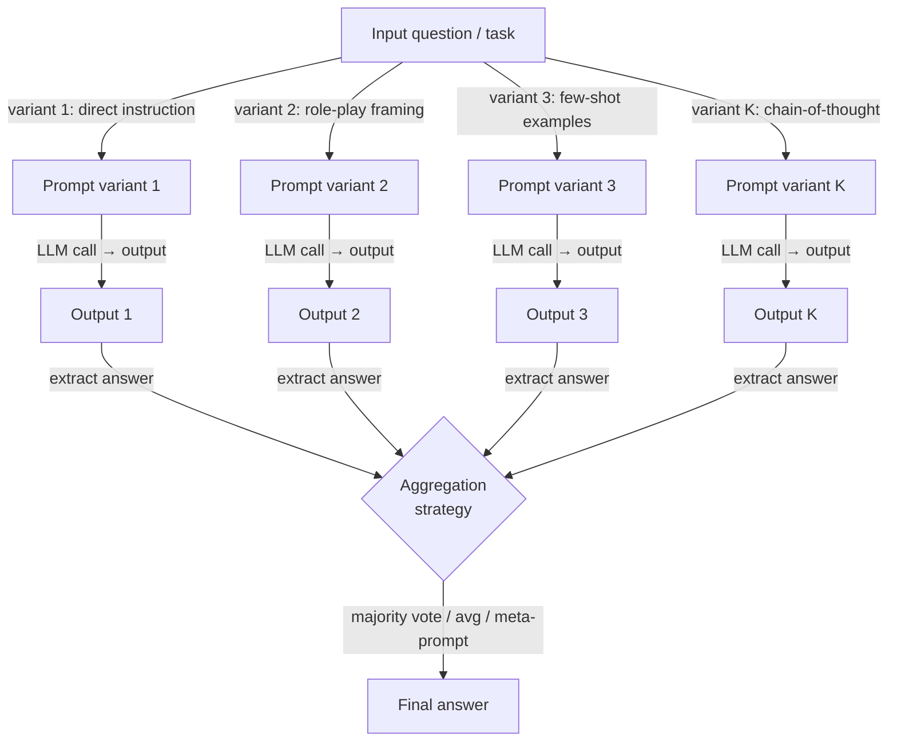

# Prompt Ensembling

## Definition

Prompt Ensembling ist eine Prompting-Technik, die mehrere strukturell unterschiedliche Formulierungen derselben Frage oder Aufgabe generiert, alle an ein Sprachmodell sendet und dann die resultierenden Ausgaben in einer einzigen endgültigen Antwort kombiniert. Die Kernintuition ist dem klassischen maschinellen Lern-Ensemble entlehnt (Bagging, Boosting, Stacking): Kein einzelner Prädiktor ist perfekt, aber ein vielfältiges Komitee unvollkommener Prädiktoren ist tendenziell zuverlässiger als jedes einzelne Mitglied, weil ihre Fehler teilweise unkorreliert sind und sich daher bei der Aggregation aufheben.

Der kritische Unterschied zwischen Prompt Ensembling und Self-Consistency liegt in der Quelle der Diversität. Bei Self-Consistency wird derselbe Prompt N-mal bei Temperatur > 0 ausgeführt und man verlässt sich auf stochastisches Sampling, um diverse Denkpfade zu erzeugen. Bei Prompt Ensembling werden absichtlich *verschiedene* Prompts erstellt — variierend in Formulierung, Rollenzuweisung, Anweisungsphrasierung, Few-Shot-Beispielen oder Ausgabeformat — und jeder (typischerweise bei Temperatur 0 oder niedriger Temperatur) ausgeführt, um diverse, aber deterministische Ausgaben zu erzeugen. Self-Consistency nutzt durch Sampling eingeführte Varianz; Prompt Ensembling nutzt durch Prompt-Design eingeführte Varianz. In der Praxis sind die beiden Ansätze komplementär und können kombiniert werden.

Prompt Ensembling ist besonders in zwei Szenarien wertvoll. Erstens, wenn man unsicher ist, welche Prompt-Formulierung für eine Aufgabe optimal ist und Alternativen nicht im großen Maßstab evaluieren kann — das Ausführen mehrerer Kandidaten und das Voting über ihre Ausgaben gibt den Vorteil des besten Prompts, ohne ihn im Voraus identifizieren zu müssen. Zweitens, wenn eine Aufgabe hochriskant ist und der Fehlermodus eines einzelnen Prompts inakzeptabel ist — ein Ensemble bietet eine sanfte Prüfspur, weil die Verteilung der Votes über verschiedene Antworten ein direktes Signal für die Unsicherheit des Modells ist. Die Hauptkosten sind Latenz und Token: K Prompt-Varianten erfordern K Inferenzaufrufe, die parallelisiert, aber nicht eliminiert werden können.

## Funktionsweise



### Strategien zur Prompt-Variation

Die Qualität eines Ensembles hängt stark von der *Diversität* der Prompt-Varianten ab. Wenn alle Varianten oberflächlich unterschiedlich, aber strukturell identisch sind, degeneriert das Ensemble hin zu wiederholtem Sampling. Effektive Variationsstrategien umfassen:

**Rollen- und Persona-Variation.** Das Zuweisen verschiedener Experten-Personas (z. B. „Du bist ein vorsichtiger Arzt", „Du bist ein Data Scientist", „Du bist ein pragmatischer Ingenieur") verschiebt den Prior des Modells über plausible Antworten und aktiviert verschiedene Wissensregister. Rollenvariation ist besonders effektiv für Aufgaben mit mehreren validen Rahmungen.

**Variation der Anweisungsphrasierung.** Dieselbe Aufgabe kann als Frage („Was ist das Risikoniveau von...?"), als Befehl („Bewerte das Risikoniveau von...") oder als Vervollständigung formuliert werden („Das Risikoniveau von ... ist"), und diese Oberflächenunterschiede ändern die Ausgabeverteilung des Modells messbar. Das Paraphrasieren der Kernanweisung ist die aufwandsärmste Form der Variation.

**Variation der Few-Shot-Beispiele.** Die Verwendung verschiedener Sätze von In-Context-Beispielen ändert, welcher Teil des Wissens des Modells der Few-Shot-Kontext aktiviert. Das Rotieren durch Beispielsätze aus verschiedenen Sub-Domänen der Trainingsverteilung erhöht die Ensemble-Diversität erheblich, insbesondere für Klassifikationsaufgaben.

**Variation Chain-of-Thought vs. direkte Antwort.** Das Einschließen einer oder mehrerer CoT-Varianten neben Direktantwort-Varianten kombiniert die Schlussfolgerungsqualitätsvorteile von CoT mit den Geschwindigkeitsvorteilen des direkten Promptings. Die CoT-Varianten erhalten typischerweise mehr Gewicht bei der Aggregation, weil sie zuverlässiger sind, aber direkte Varianten können überschreiben, wenn CoT das Modell dazu bringt, einfache Fragen zu überdenken.

**Variation des Ausgabeformats.** Das Anfordern der Antwort als JSON-Objekt, als nummerierte Liste oder als Freitext-Satz kann unterschiedliche Präzisionsniveaus hervorrufen. Strukturierte Ausgabevarianten sind einfacher programmatisch zu parsen und zu aggregieren.

### Aggregierungsmethoden

Sobald K Ausgaben vorliegen, müssen sie auf eine einzige Antwort reduziert werden. Die Wahl der Aggregierungsmethode sollte dem Ausgabetyp entsprechen:

**Mehrheitsvoting** eignet sich am besten für diskrete Ausgaben (Klassifikationslabels, kurze sachliche Antworten, Multiple-Choice-Auswahlen). Es ist robust gegenüber adversariellen oder verwirrten Varianten, erfordert keine zusätzlichen Modellaufrufe und ahmt direkt nach, wie Self-Consistency arbeitet. Gleichstände können durch Log-Wahrscheinlichkeit gebrochen oder durch Verweisung auf eine designierte „vertrauenswürdige" Variante aufgelöst werden.

**Score-Mittelung** ist angemessen, wenn jede Variante einen numerischen Score oder eine Wahrscheinlichkeit statt eines Labels zurückgibt. Mittelung ist empfindlich gegenüber Ausreißern; Medians Aggregation ist robuster, wenn einzelne Varianten extreme Werte produzieren können.

**Meta-Prompt (LLM-als-Richter) Aggregation** sendet alle K Ausgaben an einen zweiten LLM-Aufruf, der angewiesen wird, die beste Antwort zu synthetisieren oder auszuwählen. Dies ist die leistungsstärkste, aber teuerste Methode und führt einen zweiten LLM-Fehlerpunkt ein. Sie ist am nützlichsten, wenn die Aufgabe offene Generierung erfordert (Zusammenfassungen, Code, Essays), bei der Mehrheitsvoting nicht anwendbar ist.

**Gewichtetes Voting** weist verschiedenen Varianten unterschiedliche Gewichte basierend auf ihrer historischen Genauigkeit auf einem zurückgehaltenen Validierungsset zu. Wenn man beschriftete Daten hat und messen kann, welche Varianten am besten abschneiden, übertrifft Gewichtung gleichmäßiges Voting erheblich — erfordert aber vorab Kalibrierungsaufwand.

## Wann verwenden / Wann NICHT verwenden

| Verwenden wenn | Vermeiden wenn |
|----------|------------|
| Unsicher ist, welche Prompt-Phrasierung am besten funktioniert, und Alternativen nicht individuell im großen Maßstab evaluiert werden können | Latenz eine harte Einschränkung ist — K parallele Aufrufe haben immer noch die Latenz des langsamsten Aufrufs |
| Die Aufgabe hochriskant ist und der Fehlermodus eines einzelnen Prompts inakzeptabel ist | Das Token-Budget stark begrenzt ist und K Completions nicht geleistet werden können |
| Ausgaben aus verschiedenen Prompt-Rahmungen komplementäre Perspektiven bieten (z. B. medizinische Diagnose aus mehreren Spezialistenwinkeln) | Das Modell bereits Deckengenauigkeit mit einem einzigen gut gestimmten Prompt erreicht — abnehmende Grenznutzen |
| Ein eingebautes Unsicherheitssignal gewünscht wird (Verteilung der Votes = Modelluneinigkeit) | Der Ausgaberaum kontinuierlich oder offen in einer Weise ist, die Voting oder Mittelung bedeutungslos macht |
| Eine Produktionspipeline entwickelt wird, bei der Prompt-Sensitivität gedämpft werden muss | Die Engineering-Infrastruktur fehlt, um parallele LLM-Aufrufe auszuführen und zu aggregieren |

## Vergleiche

| Kriterium | Prompt Ensembling | Self-Consistency | Einzelner Prompt |
|-----------|------------------|-----------------|---------------|
| Quelle der Diversität | Verschiedene Prompt-Designs | Stochastisches Sampling eines Prompts | Keine |
| Anzahl der LLM-Aufrufe | K (Anzahl der Varianten, typischerweise 3–10) | N (typischerweise 10–40) | 1 |
| Temperatur | Niedrig (0–0,3) pro Variante | Hoch (0,5–0,8) | Aufgabenabhängig |
| Genauigkeitsverbesserung | Hoch für Aufgaben, die für Prompt-Phrasierung sensibel sind | Hoch für mehrstufiges Schlussfolgern | Baseline |
| Erfordert Prompt-Engineering-Aufwand | Ja — diverse Varianten entwerfen | Nein — nur ein Prompt benötigt | Moderat |
| Handhabt offene Ausgabe | Ja, via Meta-Prompt-Aggregation | Nein — Mehrheitsvoting erfordert diskrete Antworten | Ja |
| Bester Anwendungsfall | Aufgaben mit Prompt-Sensitivität oder mehreren validen Rahmungen | Mathematik, symbolisches Schlussfolgern, sachliche Fragen und Antworten | Einfache, klar definierte Aufgaben mit einem bekannten guten Prompt |

## Code-Beispiele

### Prompt Ensembling mit mehreren Templates mit OpenAI

```python
# Prompt ensembling: run K prompt variants and aggregate by majority vote
# pip install openai

import os
from collections import Counter
from openai import OpenAI

client = OpenAI(api_key=os.environ["OPENAI_API_KEY"])

# Five structurally different prompt variants for the same classification task
PROMPT_VARIANTS = [
    # 1. Direct instruction
    "Is the following customer review positive, negative, or neutral? "
    "Reply with exactly one word.\n\nReview: {review}",

    # 2. Role-play framing
    "You are a sentiment analysis expert. Classify the sentiment of the "
    "review below as positive, negative, or neutral. Output only the label.\n\nReview: {review}",

    # 3. Few-shot examples
    "Review: 'The product broke in two days.' → negative\n"
    "Review: 'Decent quality for the price.' → neutral\n"
    "Review: 'Absolutely love it, will buy again!' → positive\n"
    "Review: '{review}' →",

    # 4. Chain-of-thought variant
    "Analyze the sentiment of this review step by step, then state the "
    "final label (positive / negative / neutral) on the last line.\n\nReview: {review}",

    # 5. Completion framing
    "The overall sentiment expressed in the review '{review}' is",
]


def call_variant(prompt: str, model: str = "gpt-4o-mini") -> str:
    """Call the LLM with a single prompt variant and return the raw response."""
    resp = client.chat.completions.create(
        model=model,
        messages=[{"role": "user", "content": prompt}],
        temperature=0.0,
        max_tokens=80,
    )
    return resp.choices[0].message.content.strip()


def extract_label(text: str) -> str | None:
    """Extract a sentiment label from raw model output."""
    text_lower = text.lower()
    for label in ("positive", "negative", "neutral"):
        if label in text_lower:
            return label
    return None


def ensemble_sentiment(review: str) -> dict:
    """Run all prompt variants and aggregate by majority vote."""
    raw_outputs, labels = [], []

    for i, template in enumerate(PROMPT_VARIANTS):
        prompt = template.format(review=review)
        raw = call_variant(prompt)
        label = extract_label(raw)
        raw_outputs.append(raw)
        if label:
            labels.append(label)
        print(f"  Variant {i + 1}: {label!r}  (raw: {raw[:60]!r})")

    if not labels:
        return {"answer": None, "votes": {}}

    counts = Counter(labels)
    winner, top_votes = counts.most_common(1)[0]
    return {
        "answer": winner,
        "confidence": top_votes / len(labels),
        "votes": dict(counts),
        "raw_outputs": raw_outputs,
    }


if __name__ == "__main__":
    review = (
        "The delivery was fast but the item looks nothing like the photos. "
        "I'm disappointed and won't order again."
    )
    result = ensemble_sentiment(review)
    print(f"\nFinal answer : {result['answer']}")
    print(f"Confidence   : {result['confidence']:.0%}")
    print(f"Vote counts  : {result['votes']}")
```

### Gewichtetes Ensemble mit einem zurückgehaltenen Validierungsset

```python
# Weighted prompt ensembling: calibrate variant weights from a validation set
# pip install openai scikit-learn

import os
from collections import defaultdict
from openai import OpenAI
from sklearn.metrics import accuracy_score

client = OpenAI(api_key=os.environ["OPENAI_API_KEY"])


def evaluate_variant(template: str, examples: list[dict]) -> float:
    """Return accuracy of a single prompt variant on a labeled dataset."""
    preds = []
    for ex in examples:
        prompt = template.format(review=ex["text"])
        raw = call_variant(prompt)   # reuse function from above
        preds.append(extract_label(raw) or "neutral")
    return accuracy_score([ex["label"] for ex in examples], preds)


def weighted_ensemble(review: str, templates: list[str], weights: list[float]) -> str:
    """Aggregate variant outputs with per-variant weights."""
    scores: dict[str, float] = defaultdict(float)
    for template, weight in zip(templates, weights):
        raw = call_variant(template.format(review=review))
        label = extract_label(raw)
        if label:
            scores[label] += weight
    return max(scores, key=scores.__getitem__) if scores else "neutral"


if __name__ == "__main__":
    # Dummy validation set — replace with real labeled examples
    val_set = [
        {"text": "Great product!", "label": "positive"},
        {"text": "Terrible quality.", "label": "negative"},
        {"text": "It's okay I guess.", "label": "neutral"},
    ]
    # Calibrate weights (accuracy on val set)
    weights = [evaluate_variant(t, val_set) for t in PROMPT_VARIANTS]
    print("Variant weights:", [f"{w:.2f}" for w in weights])

    review = "Arrived on time but packaging was damaged."
    answer = weighted_ensemble(review, PROMPT_VARIANTS, weights)
    print("Weighted ensemble answer:", answer)
```

## Praktische Ressourcen

- [Diverse Demonstrations Improve In-context Compositional Generalization (Levy et al., 2022)](https://arxiv.org/abs/2212.06800) — Zeigt, dass diverse Few-Shot-Beispiele, das Rückgrat der Prompt-Variation, die Generalisierung im Vergleich zu zufällig gesampelten Demonstrationen erheblich verbessern.
- [Self-Consistency Improves Chain of Thought Reasoning in Language Models (Wang et al., 2022)](https://arxiv.org/abs/2203.11171) — Der engste Verwandte des Prompt Ensemblings; wesentlicher Hintergrund für das Verständnis der Aggregation über mehrere LLM-Ausgaben.
- [Prompt Sensitivity and Prompt Ensembling for LLMs (Mizrahi et al., 2024)](https://arxiv.org/abs/2401.00595) — Untersucht direkt, wie stark die LLM-Genauigkeit über paraphrasierte Prompts variiert, und zeigt, dass Ensembling über Paraphrasen den größten Teil der Lücke schließt.
- [Universal Self-Consistency for Large Language Model Generation (Chen et al., 2023)](https://arxiv.org/abs/2311.17311) — Erweitert Self-Consistency auf offene Generierung via Meta-Prompt-Aggregation, überbrückt die Lücke zwischen Mehrheitsvoting-Ensembling und Freitext-Ausgaben.

## Siehe auch

- [Prompt Engineering](/docs/prompt-engineering)
- [Self-Consistency](/docs/prompt-engineering/self-consistency)
- [Automatic Prompt Engineering](/docs/prompt-engineering/automatic-prompt-engineering)
