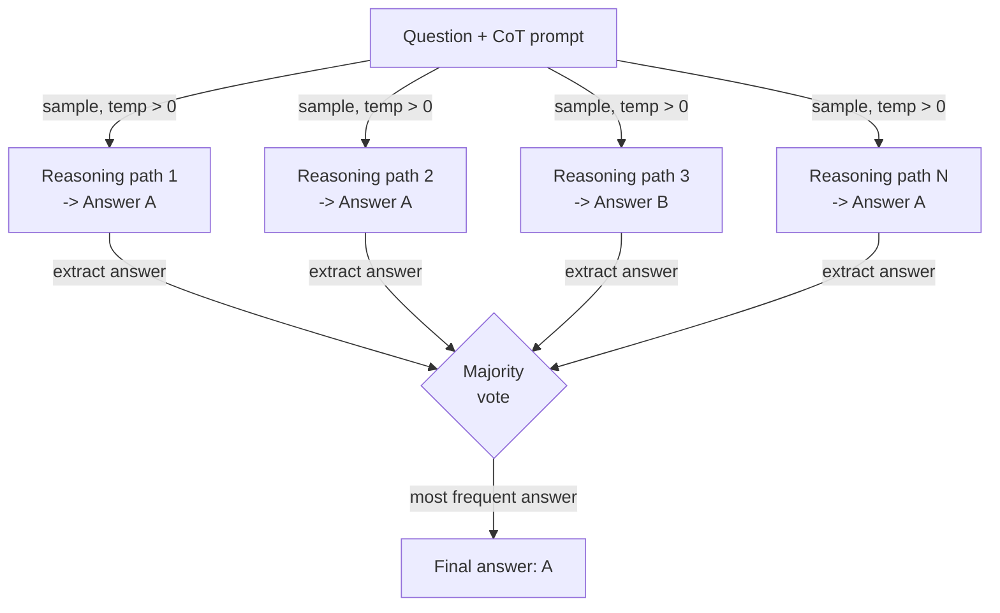

# Self-Consistency

## Definition

Self-Consistency ist eine Prompting-Technik, die von Wang et al. (2022) eingeführt wurde und eine grundlegende Schwäche des Chain-of-Thought (CoT) Promptings behebt: Ein einzelner Denkpfad kann zu einer sicheren, aber falschen Antwort führen. Die Erkenntnis ist, dass korrekte Antworten robust sind — mehrere unabhängige Denkpfade, die ein Problem aus verschiedenen Winkeln angehen, sollten zur gleichen Antwort konvergieren — während falsche Antworten fragil und über Pfade hinweg inkonsistent sind. Indem N Denkpfade bei temperature > 0 gesampelt und über ihre abschließenden Antworten per Mehrheitsvoting abgestimmt wird, agiert Self-Consistency als schwache, aber praktische Ensemble-Methode, die Denkfehler erheblich reduziert, ohne das Modell feinzutunen.

Die Beziehung zu CoT ist direkt: Self-Consistency ist CoT mit wiederholtem Sampling. Ein Standard-CoT-Prompt erzeugt eine Denkabfolge und eine Antwort; Self-Consistency erzeugt N Abfolgen (typischerweise 10–40) und N Antworten und aggregiert dann. Die Temperature-Einstellung ist entscheidend: Sie brauchen Vielfalt in den Denkpfaden, daher macht greedy decoding (temperature=0) den Zweck zunichte. Eine Temperature im Bereich 0,5–0,8 liefert typischerweise genug Vielfalt für effektives Voting, während jede einzelne Kette kohärent bleibt. Auf Benchmarks wie GSM8K (mathematische Wortprobleme), AQuA (algebraisches Reasoning) und SVAMP verbessert Self-Consistency die CoT-Genauigkeit um 10–20 Prozentpunkte zu den Kosten von N-mal mehr Inferenzaufrufen.

Was Self-Consistency praktisch nützlich macht — und es von einem bloßen Selbstevaluierungsschritt unterscheidet — ist, dass es keine zusätzlichen Modellaufrufe zum "Prüfen" oder "Kritisieren" erfordert. Der Voting-Mechanismus ist rein statistisch: Welche Antwort unter N Stichproben am häufigsten erscheint, gewinnt. Dies macht es einfach zu implementieren, modell-agnostisch und unkompliziert zu tunen (N einfach variieren). Die Hauptbeschränkung sind die Kosten: N Vervollständigungen kosten N-mal so viel. Self-Consistency wird daher am besten auf Aufgaben angewendet, bei denen Genauigkeit das Inferenzbudget wert ist — Mathematik, mehrstufiges Reasoning und hochriskante Klassifikation — und nicht auf latenz- oder tokenkosten-sensitive Anwendungen.

## Funktionsweise



### Diverse Denkpfade generieren

Der erste Schritt besteht darin, das Modell mit einem Standard-Few-Shot-CoT-Prompt zu prompten — eine Reihe von Beispiel-(Frage, schrittweises Reasoning, Antwort)-Tripeln, gefolgt von der neuen Frage. Die entscheidende Abkehr vom Standard-CoT besteht darin, die API N-mal mit temperature > 0 aufzurufen statt einmal mit temperature 0. Jeder Aufruf ist statistisch unabhängig; das Modell erkundet eine andere Zerlegung des Problems, kann verschiedene Zwischenvariablen oder Berechnungsreihenfolgen verwenden und kann sogar verschiedene Zwischenfehler machen — aber wenn die zugrunde liegende Antwort korrekt ist, werden die meisten Pfade dennoch dorthin gelangen. Die Anzahl der Stichproben N ist ein Hyperparameter: Mehr Stichproben reduzieren die Varianz, erhöhen aber die Kosten. Im Originalpapier wird N=40 für maximale Genauigkeit verwendet; in der Praxis erholt N=10–20 oft den größten Teil des Nutzens zu geringeren Kosten.

### Antworten extrahieren und normalisieren

Nach dem Sammeln von N Vervollständigungen müssen Sie die abschließende Antwort aus jeder Denkabfolge extrahieren. Für gut strukturierte CoT-Prompts ist die Antwort typischerweise im letzten Satz nach einer Phrase wie "The answer is..." oder "Therefore, X." Für numerische Antworten ist die Normalisierung wichtig: "3/4", "0,75" und "75%" sind dieselbe Antwort und müssen vor dem Voting auf dieselbe kanonische Form abgebildet werden. Für Klassifikations- oder Kurzantwortaufgaben ist die Extraktion normalerweise ein Teilstring-Abgleich oder ein einfaches Parsen. Die Robustheit der Extraktion ist der fraglichste Teil der Pipeline — wenn das Modell eine Kette erzeugt, die nicht mit einer klar parsbaren Antwort endet, muss dieser Pfad verworfen oder einem "unbekannten" Bucket zugewiesen werden.

### Mehrheitsvoting

Der Aggregationsschritt ist eine Häufigkeitsauszählung über extrahierte Antworten. Die häufigste Antwort gewinnt. Unentschieden können durch Wahl der Antwort mit der höchsten Log-Wahrscheinlichkeit aufgelöst werden oder indem die gebundenen Antworten mit ihren Stimmenzählungen zur menschlichen Überprüfung zurückgegeben werden. Die statistische Intuition ist, dass Fehler vielfältig sind (verschiedene falsche Antworten aus verschiedenen Gründen), während korrekte Antworten konzentriert sind (die meisten Pfade gelangen zur gleichen richtigen Antwort). Diese Eigenschaft gilt am stärksten für Aufgaben mit einer eindeutigen richtigen Antwort, wie Arithmetik, symbolisches Reasoning und faktenbasierte Fragen. Für offene Generierungsaufgaben — Zusammenfassung, kreatives Schreiben, Code — ist Self-Consistency weniger anwendbar, weil Mehrheitsvoting über Essays nicht wohldefiniert ist.

## Wann verwenden / Wann NICHT verwenden

| Verwenden wenn | Vermeiden wenn |
|----------------|----------------|
| Die Aufgabe eine eindeutige richtige Antwort hat und die CoT-Genauigkeit unzureichend ist | Latenz eine harte Einschränkung ist (N-malige Inferenzaufrufe sind inakzeptabel) |
| Mehrstufige Arithmetik oder algebraisches Reasoning mit bekannten Fehlerraten | Tokenkosten das primäre Anliegen sind und Sie sich N Vervollständigungen nicht leisten können |
| Hochriskante Klassifikation, bei der einige Prozentpunkte Genauigkeit wichtig sind | Die Aufgabe offene Generierung ist, bei der Mehrheitsvoting nicht sinnvoll ist |
| Sie Genauigkeitsverbesserungen ohne Fine-Tuning oder zusätzliche Modelle wünschen | Das Modell bei N=1 bereits nahezu maximale Genauigkeit erreicht — abnehmende Erträge |
| Die Denkpfade überprüfbar sein müssen (Sie können alle N Ketten inspizieren) | Die Antwortextraktion aufgrund inkonsistenter Ausgabeformate unzuverlässig ist |

## Vergleiche

| Kriterium | Self-Consistency | Chain-of-Thought (CoT) | Selbstevaluation |
|-----------|-----------------|------------------------|-----------------|
| Anzahl der LLM-Aufrufe | N (typischerweise 10–40) | 1 | 2 (generieren + kritisieren) |
| Genauigkeitsverbesserung | Hoch — 10–20 Prozentpunkte auf Reasoning-Benchmarks | Moderat — erheblich über direktem Prompting | Moderat — hängt von der Selbstkritikqualität des Modells ab |
| Kosten | Hoch — linear in N | Niedrig | Niedrig-moderat |
| Implementierungskomplexität | Niedrig — N-mal sampeln und abstimmen | Sehr niedrig | Moderat — erfordert das Entwerfen eines Kritik-Prompts |
| Funktioniert ohne externes Feedback | Ja | Ja | Ja |
| Bester Aufgabentyp | Mathematik, symbolisches Reasoning, sachliche Fragen | Die meisten Reasoning-Aufgaben | Aufgaben, bei denen das Modell eigene Fehler erkennen kann |
| Hinweis | Zuverlässiger als CoT, aber proportional teurer | Einfachere Baseline — vor Self-Consistency versuchen | Ergänzend — kann für weitere Gewinne kombiniert werden |

## Code-Beispiele

### Self-Consistency mit der OpenAI API

```python
# Self-consistency: sample N CoT paths and take majority vote
# pip install openai

import os, re
from collections import Counter
from openai import OpenAI

client = OpenAI(api_key=os.environ["OPENAI_API_KEY"])

FEW_SHOT = """Q: Roger has 5 tennis balls. He buys 2 cans with 3 each. How many now?
A: 5 + (2 x 3) = 5 + 6 = 11. The answer is 11.

Q: Cafeteria had 23 apples, used 20, bought 6 more. How many now?
A: 23 - 20 = 3. 3 + 6 = 9. The answer is 9.

Q: {question}
A:"""


def extract_answer(text: str) -> str | None:
    m = re.search(r"[Tt]he answer is\s+([^.\n]+)", text)
    return m.group(1).strip().rstrip(".,;") if m else None


def self_consistency(question: str, n: int = 10, temp: float = 0.7) -> dict:
    """Sample n CoT paths and return majority vote answer with confidence."""
    answers, completions = [], []
    for i in range(n):
        resp = client.chat.completions.create(
            model="gpt-4o-mini",
            messages=[{"role": "user", "content": FEW_SHOT.format(question=question)}],
            temperature=temp,
            max_tokens=300,
        )
        text = resp.choices[0].message.content.strip()
        completions.append(text)
        ans = extract_answer(text)
        if ans:
            answers.append(ans)
        print(f"  Path {i+1:>2}: {ans!r}")

    if not answers:
        return {"answer": None, "votes": {}}
    counts = Counter(answers)
    winner, votes = counts.most_common(1)[0]
    return {"answer": winner, "confidence": votes / len(answers), "votes": dict(counts)}


if __name__ == "__main__":
    q = ("Janet's ducks lay 16 eggs per day. She eats 3 and bakes with 4. "
         "She sells the rest at $2/egg. How much does she make daily?")
    r = self_consistency(q, n=10)
    print(f"\nAnswer    : {r['answer']}")
    print(f"Confidence: {r['confidence']:.0%}")
    print(f"Votes     : {r['votes']}")
```

### Numerische Antwortnormalisierung für robustes Voting

```python
# Normalize numeric answers before majority voting
# Handles fractions, decimals, currency, and percentage strings

import re
from collections import Counter
from fractions import Fraction


def normalize_numeric(raw: str) -> str:
    """Canonicalize a raw answer string to a float string for voting."""
    raw = raw.strip().lower()
    raw = re.sub(r"[$%,]", "", raw)
    m = re.match(r"^(\d+)/(\d+)$", raw)
    if m:
        return str(float(Fraction(int(m.group(1)), int(m.group(2)))))
    try:
        return str(float(raw))
    except ValueError:
        return raw


def majority_vote(answers: list[str]) -> str | None:
    normalized = [normalize_numeric(a) for a in answers]
    return Counter(normalized).most_common(1)[0][0] if normalized else None


if __name__ == "__main__":
    raw = ["18", "18.0", "$18", "18", "17", "18", "18", "17", "18", "18"]
    print("Majority:", majority_vote(raw))  # -> "18.0"
```

## Praktische Ressourcen

- [Self-Consistency Improves Chain of Thought Reasoning in Language Models (Wang et al., 2022)](https://arxiv.org/abs/2203.11171) — Originalpaper mit Benchmarks auf GSM8K, AQuA, SVAMP, StrategyQA und ARC.
- [Chain-of-Thought Prompting Elicits Reasoning in Large Language Models (Wei et al., 2022)](https://arxiv.org/abs/2201.11903) — Das CoT-Paper, auf dem Self-Consistency aufbaut; wesentlicher Hintergrund.
- [OpenAI — Chat Completions API-Referenz](https://platform.openai.com/docs/api-reference/chat/create) — Referenz für `temperature`, `n` und `logprobs` Parameter, die in Self-Consistency-Implementierungen verwendet werden.
- [Anthropic — Prompt Engineering Übersicht](https://docs.anthropic.com/en/docs/build-with-claude/prompt-engineering/overview) — Enthält Hinweise zu Sampling und Chain-of-Thought für Claude-Modelle.

## Siehe auch

- [Prompt Engineering](/docs/prompt-engineering)
- [Chain-of-Thought (CoT)](/docs/reasoning-patterns/cot)
- [Prompt Ensembling](/docs/prompt-engineering/prompt-ensembling)
