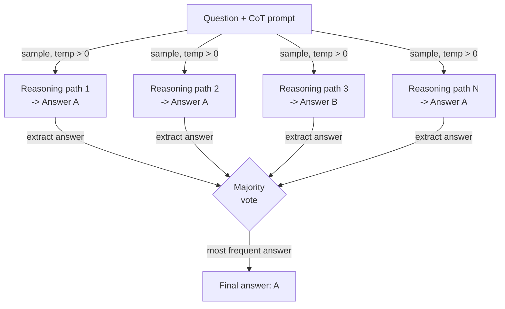

# Self-Consistency

## Definition

Self-Consistency ist eine Prompting-Technik, die von Wang et al. (2022) eingeführt wurde und eine grundlegende Schwäche des Chain-of-Thought (CoT)-Promptings behebt: Ein einzelner Denkpfad kann zu einer selbstsicheren, aber falschen Antwort führen. Die Erkenntnis ist, dass korrekte Antworten tendenziell robust sind — mehrere unabhängige Denkpfade, die ein Problem aus verschiedenen Winkeln angehen, sollten zur selben Antwort konvergieren — während falsche Antworten tendenziell fragil und über Pfade hinweg inkonsistent sind. Durch Sampling vieler Denkketten bei Temperatur > 0 und Mehrheitsvoting über ihre abschließenden Antworten fungiert Self-Consistency als eine schwache, aber praktische Ensemble-Methode, die Denkfehler ohne jegliches Modell-Fine-Tuning erheblich reduziert.

Die Beziehung zu CoT ist direkt: Self-Consistency ist CoT mit wiederholtem Sampling. Ein Standard-CoT-Prompt erzeugt eine Denkkette und eine Antwort; Self-Consistency erzeugt N Ketten (typischerweise 10–40) und N Antworten, dann aggregiert es. Die Temperature-Einstellung ist entscheidend: Man braucht Diversität in den Denkpfaden, sodass Greedy-Dekodierung (temperature=0) den Zweck vereitelt. Eine Temperature im Bereich 0,5–0,8 bietet typischerweise genug Diversität für effektives Voting, während jede einzelne Kette kohärent bleibt. Auf Benchmarks wie GSM8K (Mathematik-Textaufgaben), AQuA (algebraisches Schlussfolgern) und SVAMP verbessert Self-Consistency die CoT-Genauigkeit um 10–20 Prozentpunkte zu den Kosten von N-mal mehr Inferenzaufrufen.

Was Self-Consistency praktisch nützlich macht — und es von einem einfachen Selbstevaluierungsschritt unterscheidet — ist, dass keine zusätzlichen Modellaufrufe für „Überprüfung" oder „Kritik" benötigt werden. Der Voting-Mechanismus ist rein statistisch: Welche Antwort am häufigsten unter N Samples vorkommt, gewinnt. Dies macht es einfach zu implementieren, modell-agnostisch und einfach zu tunen (N einfach variieren). Die Haupteinschränkung sind die Kosten: N Completions kosten N-mal so viel. Self-Consistency wird daher am besten auf Aufgaben angewendet, bei denen die Genauigkeit das Inferenzbudget wert ist — Mathematik, mehrstufiges Schlussfolgern und hochriskante Klassifikation — nicht auf latenz- oder tokenkostensensitive Anwendungen.

## Funktionsweise



### Diverse Denkpfade generieren

Der erste Schritt besteht darin, das Modell mit einem Standard-Few-Shot-CoT-Prompt zu promten — eine Reihe von Beispiel-(Frage, Schritt-für-Schritt-Argumentation, Antwort)-Triples gefolgt von der neuen Frage. Die wesentliche Abweichung vom Standard-CoT besteht darin, dass die API N-mal mit Temperatur > 0 statt einmal mit Temperatur 0 aufgerufen wird. Jeder Aufruf ist statistisch unabhängig; das Modell erkundet eine andere Zerlegung des Problems, verwendet möglicherweise andere Zwischenvariablen oder Berechnungsreihenfolgen und macht möglicherweise sogar verschiedene Zwischenfehler — aber wenn die zugrunde liegende Antwort korrekt ist, werden die meisten Pfade sie trotzdem erreichen. Die Anzahl der Samples N ist ein Hyperparameter: Mehr Samples reduzieren die Varianz, erhöhen aber die Kosten. Im Original-Papier wird N=40 für maximale Genauigkeit verwendet; in der Praxis erholt sich mit N=10–20 oft der größte Teil des Vorteils zu geringeren Kosten.

### Antworten extrahieren und normalisieren

Nach dem Sammeln von N Completions muss die abschließende Antwort aus jeder Denkkette extrahiert werden. Für gut strukturierte CoT-Prompts befindet sich die Antwort typischerweise im letzten Satz nach einer Phrase wie „Die Antwort ist..." oder „Daher, X." Für numerische Antworten ist die Normalisierung wichtig: „3/4", „0,75" und „75%" sind dieselbe Antwort und müssen vor dem Voting auf dieselbe kanonische Form abgebildet werden. Für Klassifikations- oder Kurzantwort-Aufgaben ist die Extraktion üblicherweise ein Teilzeichenketten-Abgleich oder ein einfaches Parsing. Die Robustheit der Extraktion ist der fragilste Teil der Pipeline — wenn das Modell eine Kette produziert, die nicht mit einer klar parsbaren Antwort endet, muss dieser Pfad verworfen oder einem „unbekannt"-Bucket zugeordnet werden.

### Mehrheitsvoting

Der Aggregierungsschritt ist eine Häufigkeitszählung über extrahierte Antworten. Die häufigste Antwort gewinnt. Gleichstände können durch Wahl der Antwort aus dem Pfad mit der höchsten Log-Wahrscheinlichkeit gebrochen werden, oder einfach indem die gleichrangigen Antworten mit ihren Stimmenanzahlen zur menschlichen Überprüfung zurückgegeben werden. Die statistische Intuition ist, dass Fehler divers sind (verschiedene falsche Antworten aus verschiedenen Gründen), während korrekte Antworten konzentriert sind (die meisten Pfade kommen zur gleichen richtigen Antwort). Diese Eigenschaft gilt am stärksten für Aufgaben mit einer eindeutigen korrekten Antwort, wie Arithmetik, symbolisches Schlussfolgern und faktenbasiertes Fragen und Antworten. Für offene Generierungsaufgaben — Zusammenfassung, kreatives Schreiben, Code — ist Self-Consistency weniger anwendbar, weil Mehrheitsvoting über Essays nicht klar definiert ist.

## Wann verwenden / Wann NICHT verwenden

| Verwenden wenn | Vermeiden wenn |
|----------|------------|
| Die Aufgabe eine eindeutige korrekte Antwort hat und die CoT-Genauigkeit unzureichend ist | Latenz eine harte Einschränkung ist (N-fache Inferenzaufrufe sind nicht akzeptabel) |
| Mehrstufige arithmetische oder algebraische Schlussfolgerung mit bekannten Fehlerquoten | Token-Kosten die primäre Sorge sind und N Completions nicht geleistet werden können |
| Hochriskante Klassifikation, bei der wenige Prozentpunkte Genauigkeit wichtig sind | Die Aufgabe eine offene Generierung ist, bei der Mehrheitsvoting nicht sinnvoll ist |
| Genauigkeitsverbesserung ohne Fine-Tuning oder zusätzliche Modelle gewünscht wird | Das Modell bei N=1 bereits nahezu Höchstgenauigkeit erreicht — abnehmende Grenznutzen |
| Die Denkpfade überprüfbar sein sollen (alle N Ketten können inspiziert werden) | Die Antwortextraktion aufgrund inkonsistenter Ausgabeformate unzuverlässig ist |

## Vergleiche

| Kriterium | Self-Consistency | Chain-of-Thought (CoT) | Selbstevaluation |
|-----------|-----------------|------------------------|-----------------|
| Anzahl der LLM-Aufrufe | N (typischerweise 10–40) | 1 | 2 (generieren + kritisieren) |
| Genauigkeitsverbesserung | Hoch — 10–20 Prozentpunkte bei Schlussfolger-Benchmarks | Mittel — erheblich gegenüber direktem Prompting | Mittel — hängt von der Selbstkritikqualität des Modells ab |
| Kosten | Hoch — linear in N | Gering | Gering bis mittel |
| Implementierungskomplexität | Gering — N-mal samplen und voten | Sehr gering | Mittel — erfordert die Gestaltung eines Kritik-Prompts |
| Funktioniert ohne externes Feedback | Ja | Ja | Ja |
| Bestes Aufgabentyp | Mathematik, symbolisches Schlussfolgern, sachliche Fragen und Antworten | Die meisten Schlussfolgerungsaufgaben | Aufgaben, bei denen das Modell seine eigenen Fehler erkennen kann |
| Hinweis | Zuverlässiger als CoT, aber proportional teurer | Einfacherer Ausgangspunkt — vor Self-Consistency ausprobieren | Komplementär — kann für weitere Gewinne kombiniert werden |

## Code-Beispiele

### Self-Consistency mit der OpenAI API

```python
# Self-consistency: sample N CoT paths and take majority vote
# pip install openai

import os, re
from collections import Counter
from openai import OpenAI

client = OpenAI(api_key=os.environ["OPENAI_API_KEY"])

FEW_SHOT = """Q: Roger has 5 tennis balls. He buys 2 cans with 3 each. How many now?
A: 5 + (2 x 3) = 5 + 6 = 11. The answer is 11.

Q: Cafeteria had 23 apples, used 20, bought 6 more. How many now?
A: 23 - 20 = 3. 3 + 6 = 9. The answer is 9.

Q: {question}
A:"""


def extract_answer(text: str) -> str | None:
    m = re.search(r"[Tt]he answer is\s+([^.\n]+)", text)
    return m.group(1).strip().rstrip(".,;") if m else None


def self_consistency(question: str, n: int = 10, temp: float = 0.7) -> dict:
    """Sample n CoT paths and return majority vote answer with confidence."""
    answers, completions = [], []
    for i in range(n):
        resp = client.chat.completions.create(
            model="gpt-4o-mini",
            messages=[{"role": "user", "content": FEW_SHOT.format(question=question)}],
            temperature=temp,
            max_tokens=300,
        )
        text = resp.choices[0].message.content.strip()
        completions.append(text)
        ans = extract_answer(text)
        if ans:
            answers.append(ans)
        print(f"  Path {i+1:>2}: {ans!r}")

    if not answers:
        return {"answer": None, "votes": {}}
    counts = Counter(answers)
    winner, votes = counts.most_common(1)[0]
    return {"answer": winner, "confidence": votes / len(answers), "votes": dict(counts)}


if __name__ == "__main__":
    q = ("Janet's ducks lay 16 eggs per day. She eats 3 and bakes with 4. "
         "She sells the rest at $2/egg. How much does she make daily?")
    r = self_consistency(q, n=10)
    print(f"\nAnswer    : {r['answer']}")
    print(f"Confidence: {r['confidence']:.0%}")
    print(f"Votes     : {r['votes']}")
```

### Numerische Antwortnormalisierung für robustes Voting

```python
# Normalize numeric answers before majority voting
# Handles fractions, decimals, currency, and percentage strings

import re
from collections import Counter
from fractions import Fraction


def normalize_numeric(raw: str) -> str:
    """Canonicalize a raw answer string to a float string for voting."""
    raw = raw.strip().lower()
    raw = re.sub(r"[$%,]", "", raw)
    m = re.match(r"^(\d+)/(\d+)$", raw)
    if m:
        return str(float(Fraction(int(m.group(1)), int(m.group(2)))))
    try:
        return str(float(raw))
    except ValueError:
        return raw


def majority_vote(answers: list[str]) -> str | None:
    normalized = [normalize_numeric(a) for a in answers]
    return Counter(normalized).most_common(1)[0][0] if normalized else None


if __name__ == "__main__":
    raw = ["18", "18.0", "$18", "18", "17", "18", "18", "17", "18", "18"]
    print("Majority:", majority_vote(raw))  # -> "18.0"
```

## Praktische Ressourcen

- [Self-Consistency Improves Chain of Thought Reasoning in Language Models (Wang et al., 2022)](https://arxiv.org/abs/2203.11171) — Originalpapier mit Benchmarks auf GSM8K, AQuA, SVAMP, StrategyQA und ARC.
- [Chain-of-Thought Prompting Elicits Reasoning in Large Language Models (Wei et al., 2022)](https://arxiv.org/abs/2201.11903) — Das CoT-Papier, auf dem Self-Consistency aufbaut; wesentlicher Hintergrund.
- [OpenAI — Chat Completions API-Referenz](https://platform.openai.com/docs/api-reference/chat/create) — Referenz für `temperature`, `n` und `logprobs`-Parameter, die in Self-Consistency-Implementierungen verwendet werden.
- [Anthropic — Prompt Engineering Übersicht](https://docs.anthropic.com/en/docs/build-with-claude/prompt-engineering/overview) — Enthält Leitlinien zu Sampling und Chain-of-Thought für Claude-Modelle.

## Siehe auch

- [Prompt Engineering](/docs/prompt-engineering)
- [Chain-of-Thought (CoT)](/docs/reasoning-patterns/cot)
- [Prompt Ensembling](/docs/prompt-engineering/prompt-ensembling)
