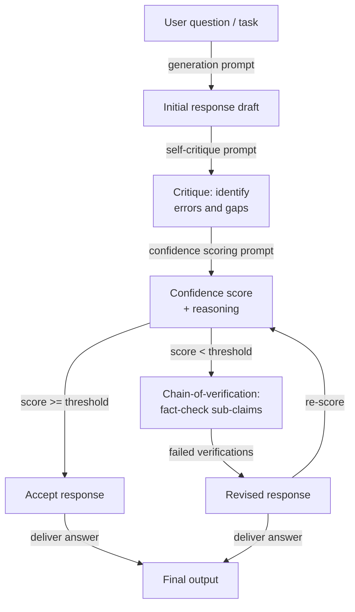

# Selbstevaluation und Kalibrierung

## Definition

Selbstevaluation bezeichnet das Prompting eines Sprachmodells, seine eigene zuvor generierte Ausgabe zu kritisieren, zu verifizieren oder zu bewerten. Anstatt die erste Antwort des Modells als endgültig zu behandeln, fordert ein Selbstevaluierungsschritt das Modell auf, als sein eigener Reviewer zu fungieren — auf sachliche Fehler, logische Inkonsistenzen, unvollständiges Schlussfolgern oder Nichtbefolgung von Anweisungen zu prüfen — und dann entweder Probleme zu kennzeichnen oder eine verbesserte Antwort zu generieren. Das Modell verwendet dieselben Gewichte und dasselbe Kontextfenster für beide Rollen, was sowohl eine Stärke (kein zusätzliches Modell erforderlich) als auch eine grundlegende Einschränkung ist (das Modell hat möglicherweise systematische blinde Flecken, die es nicht selbst erkennen kann).

Kalibrierung ist die engere, quantitative Dimension der Selbstevaluation. Ein Modell ist *gut kalibriert*, wenn sein ausgedrücktes Vertrauen seiner empirischen Genauigkeit entspricht: Wenn es sagt, es sei zu 80% sicher, sollte es etwa 80% der Zeit korrekt sein. Die meisten LLMs sind von Haus aus schlecht kalibriert — sie drücken hohes Vertrauen auch bei Fragen aus, die sie falsch beantworten, ein Phänomen, das als *Übervertrauen* oder *epistemische Überschreitung* bekannt ist. Kalibrierungstechniken fordern das Modell auf, zusammen mit jeder Antwort einen expliziten numerischen Confidence Score zu produzieren, und das System kann diesen Score dann nutzen, um unsichere Antworten zur menschlichen Überprüfung weiterzuleiten, zusätzliche Verifizierungsschritte auszulösen oder ganz auf eine Antwort zu verzichten.

Zusammen adressieren Selbstevaluation und Kalibrierung zwei verschiedene, aber zusammenhängende Fehlermodi. Selbstevaluation adressiert *Korrektheit*: Das Modell hat eine Antwort produziert, aber ist sie richtig? Kalibrierung adressiert *Unsicherheitsbewusstsein*: Weiß das Modell, wenn es nicht weiß? Beides ist notwendig für den Einsatz von LLMs in hochriskanten Umgebungen. Ein Modell, das seine eigenen Fehler erkennt, ist zuverlässiger; ein Modell, das weiß, was es nicht weiß, ist vertrauenswürdiger. Die hier behandelten Techniken — Selbstkritik, Confidence Scoring und Chain-of-Verification — sind zunehmend Standardkomponenten von Produktions-LLM-Pipelines.

## Funktionsweise



### Selbstkritik

Selbstkritik ist die einfachste Selbstevaluierungsmethode. Nach der Generierung einer anfänglichen Antwort wird ein zweiter Prompt angehängt, der das Modell auffordert, seine eigene Ausgabe anhand expliziter Kriterien zu überprüfen. Gute Selbstkritik-Prompts sind *spezifisch* darin, was überprüft werden soll: sachliche Genauigkeit, logische Konsistenz, Vollständigkeit, Anweisungsbefolgung, Ton oder Sicherheit. Vage Prompts wie „Ist diese Antwort gut?" erzeugen flache, oberflächliche Kritiken. Spezifische Prompts wie „Liste alle sachlichen Behauptungen in der Antwort auf, bei denen du weniger als 90% sicher bist, und erkläre warum" erzeugen verwertbares Feedback.

Die Qualität der Selbstkritik verbessert sich erheblich, wenn das Modell angewiesen wird, eine adversarielle Haltung einzunehmen — aktiv nach Problemen zu suchen, anstatt zu bestätigen, dass die Antwort in Ordnung ist. Formulierungen wie „Bestreite jede Schlüsselbehauptung", „Finde mindestens einen Fehler" und „Was würde ein Skeptiker dagegen einwenden?" verzerren das Modell in Richtung nützlicher Kritik statt Validierung. Constitutional AI (Anthropic, 2022) systematisiert dies, indem eine Reihe von „Prinzipien" definiert wird, gegen die das Modell die Antwort prüfen muss, bevor es sie überarbeitet — und so effektiv eine strukturierte Kritik-Rubrik schafft, die geprüft werden kann.

Ein kritischer Fehlermodus der Selbstkritik ist *sykophantische Validierung*: Das Modell lobt seine eigene Antwort und findet keine Probleme, insbesondere wenn die ursprüngliche Antwort bereits plausibel klang, aber falsch war. Dies ist am ausgeprägtesten bei kleineren Modellen und am wenigsten bei Modellen, die mit Kritikdaten fine-getuned wurden. Abhilfemaßnahmen umfassen: Verwendung einer separaten Modellinstanz für die Kritik, absichtliches Einbetten von Fehlern in den Entwurf, um zu testen, ob der Kritikschritt sie erkennt, und Anforderung einer strukturierten Liste statt Freitext für die Kritik (was die Behauptung „keine Probleme" schwerer zu verteidigen macht).

### Kalibrierung und Confidence Scoring

Confidence-Scoring-Prompts fordern das Modell auf, eine explizite Wahrscheinlichkeit oder eine ordinale Bewertung zusammen mit jeder Antwort zu produzieren. Eine minimale Version ist eine einfache Anfrage, die an den Antwort-Prompt angehängt wird: „Nach Ihrer Antwort geben Sie Ihr Vertrauen als Prozentsatz von 0 bis 100 an, wobei 100 bedeutet, dass Sie sicher sind, und 0 bedeutet, dass Sie raten." Ausgefeiltere Versionen fordern eine Aufschlüsselung nach Behauptung: „Für jede sachliche Aussage in Ihrer Antwort bewerten Sie Ihr Vertrauen (hoch / mittel / niedrig) und identifizieren Sie die Unsicherheitsquelle."

Numerische Confidence Scores von LLMs müssen mit Skepsis behandelt werden. Rohe verbalisierte Wahrscheinlichkeiten sind im statistischen Sinne nicht gut kalibriert — ein Modell, das „70% sicher" sagt, hat bei diesen Fragen nicht systematisch 70% der Zeit Recht. Sie sind jedoch *monoton nützlich*: Fragen, bei denen das Modell geringes Vertrauen meldet, tendieren dazu, schwieriger und fehleranfälliger zu sein als Fragen, bei denen es hohes Vertrauen meldet. Das bedeutet, dass verbalisierte Confidence Scores nützlich für *Rangordnung* und *Weiterleitung* sind (Antworten mit geringem Vertrauen zur Überprüfung senden), auch wenn sie nicht für genaue Wahrscheinlichkeitsschätzung nützlich sind.

Kalibrierung kann nachträglich durch Temperature Scaling oder Platt Scaling auf die Log-Wahrscheinlichkeiten des Modells verbessert werden, aber dies erfordert ein beschriftetes Dataset. Auf Prompt-Ebene kann die relative Kalibrierung verbessert werden, indem das Modell gebeten wird, sein Vertrauen mit Referenzfragen bekannter Schwierigkeit zu vergleichen („Ich bin so sicher wie bei der Hauptstadt Frankreichs im Vergleich zu einem unbekannten historischen Datum").

### Chain-of-Verification

Chain-of-Verification (CoVe, Dhuliawala et al., 2023) strukturiert Selbstevaluation als mehrstufige Verifizierungspipeline: Eine Baseline-Antwort generieren, dann explizit einen Satz von Verifizierungsfragen planen, die die Schlüsselbehauptungen in dieser Antwort bestätigen oder widerlegen würden, diese Verifizierungsfragen unabhängig beantworten (ohne auf die ursprüngliche Antwort zu schauen, um Bestätigungsfehler zu reduzieren), und schließlich eine überarbeitete Antwort erstellen, die von den Verifizierungsergebnissen informiert wird. Diese Zerlegung ist wichtig, weil sie das Modell zwingt, *Behauptungsgenerierung* von *Behauptungsverifizierung* zu trennen, wodurch die Chance reduziert wird, dass derselbe Denkfehler durch beide Schritte propagiert.

Die Verifizierungsfragen sollten atomar sein — jede sollte eine einzige, spezifische Unterbehauptung testen. Wenn die Baseline-Antwort beispielsweise besagt: „Python 3.10 führte strukturelles Pattern-Matching und den Walrus-Operator ein", sollten die Verifizierungsfragen sein: „In welcher Python-Version wurde strukturelles Pattern-Matching eingeführt?" und „In welcher Python-Version wurde der Walrus-Operator eingeführt?" Das unabhängige Beantworten dieser Fragen deckt oft sachliche Fehler auf, die die ursprüngliche Antwort selbstsicher behauptet hatte.

## Wann verwenden / Wann NICHT verwenden

| Verwenden wenn | Vermeiden wenn |
|----------|------------|
| Die Aufgabe hochriskant ist und sachliche Korrektheit kritisch ist (medizinisch, rechtlich, finanziell) | Latenz eine harte Einschränkung ist — Selbstevaluation fügt mindestens einen vollständigen Inferenz-Round-Trip hinzu |
| Ein eingebautes Unsicherheitssignal ohne ein separates Evaluierungsmodell gewünscht wird | Die Domäne des Modells eine ist, bei der Selbstevaluation systematisch unzuverlässig ist (z. B. sehr aktuelle Ereignisse nach dem Trainings-Cutoff) |
| Die Ausgabequalität über Läufe hinweg stark variiert und ein Filtermechanismus benötigt wird | Die Aufgabe einfach und gut eingeschränkt ist — Selbstevaluierungs-Overhead übersteigt den Genauigkeitsvorteil |
| Unsichere Antworten automatisch zur menschlichen Überprüfung weitergeleitet werden sollen | Das Modell zu klein ist, um zuverlässige Selbstkritiken zu produzieren (\< 7B Parameter erzeugt typischerweise schlechte Selbstevaluation) |
| Antworten mehrere unabhängige sachliche Behauptungen enthalten, die atomar verifiziert werden können | Genaue Wahrscheinlichkeitskalibrierung benötigt wird — verbalisierte Confidence Scores sind statistisch nicht kalibriert |
| Eine Pipeline entwickelt wird, bei der das Modell seine eigenen Halluzinationen erkennen muss | Die ursprüngliche Generierung bereits Deckengenauigkeit hat — Selbstkritik fügt Kosten ohne Genauigkeitsgewinn hinzu |

## Vergleiche

| Kriterium | Selbstevaluation | Self-Consistency | Externe Evaluierung |
|-----------|----------------|-----------------|---------------------|
| Zusätzliche Modellaufrufe | 1–3 (Kritik, Score, Verifizierung) | N (typischerweise 10–40) | 1 (separater Evaluator) |
| Benötigt separates Modell | Nein — dasselbe Modell überprüft sich selbst | Nein | Ja — typischerweise ein stärkeres oder spezialisiertes Modell |
| Erkennt sachliche Fehler | Ja, wenn Selbstkritik gut gepromtet ist | Teilweise — inkonsistente Fakten können das Mehrheitsvoting überleben | Ja, zuverlässiger |
| Bietet Unsicherheitsscore | Ja — explizite Confidence-Bewertung | Implizit — Vote-Verteilung ist ein Proxy für Vertrauen | Ja — Evaluator kann einen Score ausgeben |
| Reduziert Halluzination | Ja, besonders mit CoVe | Teilweise — Voting reduziert, aber eliminiert keine Halluzination | Zuverlässiger, aber fügt Kosten und Latenz hinzu |
| Implementierungsaufwand | Mittel — erfordert sorgfältiges Kritik-Prompt-Design | Gering — N-mal samplen und voten | Hoch — erfordert Evaluator-Prompt, separaten API-Aufruf, möglicherweise ein separates Modell |
| Bester Anwendungsfall | Einzelne hochriskante Fragen und Antworten, sachliche Generierung | Mehrstufige Mathematik und Schlussfolgern | Enterprise-Pipelines mit starken Korrektheitanforderungen |

## Code-Beispiele

### Selbstevaluation mit Kritikschritt mit dem Anthropic SDK

```python
# Self-evaluation pipeline: generate → critique → score → revise
# pip install anthropic

import os
from anthropic import Anthropic

client = Anthropic(api_key=os.environ["ANTHROPIC_API_KEY"])
MODEL = "claude-opus-4-5"


def generate_initial(question: str) -> str:
    """Step 1: Generate an initial response."""
    response = client.messages.create(
        model=MODEL,
        max_tokens=512,
        messages=[{"role": "user", "content": question}],
    )
    return response.content[0].text.strip()


def critique_response(question: str, response: str) -> str:
    """Step 2: Critique the initial response for errors and gaps."""
    prompt = f"""You are a rigorous fact-checker and critic. Review the response below and identify:
1. Any factual claims you are less than fully confident about
2. Logical inconsistencies or gaps in reasoning
3. Missing context that would be important for the user

Question: {question}

Response to critique:
{response}

Provide a structured critique. If you find no issues, you must still explain why you believe the response is correct. Do not simply validate the response."""

    critique = client.messages.create(
        model=MODEL,
        max_tokens=512,
        messages=[{"role": "user", "content": prompt}],
    )
    return critique.content[0].text.strip()


def score_confidence(question: str, response: str, critique: str) -> dict:
    """Step 3: Produce an explicit confidence score based on the critique."""
    prompt = f"""Given the question, the response, and the critique below, assign a confidence score.

Question: {question}

Response:
{response}

Critique:
{critique}

Output in this exact format:
CONFIDENCE: [integer 0-100]
REASONING: [one sentence explaining the score]
SHOULD_REVISE: [yes/no]"""

    result = client.messages.create(
        model=MODEL,
        max_tokens=128,
        messages=[{"role": "user", "content": prompt}],
    )
    text = result.content[0].text.strip()

    # Parse structured output
    confidence, reasoning, should_revise = None, "", False
    for line in text.splitlines():
        if line.startswith("CONFIDENCE:"):
            try:
                confidence = int(line.split(":", 1)[1].strip())
            except ValueError:
                pass
        elif line.startswith("REASONING:"):
            reasoning = line.split(":", 1)[1].strip()
        elif line.startswith("SHOULD_REVISE:"):
            should_revise = "yes" in line.lower()

    return {"confidence": confidence, "reasoning": reasoning, "should_revise": should_revise}


def revise_response(question: str, initial: str, critique: str) -> str:
    """Step 4: Produce a revised response informed by the critique."""
    prompt = f"""Revise the response below to address the issues identified in the critique.
Preserve correct information. Be explicit about any remaining uncertainty.

Question: {question}

Original response:
{initial}

Critique to address:
{critique}

Revised response:"""

    revised = client.messages.create(
        model=MODEL,
        max_tokens=512,
        messages=[{"role": "user", "content": prompt}],
    )
    return revised.content[0].text.strip()


def self_evaluate(question: str, confidence_threshold: int = 75) -> dict:
    """Full self-evaluation pipeline: generate, critique, score, conditionally revise."""
    print("=== Step 1: Generating initial response ===")
    initial = generate_initial(question)
    print(initial[:200], "...\n" if len(initial) > 200 else "\n")

    print("=== Step 2: Critiquing response ===")
    critique = critique_response(question, initial)
    print(critique[:200], "...\n" if len(critique) > 200 else "\n")

    print("=== Step 3: Scoring confidence ===")
    score = score_confidence(question, initial, critique)
    print(f"Confidence : {score['confidence']}")
    print(f"Reasoning  : {score['reasoning']}")
    print(f"Revise?    : {score['should_revise']}\n")

    final = initial
    if score["should_revise"] or (score["confidence"] is not None and score["confidence"] < confidence_threshold):
        print("=== Step 4: Revising response ===")
        final = revise_response(question, initial, critique)
        print(final[:200], "...\n" if len(final) > 200 else "\n")
    else:
        print("=== Step 4: Skipped — confidence above threshold ===\n")

    return {
        "question": question,
        "initial_response": initial,
        "critique": critique,
        "confidence_score": score,
        "final_response": final,
        "was_revised": final != initial,
    }


if __name__ == "__main__":
    q = ("What were the main causes of the 2008 financial crisis, "
         "and which regulatory changes were enacted in response?")
    result = self_evaluate(q, confidence_threshold=80)
    print("=== Final answer ===")
    print(result["final_response"])
    print(f"\nRevised: {result['was_revised']}")
    print(f"Confidence: {result['confidence_score']['confidence']}")
```

### Chain-of-Verification für sachliche Behauptungen

```python
# Chain-of-Verification (CoVe): decompose claims, verify independently, revise
# pip install anthropic

import os
from anthropic import Anthropic

client = Anthropic(api_key=os.environ["ANTHROPIC_API_KEY"])
MODEL = "claude-opus-4-5"


def extract_verification_questions(response: str) -> list[str]:
    """Generate atomic verification questions for each factual claim."""
    prompt = f"""Read the response below and generate a list of atomic verification questions
— one per distinct factual claim. Each question should be answerable independently
without referring to the original response.

Response:
{response}

Output as a numbered list of questions only. No preamble."""

    result = client.messages.create(
        model=MODEL,
        max_tokens=400,
        messages=[{"role": "user", "content": prompt}],
    )
    text = result.content[0].text.strip()
    questions = []
    for line in text.splitlines():
        line = line.strip()
        if line and line[0].isdigit():
            # Strip leading number and punctuation
            q = line.lstrip("0123456789.)- ").strip()
            if q:
                questions.append(q)
    return questions


def verify_claim(question: str) -> dict:
    """Answer a single verification question independently."""
    prompt = f"""Answer the following question as accurately as possible.
If you are uncertain, say so explicitly and explain why.

Question: {question}

Answer:"""

    result = client.messages.create(
        model=MODEL,
        max_tokens=150,
        messages=[{"role": "user", "content": prompt}],
    )
    answer = result.content[0].text.strip()
    uncertain = any(w in answer.lower() for w in ("uncertain", "unsure", "not sure", "don't know", "unclear"))
    return {"question": question, "answer": answer, "uncertain": uncertain}


def revise_with_verifications(original_response: str, verifications: list[dict]) -> str:
    """Produce a revised response informed by independent verification results."""
    verification_block = "\n".join(
        f"Q: {v['question']}\nA: {v['answer']}\n" for v in verifications
    )
    prompt = f"""Revise the response below using the independent verification answers provided.
Correct any inaccuracies. Where verifications indicate uncertainty, acknowledge that uncertainty explicitly.

Original response:
{original_response}

Independent verifications:
{verification_block}

Revised response:"""

    result = client.messages.create(
        model=MODEL,
        max_tokens=600,
        messages=[{"role": "user", "content": prompt}],
    )
    return result.content[0].text.strip()


def chain_of_verification(question: str) -> dict:
    """Full CoVe pipeline for a factual question."""
    # Step 1: Baseline response
    baseline = client.messages.create(
        model=MODEL,
        max_tokens=400,
        messages=[{"role": "user", "content": question}],
    ).content[0].text.strip()

    # Step 2: Plan verification questions
    vqs = extract_verification_questions(baseline)
    print(f"Generated {len(vqs)} verification questions.")

    # Step 3: Answer each verification question independently
    verifications = [verify_claim(q) for q in vqs]
    uncertain_count = sum(1 for v in verifications if v["uncertain"])
    print(f"Uncertain claims: {uncertain_count}/{len(verifications)}")

    # Step 4: Revise using verification results
    revised = revise_with_verifications(baseline, verifications)

    return {
        "question": question,
        "baseline": baseline,
        "verification_questions": vqs,
        "verifications": verifications,
        "revised": revised,
        "uncertain_claims": uncertain_count,
    }


if __name__ == "__main__":
    q = "Summarize the key milestones in the development of transformer models from 2017 to 2023."
    result = chain_of_verification(q)
    print("\n=== Baseline ===")
    print(result["baseline"])
    print("\n=== Revised (after CoVe) ===")
    print(result["revised"])
    print(f"\nUncertain claims flagged: {result['uncertain_claims']}/{len(result['verifications'])}")
```

## Praktische Ressourcen

- [Self-Refine: Iterative Refinement with Self-Feedback (Madaan et al., 2023)](https://arxiv.org/abs/2303.17651) — Führt iterative Selbstkritik und Überarbeitung über sieben diverse Textgenerierungsaufgaben ein und evaluiert sie; die grundlegende Referenz für Selbstevaluierungs-Pipelines.
- [Chain-of-Verification Reduces Hallucination in Large Language Models (Dhuliawala et al., 2023)](https://arxiv.org/abs/2309.11495) — Schlägt CoVe vor, den in diesem Artikel beschriebenen strukturierten Verifizierungsplanungsansatz, mit Experimenten zu listenbasiertem Fragen und Antworten und Langform-Generierung.
- [Constitutional AI: Harmlessness from AI Feedback (Bai et al., 2022)](https://arxiv.org/abs/2212.08073) — Demonstriert systematische Selbstkritik gegen einen definierten Satz von Prinzipien im großen Maßstab; der Produktions-Präzedenzfall für strukturierte Selbstevaluierungs-Rubriken.
- [Language Models (Mostly) Know What They Know (Kadavath et al., 2022)](https://arxiv.org/abs/2207.05221) — Untersucht, ob LLMs ihre eigene Unsicherheit genau melden können; zeigt, dass Kalibrierung möglich, aber unvollkommen ist, und liefert die empirische Basis für Confidence-Scoring-Techniken.
- [Calibration of Large Language Models Using Their Generations (Kapoor et al., 2024)](https://arxiv.org/abs/2403.07221) — Überblickt Post-hoc-Kalibrierungsmethoden einschließlich verbalisierter Confidence und vergleicht sie mit Log-Wahrscheinlichkeits-Baselines über GPT-4- und Claude-Familien.

## Siehe auch

- [Prompt Engineering](/docs/prompt-engineering)
- [Self-Consistency](/docs/prompt-engineering/self-consistency)
- [Debiasing-Techniken](/docs/prompt-engineering/debiasing-techniques)
- [Evaluierungsmetriken](/docs/evaluation-metrics)
