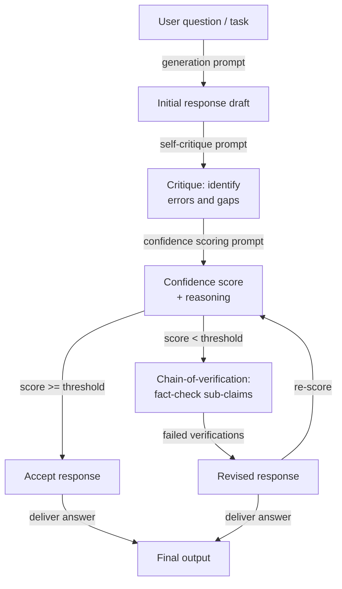

# Selbstevaluation und Kalibrierung

## Definition

Selbstevaluation bezieht sich auf das Prompting eines Sprachmodells, um seine eigene zuvor generierte Ausgabe zu kritisieren, zu verifizieren oder zu bewerten. Anstatt die erste Antwort des Modells als endgültig zu behandeln, fragt ein Selbstevaluierungsschritt das Modell, als sein eigener Reviewer zu fungieren — auf sachliche Fehler, logische Inkonsistenzen, unvollständiges Reasoning oder Nichtbefolgung von Anweisungen zu prüfen — und dann entweder Probleme zu kennzeichnen oder eine verbesserte Antwort zu generieren. Das Modell verwendet dieselben Gewichte und das Kontextfenster für beide Rollen, was sowohl eine Stärke (kein zusätzliches Modell wird benötigt) als auch eine grundlegende Einschränkung ist (das Modell kann systematische blinde Flecken haben, die es nicht selbst erkennen kann).

Kalibrierung ist die engere, quantitative Dimension der Selbstevaluation. Ein Modell ist *gut kalibriert*, wenn sein ausgedrücktes Vertrauen mit seiner empirischen Genauigkeit übereinstimmt: Wenn es sagt, es ist zu 80% sicher, sollte es ungefähr 80% der Zeit korrekt sein. Die meisten LLMs sind von Haus aus schlecht kalibriert — sie drücken hohes Vertrauen auch bei Fragen aus, die sie falsch beantworten, ein Phänomen, das als *Überconfidence* oder *epistemische Überschreitung* bekannt ist. Kalibrierungstechniken fordern das Modell auf, neben jeder Antwort einen expliziten numerischen Confidence Score zu erzeugen, und das System kann dann diesen Score verwenden, um unsichere Antworten zur menschlichen Überprüfung weiterzuleiten, zusätzliche Verifizierungsschritte auszulösen oder die Antwort ganz zu verweigern.

Zusammen behandeln Selbstevaluation und Kalibrierung zwei unterschiedliche, aber verwandte Versagensmodi. Selbstevaluation behandelt *Korrektheit*: Das Modell hat eine Antwort gegeben, aber ist sie richtig? Kalibrierung behandelt *Unsicherheitsbewusstsein*: Weiß das Modell, wenn es etwas nicht weiß? Beide sind notwendig für den Einsatz von LLMs in hochriskanten Situationen. Ein Modell, das eigene Fehler erkennt, ist zuverlässiger; ein Modell, das weiß, was es nicht weiß, ist vertrauenswürdiger. Die hier behandelten Techniken — Selbstkritik, Confidence Scoring und Chain-of-Verification — sind zunehmend standardmäßige Komponenten von Produktions-LLM-Pipelines.

## Funktionsweise



### Selbstkritik

Selbstkritik ist die einfachste Selbstevaluierungsmethode. Nach dem Generieren einer ersten Antwort fügen Sie einen zweiten Prompt hinzu, der das Modell auffordert, seine eigene Ausgabe gegen explizite Kriterien zu überprüfen. Gute Selbstkritik-Prompts sind *spezifisch* darin, was zu prüfen ist: sachliche Genauigkeit, logische Konsistenz, Vollständigkeit, Befolgung von Anweisungen, Ton oder Sicherheit. Vage Prompts wie "Ist diese Antwort gut?" erzeugen oberflächliche, untiefe Kritiken. Spezifische Prompts wie "Listen Sie sachliche Behauptungen in der Antwort auf, bei denen Sie weniger als 90% sicher sind, und erklären Sie warum" erzeugen umsetzbare Rückmeldungen.

Die Qualität der Selbstkritik verbessert sich erheblich, wenn Sie das Modell anweisen, eine adversarielle Haltung einzunehmen — aktiv nach Problemen zu suchen, anstatt zu bestätigen, dass die Antwort in Ordnung ist. Phrasen wie "Hinterfragen Sie jede Schlüsselbehauptung", "Finden Sie mindestens einen Fehler" und "Was würde ein Skeptiker einwenden?" lenken das Modell in Richtung nützlicher Kritik statt Validierung. Constitutional AI (Anthropic, 2022) systematisiert dies, indem es eine Reihe von "Prinzipien" definiert, gegen die das Modell die Antwort prüfen muss, bevor es sie überarbeitet — erstellt effektiv ein strukturiertes Kritik-Rubrik, das überprüft werden kann.

Ein kritischer Versagensmodus der Selbstkritik ist *sycophantische Validierung*: Das Modell lobt seine eigene Antwort und findet keine Probleme, besonders wenn die ursprüngliche Antwort bereits plausibel klingte, aber falsch war. Dies ist am ausgeprägtesten bei kleineren Modellen und am wenigsten ausgeprägt bei Modellen, die mit Kritikdaten feingetuned wurden. Abhilfemaßnahmen umfassen: Verwendung einer separaten Modellinstanz zur Kritik, Injektion absichtlicher Fehler in den Entwurf, um zu testen, ob der Kritikschritt sie erkennt, und das Erfordern einer strukturierten Liste statt freier Prosa für die Kritik (was "keine Probleme" zu einer schwereren Behauptung macht).

### Kalibrierung und Confidence Scoring

Confidence Scoring Prompts bitten das Modell, neben jeder Antwort eine explizite Wahrscheinlichkeit oder ordinale Bewertung zu erzeugen. Eine minimale Version ist eine einfache Anfrage, die dem Antwort-Prompt angehängt wird: "Geben Sie nach Ihrer Antwort Ihr Vertrauen als Prozentsatz von 0 bis 100 an, wobei 100 bedeutet, dass Sie sicher sind, und 0, dass Sie raten." Ausgefeiltere Versionen bitten um eine Aufschlüsselung nach Behauptung: "Bewerten Sie für jede sachliche Aussage in Ihrer Antwort Ihr Vertrauen (hoch/mittel/niedrig) und identifizieren Sie die Quelle der Unsicherheit."

Numerische Confidence Scores von LLMs müssen mit Skepsis behandelt werden. Rohe verbalisierte Wahrscheinlichkeiten sind nicht im statistischen Sinne gut kalibriert — ein Modell, das "70% sicher" sagt, hat nicht systematisch bei 70% dieser Fragen Recht. Sie sind jedoch *monoton nützlich*: Fragen, bei denen das Modell geringes Vertrauen meldet, sind tendenziell schwieriger und fehleranfälliger als Fragen, bei denen es hohes Vertrauen meldet. Das bedeutet, verbalisierte Confidence Scores sind für *Ranking* und *Routing* nützlich (senden Sie Antworten mit geringem Vertrauen zur Überprüfung), auch wenn sie für die genaue Wahrscheinlichkeitsschätzung nicht nützlich sind.

Die Kalibrierung kann im Nachhinein durch Temperature Scaling oder Platt Scaling auf die Log-Wahrscheinlichkeiten des Modells verbessert werden, aber dies erfordert einen gelabelten Datensatz. Auf Prompt-Ebene können Sie die relative Kalibrierung verbessern, indem Sie das Modell bitten, sein Vertrauen mit Referenzfragen bekannter Schwierigkeit zu vergleichen ("Ich bin so sicher wie ich es über die Hauptstadt Frankreichs wäre vs. ein obskures historisches Datum").

### Chain-of-Verification

Chain-of-Verification (CoVe, Dhuliawala et al., 2023) strukturiert die Selbstevaluation als mehrstufige Verifizierungs-Pipeline: Eine Baseline-Antwort generieren, dann explizit einen Satz von Verifizierungsfragen planen, die die Schlüsselbehauptungen in dieser Antwort bestätigen oder widerlegen würden, diese Verifizierungsfragen unabhängig beantworten (ohne auf die ursprüngliche Antwort zu schauen, um Bestätigungsverzerrung zu reduzieren), und schließlich eine überarbeitete Antwort erzeugen, die durch die Verifizierungsergebnisse informiert ist. Diese Zerlegung ist wichtig, weil sie das Modell zwingt, *Behauptungsgenerierung* von *Behauptungsverifizierung* zu trennen, was die Chance reduziert, dass derselbe Denkfehler durch beide Schritte propagiert.

Die Verifizierungsfragen sollten atomar sein — jede sollte eine einzige, spezifische Teilbehauptung testen. Wenn die Baseline-Antwort beispielsweise behauptet "Python 3.10 führte Strukturmuster-Matching und den Walross-Operator ein", sollten die Verifizierungsfragen lauten: "In welcher Python-Version wurde Strukturmuster-Matching eingeführt?" und "In welcher Python-Version wurde der Walross-Operator eingeführt?" Das unabhängige Beantworten dieser Fragen bringt oft sachliche Fehler zutage, die die ursprüngliche Antwort zuversichtlich behauptet hatte.

## Wann verwenden / Wann NICHT verwenden

| Verwenden wenn | Vermeiden wenn |
|----------------|----------------|
| Die Aufgabe hochriskant ist und sachliche Korrektheit entscheidend ist (medizinisch, rechtlich, finanziell) | Latenz eine harte Einschränkung ist — Selbstevaluation fügt mindestens eine vollständige Inferenz-Runden-Reise hinzu |
| Sie ein eingebautes Unsicherheitssignal ohne ein separates Evaluatormodell möchten | Die Domäne des Modells eine ist, bei der Selbstevaluation systematisch unzuverlässig ist (z.B. sehr aktuelle Ereignisse jenseits des Trainingsdaten-Cutoffs) |
| Die Ausgabequalität über Ausführungen hinweg sehr variabel ist und Sie einen Filtermechanismus benötigen | Die Aufgabe einfach und gut eingeschränkt ist — der Selbstevaluierungs-Overhead übersteigt den Genauigkeitsnutzen |
| Sie unsichere Antworten automatisch zur menschlichen Überprüfung weiterleiten müssen | Das Modell zu klein ist, um zuverlässige Selbstkritiken zu erzeugen (< 7B Parameter liefert typischerweise schlechte Selbstevaluation) |
| Antworten mehrere unabhängige sachliche Behauptungen enthalten, die atomar verifiziert werden können | Sie exakte Wahrscheinlichkeitskalibrierung benötigen — verbalisierte Confidence Scores sind nicht statistisch kalibriert |
| Eine Pipeline entwickelt wird, bei der das Modell seine eigenen Halluzinationen erkennen muss | Die ursprüngliche Generierung bereits maximale Genauigkeit erreicht hat — Selbstkritik fügt Kosten ohne Genauigkeitsgewinn hinzu |

## Vergleiche

| Kriterium | Selbstevaluation | Self-Consistency | Externe Evaluierung |
|-----------|-----------------|-----------------|---------------------|
| Zusätzliche Modellaufrufe | 1–3 (kritisieren, bewerten, verifizieren) | N (typischerweise 10–40) | 1 (separater Evaluator) |
| Benötigt separates Modell | Nein — dasselbe Modell überprüft sich selbst | Nein | Ja — typischerweise ein stärkeres oder spezialisiertes Modell |
| Erkennt sachliche Fehler | Ja, wenn Selbstkritik gut geprompt ist | Teilweise — inkonsistente Fakten können Mehrheitsvoting überstehen | Ja, zuverlässiger |
| Liefert Unsicherheits-Score | Ja — explizite Confidence-Bewertung | Implizit — Stimmverteilung ist ein Proxy für Vertrauen | Ja — Evaluator kann einen Score ausgeben |
| Reduziert Halluzinationen | Ja, besonders mit CoVe | Teilweise — Voting reduziert, eliminiert aber keine Halluzinationen | Zuverlässiger, erhöht aber Kosten und Latenz |
| Implementierungsaufwand | Moderat — erfordert sorgfältiges Kritik-Prompt-Design | Niedrig — N-mal sampeln und abstimmen | Hoch — erfordert Evaluator-Prompt, separaten API-Aufruf, möglicherweise ein separates Modell |
| Bester Anwendungsfall | Einzel-Turn hochriskante Fragen, sachliche Generierung | Mehrstufige Mathematik und Reasoning | Unternehmens-Pipelines mit starken Korrektheitserfordernissen |

## Code-Beispiele

### Selbstevaluation mit Kritikschritt unter Verwendung des Anthropic SDK

```python
# Self-evaluation pipeline: generate → critique → score → revise
# pip install anthropic

import os
from anthropic import Anthropic

client = Anthropic(api_key=os.environ["ANTHROPIC_API_KEY"])
MODEL = "claude-opus-4-5"


def generate_initial(question: str) -> str:
    """Step 1: Generate an initial response."""
    response = client.messages.create(
        model=MODEL,
        max_tokens=512,
        messages=[{"role": "user", "content": question}],
    )
    return response.content[0].text.strip()


def critique_response(question: str, response: str) -> str:
    """Step 2: Critique the initial response for errors and gaps."""
    prompt = f"""You are a rigorous fact-checker and critic. Review the response below and identify:
1. Any factual claims you are less than fully confident about
2. Logical inconsistencies or gaps in reasoning
3. Missing context that would be important for the user

Question: {question}

Response to critique:
{response}

Provide a structured critique. If you find no issues, you must still explain why you believe the response is correct. Do not simply validate the response."""

    critique = client.messages.create(
        model=MODEL,
        max_tokens=512,
        messages=[{"role": "user", "content": prompt}],
    )
    return critique.content[0].text.strip()


def score_confidence(question: str, response: str, critique: str) -> dict:
    """Step 3: Produce an explicit confidence score based on the critique."""
    prompt = f"""Given the question, the response, and the critique below, assign a confidence score.

Question: {question}

Response:
{response}

Critique:
{critique}

Output in this exact format:
CONFIDENCE: [integer 0-100]
REASONING: [one sentence explaining the score]
SHOULD_REVISE: [yes/no]"""

    result = client.messages.create(
        model=MODEL,
        max_tokens=128,
        messages=[{"role": "user", "content": prompt}],
    )
    text = result.content[0].text.strip()

    # Parse structured output
    confidence, reasoning, should_revise = None, "", False
    for line in text.splitlines():
        if line.startswith("CONFIDENCE:"):
            try:
                confidence = int(line.split(":", 1)[1].strip())
            except ValueError:
                pass
        elif line.startswith("REASONING:"):
            reasoning = line.split(":", 1)[1].strip()
        elif line.startswith("SHOULD_REVISE:"):
            should_revise = "yes" in line.lower()

    return {"confidence": confidence, "reasoning": reasoning, "should_revise": should_revise}


def revise_response(question: str, initial: str, critique: str) -> str:
    """Step 4: Produce a revised response informed by the critique."""
    prompt = f"""Revise the response below to address the issues identified in the critique.
Preserve correct information. Be explicit about any remaining uncertainty.

Question: {question}

Original response:
{initial}

Critique to address:
{critique}

Revised response:"""

    revised = client.messages.create(
        model=MODEL,
        max_tokens=512,
        messages=[{"role": "user", "content": prompt}],
    )
    return revised.content[0].text.strip()


def self_evaluate(question: str, confidence_threshold: int = 75) -> dict:
    """Full self-evaluation pipeline: generate, critique, score, conditionally revise."""
    print("=== Step 1: Generating initial response ===")
    initial = generate_initial(question)
    print(initial[:200], "...\n" if len(initial) > 200 else "\n")

    print("=== Step 2: Critiquing response ===")
    critique = critique_response(question, initial)
    print(critique[:200], "...\n" if len(critique) > 200 else "\n")

    print("=== Step 3: Scoring confidence ===")
    score = score_confidence(question, initial, critique)
    print(f"Confidence : {score['confidence']}")
    print(f"Reasoning  : {score['reasoning']}")
    print(f"Revise?    : {score['should_revise']}\n")

    final = initial
    if score["should_revise"] or (score["confidence"] is not None and score["confidence"] < confidence_threshold):
        print("=== Step 4: Revising response ===")
        final = revise_response(question, initial, critique)
        print(final[:200], "...\n" if len(final) > 200 else "\n")
    else:
        print("=== Step 4: Skipped — confidence above threshold ===\n")

    return {
        "question": question,
        "initial_response": initial,
        "critique": critique,
        "confidence_score": score,
        "final_response": final,
        "was_revised": final != initial,
    }


if __name__ == "__main__":
    q = ("What were the main causes of the 2008 financial crisis, "
         "and which regulatory changes were enacted in response?")
    result = self_evaluate(q, confidence_threshold=80)
    print("=== Final answer ===")
    print(result["final_response"])
    print(f"\nRevised: {result['was_revised']}")
    print(f"Confidence: {result['confidence_score']['confidence']}")
```

### Chain-of-Verification für sachliche Behauptungen

```python
# Chain-of-Verification (CoVe): decompose claims, verify independently, revise
# pip install anthropic

import os
from anthropic import Anthropic

client = Anthropic(api_key=os.environ["ANTHROPIC_API_KEY"])
MODEL = "claude-opus-4-5"


def extract_verification_questions(response: str) -> list[str]:
    """Generate atomic verification questions for each factual claim."""
    prompt = f"""Read the response below and generate a list of atomic verification questions
— one per distinct factual claim. Each question should be answerable independently
without referring to the original response.

Response:
{response}

Output as a numbered list of questions only. No preamble."""

    result = client.messages.create(
        model=MODEL,
        max_tokens=400,
        messages=[{"role": "user", "content": prompt}],
    )
    text = result.content[0].text.strip()
    questions = []
    for line in text.splitlines():
        line = line.strip()
        if line and line[0].isdigit():
            # Strip leading number and punctuation
            q = line.lstrip("0123456789.)- ").strip()
            if q:
                questions.append(q)
    return questions


def verify_claim(question: str) -> dict:
    """Answer a single verification question independently."""
    prompt = f"""Answer the following question as accurately as possible.
If you are uncertain, say so explicitly and explain why.

Question: {question}

Answer:"""

    result = client.messages.create(
        model=MODEL,
        max_tokens=150,
        messages=[{"role": "user", "content": prompt}],
    )
    answer = result.content[0].text.strip()
    uncertain = any(w in answer.lower() for w in ("uncertain", "unsure", "not sure", "don't know", "unclear"))
    return {"question": question, "answer": answer, "uncertain": uncertain}


def revise_with_verifications(original_response: str, verifications: list[dict]) -> str:
    """Produce a revised response informed by independent verification results."""
    verification_block = "\n".join(
        f"Q: {v['question']}\nA: {v['answer']}\n" for v in verifications
    )
    prompt = f"""Revise the response below using the independent verification answers provided.
Correct any inaccuracies. Where verifications indicate uncertainty, acknowledge that uncertainty explicitly.

Original response:
{original_response}

Independent verifications:
{verification_block}

Revised response:"""

    result = client.messages.create(
        model=MODEL,
        max_tokens=600,
        messages=[{"role": "user", "content": prompt}],
    )
    return result.content[0].text.strip()


def chain_of_verification(question: str) -> dict:
    """Full CoVe pipeline for a factual question."""
    # Step 1: Baseline response
    baseline = client.messages.create(
        model=MODEL,
        max_tokens=400,
        messages=[{"role": "user", "content": question}],
    ).content[0].text.strip()

    # Step 2: Plan verification questions
    vqs = extract_verification_questions(baseline)
    print(f"Generated {len(vqs)} verification questions.")

    # Step 3: Answer each verification question independently
    verifications = [verify_claim(q) for q in vqs]
    uncertain_count = sum(1 for v in verifications if v["uncertain"])
    print(f"Uncertain claims: {uncertain_count}/{len(verifications)}")

    # Step 4: Revise using verification results
    revised = revise_with_verifications(baseline, verifications)

    return {
        "question": question,
        "baseline": baseline,
        "verification_questions": vqs,
        "verifications": verifications,
        "revised": revised,
        "uncertain_claims": uncertain_count,
    }


if __name__ == "__main__":
    q = "Summarize the key milestones in the development of transformer models from 2017 to 2023."
    result = chain_of_verification(q)
    print("\n=== Baseline ===")
    print(result["baseline"])
    print("\n=== Revised (after CoVe) ===")
    print(result["revised"])
    print(f"\nUncertain claims flagged: {result['uncertain_claims']}/{len(result['verifications'])}")
```

## Praktische Ressourcen

- [Self-Refine: Iterative Refinement with Self-Feedback (Madaan et al., 2023)](https://arxiv.org/abs/2303.17651) — Führt iterative Selbstkritik und Überarbeitung über sieben verschiedene Textgenerierungsaufgaben ein und evaluiert diese; die grundlegende Referenz für Selbstevaluierungs-Pipelines.
- [Chain-of-Verification Reduces Hallucination in Large Language Models (Dhuliawala et al., 2023)](https://arxiv.org/abs/2309.11495) — Schlägt CoVe vor, den in diesem Artikel beschriebenen strukturierten Verifizierungsplanungsansatz, mit Experimenten zur listenbasierten Fragen-Antwort und Langform-Generierung.
- [Constitutional AI: Harmlessness from AI Feedback (Bai et al., 2022)](https://arxiv.org/abs/2212.08073) — Demonstriert systematische Selbstkritik gegen einen definierten Satz von Prinzipien im großen Maßstab; der Produktionspräzedenzfall für strukturierte Selbstevaluierungs-Rubriken.
- [Language Models (Mostly) Know What They Know (Kadavath et al., 2022)](https://arxiv.org/abs/2207.05221) — Untersucht, ob LLMs ihre eigene Unsicherheit genau berichten können; zeigt, dass Kalibrierung möglich, aber unvollkommen ist, und liefert die empirische Grundlage für Confidence-Scoring-Techniken.
- [Calibration of Large Language Models Using Their Generations (Kapoor et al., 2024)](https://arxiv.org/abs/2403.07221) — Überblickt Post-hoc-Kalibrierungsmethoden einschließlich verbalisiertem Vertrauen und vergleicht diese mit Log-Wahrscheinlichkeits-Baselines über GPT-4 und Claude-Familien.

## Siehe auch

- [Prompt Engineering](/docs/prompt-engineering)
- [Self-Consistency](/docs/prompt-engineering/self-consistency)
- [Debiasing-Techniken](/docs/prompt-engineering/debiasing-techniques)
- [Evaluierungsmetriken](/docs/evaluation-metrics)
