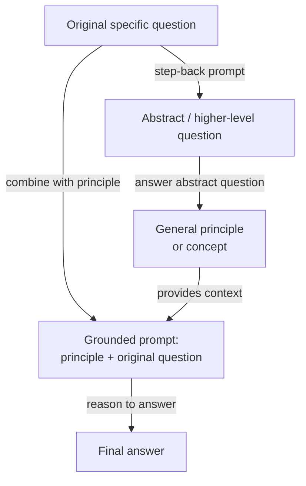

# Step-Back Prompting

## Definition

Step-Back Prompting ist eine zweistufige Prompting-Technik, die von Zheng et al. (2023) bei Google DeepMind eingeführt wurde. Die Kernidee ist täuschend einfach: Bevor das Modell eine spezifische, möglicherweise schwierige Frage beantwortet, wird es zunächst nach einer abstrakteren, übergeordneten Version derselben Frage gefragt — und dann wird die Antwort des Modells auf diese abstrakte Frage als Kontext verwendet, wenn die ursprüngliche beantwortet wird. Die Technik basiert auf der Beobachtung, dass LLMs bei spezifischen sachlichen oder Reasoning-Fragen oft nicht scheitern, weil ihnen das relevante Wissen fehlt, sondern weil die Spezifität der Frage den falschen "Abrufkontext" in den internen Repräsentationen des Modells aktiviert. Ein Schritt zurück zu einer höheren Abstraktionsebene aktiviert breiteres, zuverlässigeres Wissen, das dann die abschließende Antwort begründet.

Die Erkenntnis hinter Step-Back Prompting stammt aus der Art, wie Experten schwierige Probleme angehen. Ein Physiker, der gefragt wird "Was passiert mit dem Druck in einem Gas, wenn die Temperatur bei konstantem Volumen erhöht wird?", könnte zunächst das ideale Gasgesetz (PV = nRT) als allgemeinen Hintergrund abrufen, bevor er es auf den spezifischen Fall anwendet — anstatt direkt zu einer Antwort zu springen, die riskiert, Variablen zu verwechseln. Step-Back Prompting weist das Modell an, dasselbe zu tun: Ein allgemeines Prinzip oder Konzept zu generieren, das der spezifischen Frage zugrunde liegt, und dann von diesem Prinzip zur Antwort zu schließen. Dies fügt einen konzeptionellen Gerüstschritt hinzu, der die Chance reduziert, dass oberflächliches Musterabgleichen zu einer falschen Antwort führt.

Im Originalpaper wird Step-Back Prompting mit Few-Shot-Beispielen demonstriert, die das Modell lehren, wie es für eine gegebene Domäne angemessen "zurückgeht". Bei Physikfragen fragt die abstrakte Frage typischerweise nach dem relevanten physikalischen Gesetz oder Prinzip. Bei Geschichtsfragen fragt sie nach dem breiteren historischen Kontext. Bei medizinischen Fragen fragt sie nach der relevanten Physiologie. Die Technik ist modell-agnostisch und erfordert kein Fine-Tuning — es ist ausschließlich eine Prompt-Level-Intervention. Auf den Benchmarks MMLU und TimeQA übertrifft Step-Back Prompting sowohl Standard-Chain-of-Thought als auch Retrieval-Augmented-Baselines bei schwierigen, wissensintensiven Fragen.

## Funktionsweise



### Schritt 1 — Die abstrakte Frage generieren

Der erste Schritt besteht darin, das Modell zu prompten, eine übergeordnete Frage zu identifizieren, die die ursprüngliche einschließt. Dies wird typischerweise mit einem Few-Shot-Prompt durchgeführt, der domänenspezifische Beispiele von (spezifische Frage, abstrakte Frage)-Paaren enthält. Wenn die ursprüngliche Frage beispielsweise "Was ist der Schmelzpunkt von Galliumarsenid?" ist, könnte die abstrakte Frage lauten "Was sind die thermodynamischen und kristallographischen Eigenschaften von III-V-Halbleitern?" Die abstrakte Frage sollte allgemein genug sein, um breites relevantes Wissen zu aktivieren, aber nicht so allgemein, dass sie uninformativ ist. Das richtige Abstraktionsniveau zu finden ist die primäre Prompt-Engineering-Herausforderung, und Few-Shot-Beispiele sind unerlässlich, um das Modell auf das angemessene Abstraktionsniveau für eine bestimmte Domäne zu lenken.

### Schritt 2 — Die abstrakte Frage beantworten

Mit der generierten abstrakten Frage beantwortet das Modell diese. Diese Antwort nimmt typischerweise die Form eines allgemeinen Prinzips, einer Definition, eines physikalischen Gesetzes oder einer Zusammenfassung des relevanten Hintergrundkontexts an. Die Schlüsseleigenschaft dieses Schritts ist, dass die abstrakte Frage für das Modell normalerweise einfacher zuverlässig zu beantworten ist als die ursprüngliche spezifische Frage — sie aktiviert gut gelernte, sachlich fundierte Repräsentationen statt Randfälle oder spezifische numerische Fakten, die anfälliger für Halluzinationen sind. Die Antwort auf die abstrakte Frage wird zu einem Kontextblock, der den abschließenden Reasoning-Schritt einschränkt und informiert.

### Schritt 3 — Die ursprüngliche Frage mit der Abstraktion als Kontext beantworten

Der abschließende Schritt kombiniert das abstrakte Prinzip mit der ursprünglichen spezifischen Frage in einem einzigen Prompt: "Gegeben diesen Hintergrund: [abstrakte Antwort], beantworte die spezifische Frage: [ursprüngliche Frage]." Das Modell schlussfolgert jetzt von einer soliden konzeptionellen Grundlage aus, anstatt zu versuchen, einen spezifischen Fakt direkt abzurufen. Dies reduziert das Halluzinationsrisiko bei faktenintensiven Fragen und verbessert die logische Konsistenz mehrstufigen Reasonings. Im Originalpaper verwendet dieser abschließende Schritt auch Chain-of-Thought, was Step-Back Prompting mit CoT kombinierbar macht: Der Abstraktionsschritt begründet das Reasoning, und CoT macht es explizit.

## Wann verwenden / Wann NICHT verwenden

| Verwenden wenn | Vermeiden wenn |
|----------------|----------------|
| Die Frage spezifisches sachliches Wissen erfordert, bei dem das Modell anfällig für Halluzinationen ist | Einfache Fragen, bei denen direktes Prompting bereits zuverlässig funktioniert |
| Die Domäne eine klare Hierarchie von allgemeinen Prinzipien zu spezifischen Instanzen hat (Physik, Chemie, Geschichte) | Die abstrakte Frage schwer zu definieren ist — Aufgaben ohne eine natürliche allgemeine/spezifische Unterscheidung |
| Das Modell spezifische Fragen inkonsistent beantwortet, bei allgemeinen Prinzipien aber zuverlässig ist | Latenz kritisch ist — zwei LLM-Aufrufe verdoppeln die Antwortzeit |
| Sie Halluzinationen bei wissensintensiven Benchmarks ohne RAG reduzieren möchten | Die Frage rein mathematisch oder symbolisch ist — CoT allein ist normalerweise ausreichend |
| Few-Shot-Beispiele für die Domäne verfügbar sind, um das Modell das Zurückgehen zu lehren | Das Token-Budget eng ist — die abstrakte Antwort fügt Tokens zum abschließenden Prompt hinzu |

## Vergleiche

| Kriterium | Step-Back Prompting | Chain-of-Thought (CoT) | Self-Consistency |
|-----------|--------------------|-----------------------|-----------------|
| Anzahl der LLM-Aufrufe | 2 (abstrakt + abschließend) | 1 | N (typischerweise 10–40) |
| Kernmechanismus | Abstraktion zu Begründung zu Reasoning | Explizites schrittweises Reasoning | Mehrere unabhängige Pfade + Mehrheitsvoting |
| Primärer Vorteil | Reduziert Halluzinationen bei wissensintensiven Fragen | Verbessert mehrstufiges logisches Reasoning | Reduziert Varianz bei Reasoning-Ergebnissen |
| Kosten | 2x Baseline | 1x Baseline | Nx Baseline |
| Erfordert Few-Shot-Beispiele | Ja — um das Step-Back-Verhalten zu lehren | Ja — für beste Ergebnisse | Ja — Few-Shot-CoT als Basis-Prompt |
| Bester Aufgabentyp | Wissensintensive Fragen, Wissenschaft, Geschichte | Mathematik, Logik, Code | Mathematik, symbolisches Reasoning, sachliche Fragen |
| Kombinierbar mit CoT | Ja — empfohlen, beides zu kombinieren | N/A | Ja — Basis-Prompt verwendet CoT |
| Hinweis | Ergänzend zu Self-Consistency; beide können gestapelt werden für weitere Gewinne | Einfachere Baseline — vor Step-Back versuchen | Teurer; verwenden, wenn hohe Genauigkeit Nx Kosten rechtfertigt |

## Code-Beispiele

### Step-Back Prompting mit OpenAI — Zwei-Call-Implementierung

```python
# Step-back prompting: abstraction-then-answer, two API calls
# pip install openai

import os
from openai import OpenAI

client = OpenAI(api_key=os.environ["OPENAI_API_KEY"])

STEP_BACK_FEW_SHOT = """Help identify a broader abstract question underpinning a specific one.

Original: At what temperature does gallium arsenide melt?
Step-back: What are the thermodynamic properties of III-V semiconductors?

Original: What was the immediate cause of the US entering World War I?
Step-back: What geopolitical tensions shaped US foreign policy before WWI?

Original: Patient has peripheral edema, elevated JVP, orthopnea. Diagnosis?
Step-back: What are the hallmark signs of right-sided and left-sided heart failure?

Original: {question}
Step-back:"""

GROUNDED = """Using the background context below, answer the specific question step by step.

Background (general principles):
{background}

Specific question:
{question}

Let's think step by step:"""


def generate_step_back(question: str) -> str:
    resp = client.chat.completions.create(
        model="gpt-4o",
        messages=[{"role": "user", "content": STEP_BACK_FEW_SHOT.format(question=question)}],
        temperature=0, max_tokens=150,
    )
    return resp.choices[0].message.content.strip()


def answer_abstract(abstract_q: str) -> str:
    resp = client.chat.completions.create(
        model="gpt-4o",
        messages=[
            {"role": "system", "content": "Answer with accurate background principles (3-5 sentences)."},
            {"role": "user", "content": abstract_q},
        ],
        temperature=0, max_tokens=300,
    )
    return resp.choices[0].message.content.strip()


def answer_with_step_back(question: str) -> str:
    abstract_q = generate_step_back(question)
    background  = answer_abstract(abstract_q)
    resp = client.chat.completions.create(
        model="gpt-4o",
        messages=[{"role": "user", "content": GROUNDED.format(
            background=background, question=question)}],
        temperature=0, max_tokens=500,
    )
    return resp.choices[0].message.content.strip()


if __name__ == "__main__":
    q = "Why did Soviet collectivization in the early 1930s lead to famine in Ukraine?"
    print(answer_with_step_back(q))
```

### Step-Back Prompting mit Anthropic — Einzelaufruf mit strukturierter Ausgabe

```python
# Step-back prompting in one Anthropic call: structured three-part format
# pip install anthropic

import os
import anthropic

client = anthropic.Anthropic(api_key=os.environ["ANTHROPIC_API_KEY"])

SYSTEM = """You are an expert reasoning assistant. For each question, respond in three parts:

## Abstract question:
A broader, general question capturing the underlying principle.

## Background context:
Answer the abstract question with relevant principles and definitions (3-5 sentences).

## Final answer:
Use the background to reason step-by-step to the specific answer."""

EXAMPLE = [
    {"role": "user", "content": "Ideal gas: 2 mol, 300 K, 0.05 m^3. What is the pressure?"},
    {"role": "assistant", "content": """## Abstract question:
What is the ideal gas law and how does it relate P, V, n, and T?

## Background context:
PV = nRT, where P is pressure (Pa), V is volume (m^3), n is moles, R = 8.314 J/mol/K, T is Kelvin. Rearranged: P = nRT / V.

## Final answer:
P = (2 x 8.314 x 300) / 0.05 = 99,768 Pa (about 0.985 atm)."""},
]


def step_back(question: str) -> str:
    response = client.messages.create(
        model="claude-opus-4-5",
        max_tokens=800,
        system=SYSTEM,
        messages=EXAMPLE + [{"role": "user", "content": question}],
    )
    return response.content[0].text


if __name__ == "__main__":
    q = "A patient is given furosemide. How does it cause hypokalemia?"
    print(step_back(q))
```

## Praktische Ressourcen

- [Take a Step Back: Evoking Reasoning via Abstraction in Large Language Models (Zheng et al., 2023)](https://arxiv.org/abs/2310.06117) — Originalpaper von Google DeepMind mit Benchmarks auf MMLU, TimeQA und MedQA.
- [Chain-of-Thought Prompting Elicits Reasoning in Large Language Models (Wei et al., 2022)](https://arxiv.org/abs/2201.11903) — Das CoT-Paper, auf dem Step-Back Prompting aufbaut und gegen das es evaluiert wird.
- [Anthropic — Prompt Engineering Übersicht](https://docs.anthropic.com/en/docs/build-with-claude/prompt-engineering/overview) — Behandelt System-Prompt-Strukturierung und Few-Shot-Beispiel-Design.
- [OpenAI — Prompt Engineering Guide](https://platform.openai.com/docs/guides/prompt-engineering) — Praktische Anleitung zu Few-Shot-Prompting, Reasoning-Strategien und Ausgabestruktur.

## Siehe auch

- [Prompt Engineering](/docs/prompt-engineering)
- [Chain-of-Thought (CoT)](/docs/reasoning-patterns/cot)
- [Self-Consistency](/docs/prompt-engineering/self-consistency)
