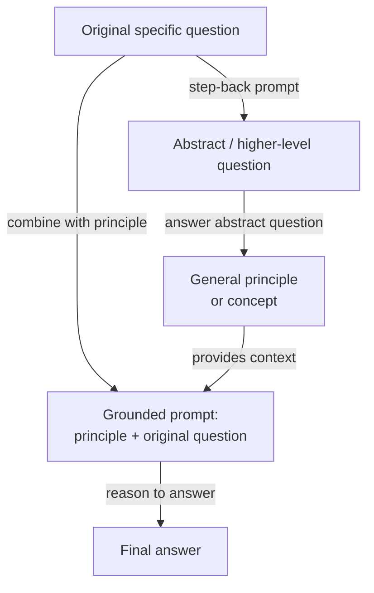

# Step-Back Prompting

## Definition

Step-Back Prompting ist eine zweistufige Prompting-Technik, die von Zheng et al. (2023) bei Google DeepMind eingeführt wurde. Die Kernidee ist täuschend einfach: Bevor das Modell aufgefordert wird, eine spezifische, potenziell schwierige Frage zu beantworten, stellt man ihm zunächst eine abstraktere, übergeordnetere Version derselben Frage — und verwendet dann die Antwort des Modells auf diese abstrakte Frage als Kontext bei der Beantwortung der ursprünglichen. Die Technik basiert auf der Beobachtung, dass LLMs bei spezifischen Fakten- oder Schlussfolgerungsfragen oft nicht scheitern, weil ihnen das relevante Wissen fehlt, sondern weil die Spezifität der Frage den falschen „Abruf-Kontext" in den internen Repräsentationen des Modells aktiviert. Das Zurücktreten auf eine höhere Abstraktionsebene aktiviert breiteres, zuverlässigeres Wissen, das dann die endgültige Antwort verankert.

Die Erkenntnis hinter Step-Back Prompting basiert auf der Herangehensweise von Experten an schwierige Probleme. Ein Physiker, der gefragt wird: „Was passiert mit dem Druck in einem Gas, wenn die Temperatur bei konstantem Volumen erhöht wird?", würde zunächst das ideale Gasgesetz (PV = nRT) als allgemeinen Hintergrund abrufen, bevor er es auf den spezifischen Fall anwendet — anstatt direkt zu einer Antwort zu springen, die riskiert, Variablen zu verwechseln. Step-Back Prompting weist das Modell an, dasselbe zu tun: ein allgemeines Prinzip oder Konzept zu generieren, das der spezifischen Frage zugrunde liegt, und dann von diesem Prinzip aus zur Antwort zu schlussfolgern. Dies fügt effektiv einen konzeptuellen Gerüstschritt hinzu, der das Risiko reduziert, dass oberflächliches Mustererkennen zu einer falschen Antwort führt.

Im Originalpapier wird Step-Back Prompting mit Few-Shot-Beispielen demonstriert, die dem Modell beibringen, wie es für eine gegebene Domäne angemessen „zurücktreten" soll. Bei Physikfragen fragt die abstrakte Frage typischerweise nach dem relevanten physikalischen Gesetz oder Prinzip. Bei Geschichtsfragen fragt sie nach dem breiteren historischen Kontext. Bei medizinischen Fragen fragt sie nach der relevanten Physiologie. Die Technik ist modell-agnostisch und erfordert kein Fine-Tuning — sie ist rein eine Prompt-Level-Intervention. Auf den MMLU- und TimeQA-Benchmarks übertrifft Step-Back Prompting sowohl Standard-Chain-of-Thought als auch retrieval-augmentierte Baselines bei schwierigen, wissensintensiven Fragen.

## Funktionsweise



### Schritt 1 — Die abstrakte Frage generieren

Der erste Schritt besteht darin, das Modell aufzufordern, eine übergeordnete Frage zu identifizieren, die die ursprüngliche umfasst. Dies geschieht typischerweise mit einem Few-Shot-Prompt, der domänenspezifische Beispiele von (spezifische Frage, abstrakte Frage)-Paaren enthält. Wenn die ursprüngliche Frage beispielsweise „Was ist der Schmelzpunkt von Galliumarsenid?" lautet, könnte die abstrakte Frage lauten: „Was sind die thermodynamischen und kristallographischen Eigenschaften von III-V-Halbleitern?" Die abstrakte Frage sollte allgemein genug sein, um breites relevantes Wissen zu aktivieren, aber nicht so allgemein, dass sie uninformativ wird. Das richtige Abstraktionsniveau zu finden, ist die primäre Prompt-Engineering-Herausforderung, und Few-Shot-Beispiele sind wesentlich dafür, das Modell zum geeigneten Abstraktionsniveau für eine gegebene Domäne zu lenken.

### Schritt 2 — Die abstrakte Frage beantworten

Mit der generierten abstrakten Frage beantwortet das Modell sie. Diese Antwort nimmt typischerweise die Form eines allgemeinen Prinzips, einer Definition, eines physikalischen Gesetzes oder einer Zusammenfassung relevanten Hintergrundkontexts an. Die Schlüsseleigenschaft dieses Schritts ist, dass die abstrakte Frage für das Modell üblicherweise zuverlässiger zu beantworten ist als die ursprüngliche spezifische Frage — sie aktiviert gut erlernte, faktisch fundierte Repräsentationen statt Randfälle oder spezifische numerische Fakten, die anfälliger für Halluzinationen sind. Die Antwort auf die abstrakte Frage wird zu einem Kontextblock, der den abschließenden Schlussfolgerungsschritt einschränkt und informiert.

### Schritt 3 — Die ursprüngliche Frage mit der Abstraktion als Kontext beantworten

Der abschließende Schritt kombiniert das abstrakte Prinzip mit der ursprünglichen spezifischen Frage in einem einzigen Prompt: „Gegeben diesen Hintergrund: [abstrakte Antwort], beantworte die spezifische Frage: [ursprüngliche Frage]." Das Modell schlussfolgert nun von einer soliden konzeptuellen Grundlage aus, anstatt einen direkten Abruf eines spezifischen Fakts zu versuchen. Dies reduziert das Risiko von Halluzinationen bei faktenintensiven Fragen und verbessert die logische Konsistenz des mehrstufigen Schlussfolgerns. Im Originalpapier verwendet dieser abschließende Schritt auch Chain-of-Thought, was Step-Back Prompting kompositionierbar mit CoT macht: Der Abstraktionsschritt verankert das Schlussfolgern, und CoT macht es explizit.

## Wann verwenden / Wann NICHT verwenden

| Verwenden wenn | Vermeiden wenn |
|----------|------------|
| Die Frage spezifisches Faktenwissen erfordert, bei dem das Modell zur Halluzination neigt | Einfache Fragen, bei denen direktes Prompting bereits zuverlässig funktioniert |
| Die Domäne eine klare Hierarchie von allgemeinen Prinzipien zu spezifischen Instanzen hat (Physik, Chemie, Geschichte) | Die abstrakte Frage schwer zu definieren ist — Aufgaben ohne eine natürliche allgemeine/spezifische Unterscheidung |
| Das Modell spezifische Fragen inkonsistent beantwortet, aber bei allgemeinen Prinzipien zuverlässig ist | Latenz kritisch ist — zwei LLM-Aufrufe verdoppeln die Antwortzeit |
| Halluzinationen bei wissensintensiven Benchmarks ohne RAG reduziert werden sollen | Die Frage rein mathematisch oder symbolisch ist — CoT allein ist üblicherweise ausreichend |
| Few-Shot-Beispiele für die Domäne verfügbar sind, um dem Modell das Zurücktreten beizubringen | Das Token-Budget knapp ist — die abstrakte Antwort fügt dem endgültigen Prompt Token hinzu |

## Vergleiche

| Kriterium | Step-Back Prompting | Chain-of-Thought (CoT) | Self-Consistency |
|-----------|--------------------|-----------------------|-----------------|
| Anzahl der LLM-Aufrufe | 2 (abstrakt + abschließend) | 1 | N (typischerweise 10–40) |
| Kernmechanismus | Abstraktion zu Verankerung zu Schlussfolgern | Explizites Schritt-für-Schritt-Schlussfolgern | Mehrere unabhängige Pfade + Mehrheitsvoting |
| Primärer Vorteil | Reduziert Halluzinationen bei wissensintensiven Fragen | Verbessert mehrstufiges logisches Schlussfolgern | Reduziert Varianz in Schlussfolgerungsergebnissen |
| Kosten | 2x Baseline | 1x Baseline | Nx Baseline |
| Benötigt Few-Shot-Beispiele | Ja — um das Step-Back-Verhalten beizubringen | Ja — für beste Ergebnisse | Ja — Few-Shot-CoT als Basis-Prompt |
| Bestes Aufgabentyp | Wissensintensives Fragen und Antworten, Wissenschaft, Geschichte | Mathematik, Logik, Code | Mathematik, symbolisches Schlussfolgern, sachliche Fragen und Antworten |
| Kompositionierbar mit CoT | Ja — empfohlen, beides zu kombinieren | N/A | Ja — Basis-Prompt verwendet CoT |
| Hinweis | Komplementär zu Self-Consistency; beides kann für weitere Gewinne gestapelt werden | Einfacherer Ausgangspunkt — vor Step-Back ausprobieren | Teurer; verwenden wenn hohe Genauigkeit Nx-Kosten rechtfertigt |

## Code-Beispiele

### Step-Back Prompting mit OpenAI — Zwei-Aufruf-Implementierung

```python
# Step-back prompting: abstraction-then-answer, two API calls
# pip install openai

import os
from openai import OpenAI

client = OpenAI(api_key=os.environ["OPENAI_API_KEY"])

STEP_BACK_FEW_SHOT = """Help identify a broader abstract question underpinning a specific one.

Original: At what temperature does gallium arsenide melt?
Step-back: What are the thermodynamic properties of III-V semiconductors?

Original: What was the immediate cause of the US entering World War I?
Step-back: What geopolitical tensions shaped US foreign policy before WWI?

Original: Patient has peripheral edema, elevated JVP, orthopnea. Diagnosis?
Step-back: What are the hallmark signs of right-sided and left-sided heart failure?

Original: {question}
Step-back:"""

GROUNDED = """Using the background context below, answer the specific question step by step.

Background (general principles):
{background}

Specific question:
{question}

Let's think step by step:"""


def generate_step_back(question: str) -> str:
    resp = client.chat.completions.create(
        model="gpt-4o",
        messages=[{"role": "user", "content": STEP_BACK_FEW_SHOT.format(question=question)}],
        temperature=0, max_tokens=150,
    )
    return resp.choices[0].message.content.strip()


def answer_abstract(abstract_q: str) -> str:
    resp = client.chat.completions.create(
        model="gpt-4o",
        messages=[
            {"role": "system", "content": "Answer with accurate background principles (3-5 sentences)."},
            {"role": "user", "content": abstract_q},
        ],
        temperature=0, max_tokens=300,
    )
    return resp.choices[0].message.content.strip()


def answer_with_step_back(question: str) -> str:
    abstract_q = generate_step_back(question)
    background  = answer_abstract(abstract_q)
    resp = client.chat.completions.create(
        model="gpt-4o",
        messages=[{"role": "user", "content": GROUNDED.format(
            background=background, question=question)}],
        temperature=0, max_tokens=500,
    )
    return resp.choices[0].message.content.strip()


if __name__ == "__main__":
    q = "Why did Soviet collectivization in the early 1930s lead to famine in Ukraine?"
    print(answer_with_step_back(q))
```

### Step-Back Prompting mit Anthropic — Einzelaufruf mit strukturierter Ausgabe

```python
# Step-back prompting in one Anthropic call: structured three-part format
# pip install anthropic

import os
import anthropic

client = anthropic.Anthropic(api_key=os.environ["ANTHROPIC_API_KEY"])

SYSTEM = """You are an expert reasoning assistant. For each question, respond in three parts:

## Abstract question:
A broader, general question capturing the underlying principle.

## Background context:
Answer the abstract question with relevant principles and definitions (3-5 sentences).

## Final answer:
Use the background to reason step-by-step to the specific answer."""

EXAMPLE = [
    {"role": "user", "content": "Ideal gas: 2 mol, 300 K, 0.05 m^3. What is the pressure?"},
    {"role": "assistant", "content": """## Abstract question:
What is the ideal gas law and how does it relate P, V, n, and T?

## Background context:
PV = nRT, where P is pressure (Pa), V is volume (m^3), n is moles, R = 8.314 J/mol/K, T is Kelvin. Rearranged: P = nRT / V.

## Final answer:
P = (2 x 8.314 x 300) / 0.05 = 99,768 Pa (about 0.985 atm)."""},
]


def step_back(question: str) -> str:
    response = client.messages.create(
        model="claude-opus-4-5",
        max_tokens=800,
        system=SYSTEM,
        messages=EXAMPLE + [{"role": "user", "content": question}],
    )
    return response.content[0].text


if __name__ == "__main__":
    q = "A patient is given furosemide. How does it cause hypokalemia?"
    print(step_back(q))
```

## Praktische Ressourcen

- [Take a Step Back: Evoking Reasoning via Abstraction in Large Language Models (Zheng et al., 2023)](https://arxiv.org/abs/2310.06117) — Originales Google DeepMind-Papier mit Benchmarks auf MMLU, TimeQA und MedQA.
- [Chain-of-Thought Prompting Elicits Reasoning in Large Language Models (Wei et al., 2022)](https://arxiv.org/abs/2201.11903) — Das CoT-Papier, auf dem Step-Back Prompting aufbaut und gegen das es evaluiert wird.
- [Anthropic — Prompt Engineering Übersicht](https://docs.anthropic.com/en/docs/build-with-claude/prompt-engineering/overview) — Umfasst Systemprompt-Strukturierung und Few-Shot-Beispieldesign.
- [OpenAI — Prompt Engineering Guide](https://platform.openai.com/docs/guides/prompt-engineering) — Praktische Anleitung zu Few-Shot-Prompting, Schlussfolgerungsstrategien und Ausgabestruktur.

## Siehe auch

- [Prompt Engineering](/docs/prompt-engineering)
- [Chain-of-Thought (CoT)](/docs/reasoning-patterns/cot)
- [Self-Consistency](/docs/prompt-engineering/self-consistency)
