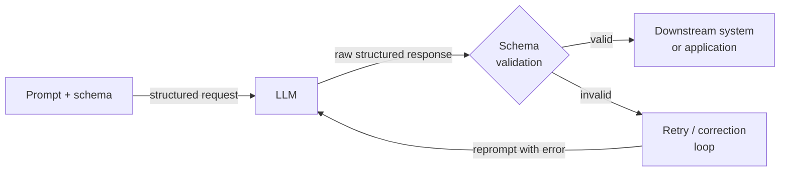

# Strukturierte Ausgaben

## Definition

Strukturierte Ausgaben bezeichnet die Praxis, ein LLM zu zwingen oder zu leiten, maschinenlesbare Daten zu erzeugen — meistens JSON — anstatt freien Fließtext. In einer Produktionspipeline ist die Lücke zwischen einem LLM, das eine korrekte Antwort zurückgibt, und einem, das eine korrekte Antwort in einem parsbaren Format zurückgibt, die Lücke zwischen einer Toy-Demo und einem einsetzbaren System. Ein nachgelagerter Dienst, der einen Produktnamen, ein Sentiment-Label oder eine Liste von Aktionspunkten extrahieren muss, kann nicht zuverlässig auf unstrukturiertem Text operieren; er benötigt eine garantierte Form, die er deserialisieren, validieren und weiterleiten kann.

Die Evolution der strukturierten Ausgabetechniken verfolgt die Reifung von LLM-APIs. Frühe Systeme stützten sich auf fragile Prompt-Anweisungen ("antworte nur mit validem JSON") kombiniert mit Regex-Parsing und Retry-Schleifen. Dieser Ansatz scheiterte, wenn das Modell eine erklärende Einleitung hinzufügte, das JSON in einem Markdown-Code-Block einwickelte oder unter Randfällen das Schema subtil verletzte. Die nächste Generation führte Function Calling (OpenAI, Mitte 2023) und Tool Use (Anthropic) ein, die die Schemadefinition aus dem Prompt herausverschieben und in einen erstklassigen API-Parameter einbringen, sodass das Modell explizit trainiert und am Ausgabevertrag eingeschränkt werden kann. Zuletzt führten Anbieter striktes grammatikbeschränktes Decoding ein, das die Schema-Compliance zu einer harten Garantie auf Token-Ebene macht, nicht zu einer weichen Prompt-Anweisung.

Das Verständnis, welche Technik anzuwenden ist — und warum — ist für jeden wichtig, der Pipelines entwickelt, die von LLM-Ausgaben abhängen. JSON-Modus ist der einfachste Einstiegspunkt, bietet aber keine Schema-Validierung. Function Calling / Tool Use bietet ein typisiertes Schema und strukturiertes Parsing in der API-Antwort, erfordert aber das vorherige Definieren von Tool-Schemas. Pydantic-basierte Extraktionsbibliotheken (Instructor, LangChain Output Parser) sitzen über der API-Schicht und fügen Python-Level-Validierung, automatischen Retry bei Schema-Verletzungen und ergonomische Modelldefinition hinzu. Die richtige Wahl hängt von der Komplexität des Zielschemas, der Kritikalität der Validierung und dem gewünschten Ausmaß an Retry/Korrektur-Logik der Bibliothek ab.

## Funktionsweise



### JSON-Modus

JSON-Modus ist der grundlegendste Mechanismus für strukturierte Ausgaben. Wenn aktiviert, ist das Modell eingeschränkt, nur valides JSON als seine Top-Level-Ausgabe zu erzeugen. In der API von OpenAI wird dies durch Setzen von `response_format={"type": "json_object"}` auf der Anfrage aktiviert; in der API von Anthropic kann ein ähnlicher Effekt durch Vorfüllen des Assistenten-Turns mit `{` erzielt werden. JSON-Modus garantiert syntaktische Gültigkeit (die Ausgabe kann immer durch `json.loads` geparst werden), validiert aber nicht gegen ein Schema — das Modell könnte `{"result": "yes"}` zurückgeben, wenn Sie `{"score": 0.87, "label": "positive", "confidence": 0.92}` erwartet haben. Sie müssen Schema-Validierung (z.B. mit Pydantic oder `jsonschema`) als separaten Schritt hinzufügen und Retry-Logik für Schema-Fehlanpassungen implementieren. JSON-Modus eignet sich am besten für einfache, flache Strukturen, bei denen das Risiko einer Schema-Drift gering ist.

### Function Calling und Tool Use

Function Calling (OpenAI) und Tool Use (Anthropic) stellen einen qualitativen Schritt nach vorne dar. Anstatt das Ausgabeschema in die Systemnachricht einzubetten, deklarieren Sie es als Tool- oder Funktionsdefinition mit einem JSON-Schema-Objekt. Die API gibt die Ausgabe des Modells als strukturierten `tool_use`-Block mit einem geparsten `input`-Dict zurück, getrennt von jedem Text-Inhalt. Diese Entkopplung ist bedeutsam: Text und strukturierte Daten befinden sich in verschiedenen Teilen der Antwort, und die API selbst behandelt das JSON-Parsing. Sie erhalten Typ-Annotationen für jedes Feld, Semantiken für erforderliche vs. optionale Felder, Enum-Einschränkungen und Unterstützung für verschachtelte Objekte — alles durch das Schema auf API-Ebene erzwungen. Der Strict-Modus von OpenAI (2024) geht weiter, indem er beschränktes Decoding aktiviert, was Schema-Adherenz zu einer harten Garantie macht. Tool Use ist die richtige Wahl für die Extraktion strukturierter Daten aus Dokumenten, das Befüllen von Datenbankeinträgen oder das Auslösen nachgelagerter API-Aufrufe mit typisierten Argumenten.

### Schema-basierte Extraktion mit Pydantic

Bibliotheken wie [Instructor](https://github.com/jxnl/instructor) und LangChains Output Parser umhüllen die Function Calling / Tool Use API mit einer Pydantic-first-Schnittstelle. Sie definieren Ihr Ausgabeschema als `pydantic.BaseModel`-Unterklasse und übergeben die Modellklasse an die Bibliothek; sie generiert automatisch das JSON-Schema für die Tool-Definition, ruft die API auf, validiert die Antwort gegen Ihr Modell und versucht es mit Validierungsfehler-Feedback erneut, wenn das Schema verletzt wird. Dieser Ansatz ist für Python-Praktiker am ergonomischsten, weil die Ausgabe ein vollständig typisiertes Python-Objekt ist — kein rohes Dict — mit Feldvalidierung, Standardwerten und verschachtelter Modellunterstützung. Automatischer Retry mit Fehlerkontext reduziert die Rate stiller Schema-Verletzungen dramatisch. Die Kosten sind eine zusätzliche Bibliotheksabhängigkeit und etwas mehr Token-Verbrauch, wenn Validierungsfehler Retry-Nachrichten auslösen.

## Wann verwenden / Wann NICHT verwenden

| Verwenden wenn | Vermeiden wenn |
|----------------|----------------|
| Die LLM-Ausgabe programmatisch verarbeitet werden muss (API-Antwort, DB-Insert, Workflow-Trigger) | Die Ausgabe nur von Menschen gelesen wird und kein nachgelagertes Parsing benötigt wird |
| Sie ein typisiertes, validiertes Python-Objekt statt eines rohen Strings benötigen | Das Schema so einfach ist (einzelner String oder Zahl), dass Klartext einfacher zu parsen ist |
| Pipelines entwickelt werden, bei denen Schema-Verletzungen stille Datenkorrompierung verursachen würden | Latenz extrem eng ist und Sie den Overhead von Retry-Schleifen nicht verkraften können |
| Die Extraktion verschachtelte Strukturen, Arrays oder Enum-eingeschränkte Felder umfasst | Sie sich im frühen Prototyping befinden und das Ausgabeschema noch nicht stabil ist |
| Sie reproduzierbares, testbares Extraktionsverhalten über Modellversionen hinweg benötigen | Das von Ihnen verwendete Modell schlechte Unterstützung für Tool Use / Function Calling hat |

## Code-Beispiele

### OpenAI — JSON-Modus mit Pydantic-Validierung

```python
# Structured extraction with OpenAI JSON mode + Pydantic validation
# pip install openai pydantic

import json, os
from pydantic import BaseModel, ValidationError
from openai import OpenAI

client = OpenAI(api_key=os.environ["OPENAI_API_KEY"])


class SentimentResult(BaseModel):
    label: str       # "positive" | "negative" | "neutral"
    score: float     # 0.0 - 1.0
    key_phrases: list[str]


def extract_sentiment(text: str, max_retries: int = 3) -> SentimentResult:
    system = (
        "You are a sentiment analysis engine. Respond ONLY with valid JSON: "
        '{"label": "positive"|"negative"|"neutral", "score": <float>, "key_phrases": [...]}'
    )
    for attempt in range(max_retries):
        resp = client.chat.completions.create(
            model="gpt-4o-mini",
            response_format={"type": "json_object"},
            messages=[{"role": "system", "content": system},
                      {"role": "user", "content": f"Analyze: {text}"}],
            temperature=0,
        )
        try:
            return SentimentResult(**json.loads(resp.choices[0].message.content))
        except (json.JSONDecodeError, ValidationError) as e:
            if attempt == max_retries - 1:
                raise RuntimeError(f"Validation failed: {e}") from e
    raise RuntimeError("Unreachable")


if __name__ == "__main__":
    r = extract_sentiment("The model is fast, but docs leave much to be desired.")
    print(r.label, r.score, r.key_phrases)
```

### OpenAI — Function Calling mit striktem Schema

```python
# Structured extraction with OpenAI function calling (strict mode)
# pip install openai

import os, json
from openai import OpenAI

client = OpenAI(api_key=os.environ["OPENAI_API_KEY"])

TOOL = {
    "type": "function",
    "function": {
        "name": "extract_product_info",
        "description": "Extract structured product info from a description.",
        "strict": True,
        "parameters": {
            "type": "object",
            "properties": {
                "product_name": {"type": "string"},
                "price_usd":    {"type": "number"},
                "features":     {"type": "array", "items": {"type": "string"}},
                "in_stock":     {"type": "boolean"},
            },
            "required": ["product_name", "price_usd", "features", "in_stock"],
            "additionalProperties": False,
        },
    },
}


def extract_product(description: str) -> dict:
    resp = client.chat.completions.create(
        model="gpt-4o",
        tools=[TOOL],
        tool_choice={"type": "function", "function": {"name": "extract_product_info"}},
        messages=[{"role": "system", "content": "Extract product information."},
                  {"role": "user", "content": description}],
        temperature=0,
    )
    return json.loads(resp.choices[0].message.tool_calls[0].function.arguments)


if __name__ == "__main__":
    desc = ("AcmePro X200 headphones — ships now at $149.99. "
            "Features: 40-hour battery, ANC, USB-C charging.")
    print(json.dumps(extract_product(desc), indent=2))
```

### Anthropic — Tool Use für strukturierte Extraktion

```python
# Structured extraction with Anthropic tool use
# pip install anthropic pydantic

import os
from pydantic import BaseModel
import anthropic

client = anthropic.Anthropic(api_key=os.environ["ANTHROPIC_API_KEY"])

TOOL = {
    "name": "extract_meeting_notes",
    "description": "Extract structured meeting notes. Always call this tool.",
    "input_schema": {
        "type": "object",
        "properties": {
            "summary": {"type": "string"},
            "action_items": {
                "type": "array",
                "items": {
                    "type": "object",
                    "properties": {
                        "owner":    {"type": "string"},
                        "task":     {"type": "string"},
                        "due_date": {"type": "string"},
                    },
                    "required": ["owner", "task", "due_date"],
                },
            },
            "decisions": {"type": "array", "items": {"type": "string"}},
        },
        "required": ["summary", "action_items", "decisions"],
    },
}


class ActionItem(BaseModel):
    owner: str
    task: str
    due_date: str | None


class MeetingNotes(BaseModel):
    summary: str
    action_items: list[ActionItem]
    decisions: list[str]


def extract_meeting_notes(transcript: str) -> MeetingNotes:
    resp = client.messages.create(
        model="claude-opus-4-5",
        max_tokens=1024,
        tools=[TOOL],
        tool_choice={"type": "tool", "name": "extract_meeting_notes"},
        messages=[{"role": "user", "content": f"Extract notes:\n\n{transcript}"}],
    )
    for block in resp.content:
        if block.type == "tool_use":
            return MeetingNotes(**block.input)
    raise RuntimeError("No tool_use block")


if __name__ == "__main__":
    notes = extract_meeting_notes("""
        Alice: New pricing model starts Q3. Bob: I'll update the pricing page by June 15.
        Carol: I'll brief legal by end of week. Alice: We dropped the free tier.
    """)
    print("Summary:", notes.summary)
    print("Decisions:", notes.decisions)
    for item in notes.action_items:
        print(f"  [{item.owner}] {item.task} — due {item.due_date}")
```

## Vergleiche

| Kriterium | JSON-Modus | Function Calling / Tool Use | Pydantic-basiert (Instructor) |
|-----------|------------|-----------------------------|-------------------------------|
| Schema-Durchsetzung | Nur syntaktisch (valides JSON, kein Schema) | Strukturell (Felder, Typen, erforderlich) | Strukturell + semantisch (Validatoren, Feldeinschränkungen) |
| API-Oberfläche | `response_format`-Parameter | `tools` + `tool_choice`-Parameter | Bibliotheks-Wrapper über Tools |
| Ausgabetyp | Roher String, der `json.loads` erfordert | Geparste Dict in Tool-Call-Argumenten | Typisierte Pydantic-Modellinstanz |
| Retry bei Fehler | Manuell — muss selbst implementiert werden | Manuell | Automatisch — Bibliothek behandelt Retry mit Fehlerkontext |
| Verschachtelte Schemas | Möglich, aber fehleranfällig | Gut unterstützt via JSON Schema | Erstklassig via verschachteltem BaseModel |
| Am besten für | Einfache, flache Strukturen; schnelles Prototyping | Produktionsextraktion und typisierter API-Dispatch | Komplexe Schemas mit Python-Level-Validierungsanforderungen |

## Praktische Ressourcen

- [OpenAI — Structured Outputs Guide](https://platform.openai.com/docs/guides/structured-outputs) — Offizieller Leitfaden zu JSON-Modus, Function Calling und Strict-Modus mit beschränktem Decoding.
- [Anthropic — Tool Use Dokumentation](https://docs.anthropic.com/en/docs/build-with-claude/tool-use) — Vollständige Referenz zum Definieren von Tool-Schemas und Behandeln von tool_use-Blöcken in Claude-Antworten.
- [Instructor Bibliothek (jxnl/instructor)](https://github.com/jxnl/instructor) — Die am häufigsten verwendete Bibliothek für Pydantic-first strukturierte Extraktion; unterstützt OpenAI, Anthropic und andere Backends.
- [Pydantic Dokumentation](https://docs.pydantic.dev/) — Wichtige Referenz für das Definieren von Schemas, Validatoren und verschachtelten Modellen, die in Extraktionspipelines verwendet werden.

## Siehe auch

- [Prompt Engineering](/docs/prompt-engineering)
- [LLMs](/docs/llms)
- [Agenten](/docs/agents)
