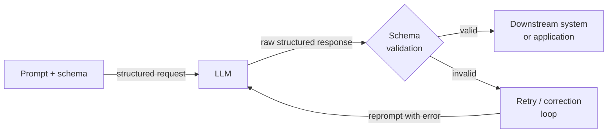

# Strukturierte Ausgaben

## Definition

Strukturierte Ausgaben bezeichnet die Praxis, ein LLM dazu zu bringen, maschinenlesbare Daten — meistens JSON — anstatt Freitext zu produzieren. In einer Produktionspipeline ist die Lücke zwischen einem LLM, das eine korrekte Antwort liefert, und einem, das eine korrekte Antwort in einem parsbaren Format liefert, die Lücke zwischen einer Spielzeug-Demo und einem deploysfähigen System. Ein nachgelagerter Dienst, der einen Produktnamen, ein Sentiment-Label oder eine Liste von Aktionspunkten extrahieren muss, kann nicht zuverlässig auf unstrukturiertem Text operieren; er benötigt eine garantierte Form, die deserialisiert, validiert und weitergeleitet werden kann.

Die Evolution der strukturierten Ausgabe-Techniken verfolgt die Reifung von LLM-APIs. Frühe Systeme stützten sich auf fragile Prompt-Anweisungen ("respond only with valid JSON"), kombiniert mit Regex-Parsing und Wiederholungsschleifen. Dieser Ansatz scheiterte immer dann, wenn das Modell eine erklärende Einleitung hinzufügte, das JSON in einen Markdown-Code-Block einwickelte oder das Schema bei Randfällen subtil verletzte. Die nächste Generation führte Function Calling (OpenAI, Mitte 2023) und Tool Use (Anthropic) ein, die die Schema-Definition aus dem Prompt herausnehmen und in einen erstklassigen API-Parameter einbetten, sodass das Modell explizit auf den Ausgabe-Vertrag trainiert und eingeschränkt werden kann. Zuletzt haben Anbieter striktes grammatikbasiertes Dekodieren eingeführt, das die Schema-Einhaltung zu einer harten Garantie auf Token-Ebene macht, nicht zu einer weichen Prompt-Anweisung.

Das Verständnis, welche Technik wann angewendet werden soll, ist wichtig für alle, die Pipelines entwickeln, die von LLM-Ausgaben abhängen. Der JSON-Modus ist der einfachste Einstiegspunkt, bietet aber keine Schema-Validierung. Function Calling / Tool Use bietet ein typisiertes Schema und strukturiertes Parsing in der API-Antwort, erfordert aber die vorherige Definition von Tool-Schemas. Pydantic-basierte Extraktionsbibliotheken (Instructor, LangChain Output Parser) sitzen über der API-Schicht und ergänzen Python-Level-Validierung, automatische Wiederholung bei Schema-Verletzungen und ergonomische Modelldefinition. Die richtige Wahl hängt von der Komplexität des Zielschemas, der Kritikalität der Validierung und davon ab, wie viel Wiederholungs-/Korrekturlogik die Bibliothek übernehmen soll.

## Funktionsweise



### JSON-Modus

Der JSON-Modus ist der grundlegendste strukturierte Ausgabemechanismus. Wenn aktiviert, ist das Modell darauf beschränkt, nur gültiges JSON als oberste Ausgabe zu produzieren. In OpenAIs API wird dies durch Setzen von `response_format={"type": "json_object"}` auf der Anfrage aktiviert; in Anthropics API kann ein ähnlicher Effekt durch Vorfüllen des Assistenten-Turns mit `{` erreicht werden. Der JSON-Modus garantiert syntaktische Gültigkeit (die Ausgabe kann immer durch `json.loads` geparst werden), validiert aber nicht gegen ein Schema — das Modell könnte `{"result": "yes"}` zurückgeben, wenn man `{"score": 0.87, "label": "positive", "confidence": 0.92}` erwartet hatte. Man muss Schema-Validierung (z. B. mit Pydantic oder `jsonschema`) als separaten Schritt hinzufügen und Wiederholungslogik für Schema-Abweichungen implementieren. Der JSON-Modus eignet sich am besten für einfache, flache Strukturen, bei denen das Risiko einer Schema-Drift gering ist.

### Function Calling und Tool Use

Function Calling (OpenAI) und Tool Use (Anthropic) stellen einen qualitativen Sprung nach vorne dar. Anstatt das Ausgabe-Schema in die Systemnachricht einzubetten, deklariert man es als Tool- oder Funktionsdefinition mit einem JSON-Schema-Objekt. Die API gibt die Ausgabe des Modells als strukturierten `tool_use`-Block mit einem geparsten `input`-Dict zurück, getrennt von jeglichem Textinhalt. Diese Entkopplung ist bedeutsam: Text und strukturierte Daten leben in verschiedenen Teilen der Antwort, und die API selbst übernimmt das JSON-Parsing. Man erhält Typannotationen für jedes Feld, erforderliche vs. optionale Feldsemantik, Enum-Einschränkungen und Unterstützung für verschachtelte Objekte — alles auf API-Ebene durch das Schema erzwungen. OpenAIs Strict Mode (2024) geht weiter, indem er eingeschränktes Dekodieren ermöglicht und Schema-Einhaltung zu einer harten Garantie macht. Tool Use ist die richtige Wahl für die Extraktion strukturierter Daten aus Dokumenten, das Befüllen von Datenbankeinträgen oder das Ausführen nachgelagerter API-Aufrufe mit typisierten Argumenten.

### Schema-basierte Extraktion mit Pydantic

Bibliotheken wie [Instructor](https://github.com/jxnl/instructor) und LangChains Output Parser umhüllen die Function Calling / Tool Use API mit einer Pydantic-first-Schnittstelle. Man definiert sein Ausgabe-Schema als `pydantic.BaseModel`-Unterklasse und übergibt die Modellklasse an die Bibliothek; sie generiert automatisch das JSON-Schema für die Tool-Definition, ruft die API auf, validiert die Antwort gegen das Modell und wiederholt mit Validierungsfehler-Feedback, wenn das Schema verletzt wird. Dieser Ansatz ist der ergonomischste für Python-Praktiker, da die Ausgabe ein vollständig typisiertes Python-Objekt ist — kein rohes Dict — mit Feldvalidierung, Standardwerten und Unterstützung für verschachtelte Modelle. Automatische Wiederholung mit Fehlerkontext reduziert die Rate stiller Schema-Verletzungen drastisch. Der Kostenfaktor ist eine zusätzliche Bibliotheksabhängigkeit und etwas mehr Token-Verbrauch, wenn Validierungsfehler Wiederholungsnachrichten auslösen.

## Wann verwenden / Wann NICHT verwenden

| Verwenden wenn | Vermeiden wenn |
|----------|------------|
| Die LLM-Ausgabe programmatisch genutzt werden muss (API-Antwort, DB-Einfügung, Workflow-Trigger) | Die Ausgabe nur von Menschen gelesen wird und kein nachgelagertes Parsing benötigt wird |
| Ein typisiertes, validiertes Python-Objekt statt einer rohen Zeichenkette benötigt wird | Das Schema so einfach ist (einzelne Zeichenkette oder Zahl), dass Klartext einfacher zu parsen ist |
| Pipelines entwickelt werden, bei denen Schema-Verletzungen zu stiller Datenbeschädigung führen würden | Latenz extrem knapp ist und kein Overhead für Wiederholungsschleifen geleistet werden kann |
| Die Extraktion verschachtelte Strukturen, Arrays oder enum-eingeschränkte Felder umfasst | Man sich in frühem Prototyping befindet und das Ausgabe-Schema noch nicht stabil ist |
| Reproduzierbares, testbares Extraktionsverhalten über Modellversionen hinweg benötigt wird | Das verwendete Modell schlechte Unterstützung für Tool Use / Function Calling hat |

## Code-Beispiele

### OpenAI — JSON-Modus mit Pydantic-Validierung

```python
# Structured extraction with OpenAI JSON mode + Pydantic validation
# pip install openai pydantic

import json, os
from pydantic import BaseModel, ValidationError
from openai import OpenAI

client = OpenAI(api_key=os.environ["OPENAI_API_KEY"])


class SentimentResult(BaseModel):
    label: str       # "positive" | "negative" | "neutral"
    score: float     # 0.0 - 1.0
    key_phrases: list[str]


def extract_sentiment(text: str, max_retries: int = 3) -> SentimentResult:
    system = (
        "You are a sentiment analysis engine. Respond ONLY with valid JSON: "
        '{"label": "positive"|"negative"|"neutral", "score": <float>, "key_phrases": [...]}'
    )
    for attempt in range(max_retries):
        resp = client.chat.completions.create(
            model="gpt-4o-mini",
            response_format={"type": "json_object"},
            messages=[{"role": "system", "content": system},
                      {"role": "user", "content": f"Analyze: {text}"}],
            temperature=0,
        )
        try:
            return SentimentResult(**json.loads(resp.choices[0].message.content))
        except (json.JSONDecodeError, ValidationError) as e:
            if attempt == max_retries - 1:
                raise RuntimeError(f"Validation failed: {e}") from e
    raise RuntimeError("Unreachable")


if __name__ == "__main__":
    r = extract_sentiment("The model is fast, but docs leave much to be desired.")
    print(r.label, r.score, r.key_phrases)
```

### OpenAI — Function Calling mit striktem Schema

```python
# Structured extraction with OpenAI function calling (strict mode)
# pip install openai

import os, json
from openai import OpenAI

client = OpenAI(api_key=os.environ["OPENAI_API_KEY"])

TOOL = {
    "type": "function",
    "function": {
        "name": "extract_product_info",
        "description": "Extract structured product info from a description.",
        "strict": True,
        "parameters": {
            "type": "object",
            "properties": {
                "product_name": {"type": "string"},
                "price_usd":    {"type": "number"},
                "features":     {"type": "array", "items": {"type": "string"}},
                "in_stock":     {"type": "boolean"},
            },
            "required": ["product_name", "price_usd", "features", "in_stock"],
            "additionalProperties": False,
        },
    },
}


def extract_product(description: str) -> dict:
    resp = client.chat.completions.create(
        model="gpt-4o",
        tools=[TOOL],
        tool_choice={"type": "function", "function": {"name": "extract_product_info"}},
        messages=[{"role": "system", "content": "Extract product information."},
                  {"role": "user", "content": description}],
        temperature=0,
    )
    return json.loads(resp.choices[0].message.tool_calls[0].function.arguments)


if __name__ == "__main__":
    desc = ("AcmePro X200 headphones — ships now at $149.99. "
            "Features: 40-hour battery, ANC, USB-C charging.")
    print(json.dumps(extract_product(desc), indent=2))
```

### Anthropic — Tool Use für strukturierte Extraktion

```python
# Structured extraction with Anthropic tool use
# pip install anthropic pydantic

import os
from pydantic import BaseModel
import anthropic

client = anthropic.Anthropic(api_key=os.environ["ANTHROPIC_API_KEY"])

TOOL = {
    "name": "extract_meeting_notes",
    "description": "Extract structured meeting notes. Always call this tool.",
    "input_schema": {
        "type": "object",
        "properties": {
            "summary": {"type": "string"},
            "action_items": {
                "type": "array",
                "items": {
                    "type": "object",
                    "properties": {
                        "owner":    {"type": "string"},
                        "task":     {"type": "string"},
                        "due_date": {"type": "string"},
                    },
                    "required": ["owner", "task", "due_date"],
                },
            },
            "decisions": {"type": "array", "items": {"type": "string"}},
        },
        "required": ["summary", "action_items", "decisions"],
    },
}


class ActionItem(BaseModel):
    owner: str
    task: str
    due_date: str | None


class MeetingNotes(BaseModel):
    summary: str
    action_items: list[ActionItem]
    decisions: list[str]


def extract_meeting_notes(transcript: str) -> MeetingNotes:
    resp = client.messages.create(
        model="claude-opus-4-5",
        max_tokens=1024,
        tools=[TOOL],
        tool_choice={"type": "tool", "name": "extract_meeting_notes"},
        messages=[{"role": "user", "content": f"Extract notes:\n\n{transcript}"}],
    )
    for block in resp.content:
        if block.type == "tool_use":
            return MeetingNotes(**block.input)
    raise RuntimeError("No tool_use block")


if __name__ == "__main__":
    notes = extract_meeting_notes("""
        Alice: New pricing model starts Q3. Bob: I'll update the pricing page by June 15.
        Carol: I'll brief legal by end of week. Alice: We dropped the free tier.
    """)
    print("Summary:", notes.summary)
    print("Decisions:", notes.decisions)
    for item in notes.action_items:
        print(f"  [{item.owner}] {item.task} — due {item.due_date}")
```

## Vergleiche

| Kriterium | JSON-Modus | Function Calling / Tool Use | Pydantic-basiert (Instructor) |
|-----------|-----------|-----------------------------|-----------------------------|
| Schema-Durchsetzung | Nur syntaktisch (gültiges JSON, kein Schema) | Strukturell (Felder, Typen, erforderlich) | Strukturell + semantisch (Validatoren, Feldeinschränkungen) |
| API-Oberfläche | `response_format`-Parameter | `tools` + `tool_choice`-Parameter | Bibliotheks-Wrapper über Tools |
| Ausgabetyp | Rohzeichenkette, die `json.loads` erfordert | Geparstetes Dict in Tool-Call-Argumenten | Typisierte Pydantic-Modellinstanz |
| Wiederholung bei Fehler | Manuell — muss selbst implementiert werden | Manuell | Automatisch — Bibliothek übernimmt Wiederholung mit Fehlerkontext |
| Verschachtelte Schemas | Möglich, aber fehleranfällig | Gut unterstützt via JSON Schema | Erstklassig via verschachteltem BaseModel |
| Am besten für | Einfache, flache Strukturen; schnelles Prototyping | Produktionsextraktion und typisierter API-Dispatch | Komplexe Schemas mit Python-Level-Validierungsbedarf |

## Praktische Ressourcen

- [OpenAI — Structured Outputs Guide](https://platform.openai.com/docs/guides/structured-outputs) — Offizieller Leitfaden für JSON-Modus, Function Calling und Strict Mode mit eingeschränktem Dekodieren.
- [Anthropic — Tool Use Dokumentation](https://docs.anthropic.com/en/docs/build-with-claude/tool-use) — Vollständige Referenz für die Definition von Tool-Schemas und die Behandlung von tool_use-Blöcken in Claude-Antworten.
- [Instructor-Bibliothek (jxnl/instructor)](https://github.com/jxnl/instructor) — Die am weitesten verbreitete Bibliothek für Pydantic-first strukturierte Extraktion; unterstützt OpenAI, Anthropic und andere Backends.
- [Pydantic-Dokumentation](https://docs.pydantic.dev/) — Wesentliche Referenz für die Definition von Schemas, Validatoren und verschachtelten Modellen für Extraktionspipelines.

## Siehe auch

- [Prompt Engineering](/docs/prompt-engineering)
- [LLMs](/docs/llms)
- [Agenten](/docs/agents)
