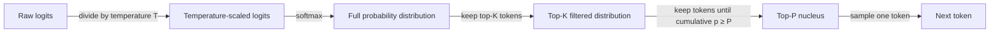

# Temperature, Top-K, Top-P

## Definition

Temperature, Top-K und Top-P sind Sampling-Parameter, die steuern, wie ein LLM das nächste Token während der Textgenerierung auswählt. Nachdem das Modell eine Wahrscheinlichkeitsverteilung über sein gesamtes Vokabular berechnet hat (via Softmax über Logits), bestimmen diese Parameter, welche Token als Kandidaten für die Auswahl in Frage kommen und wie wahrscheinlich jeder Kandidat ausgewählt wird. Zusammen regeln sie den Kompromiss zwischen Determinismus und Diversität: Niedrige Werte machen das Modell vorhersagbar und fokussiert, hohe Werte machen es kreativ und abwechslungsreich.

**Temperature** skaliert die rohen Logits vor dem Softmax-Schritt um und flacht die Wahrscheinlichkeitsverteilung effektiv ab oder schärft sie. Eine Temperature von 1,0 lässt die Verteilung unverändert. Werte unter 1,0 machen die Verteilung spitzer — das Modell wählt fast immer das Token mit der höchsten Wahrscheinlichkeit. Werte über 1,0 flachen die Verteilung ab — mehr Token werden zu plausiblen Kandidaten und erzeugen überraschendere und abwechslungsreichere Ausgaben. Bei Temperature 0 wird die Generierung deterministisch (Argmax-Dekodierung).

**Top-K** und **Top-P** sind Abschneidungsstrategien, die nach der Temperaturskalierung angewendet werden. Top-K behält nur die K wahrscheinlichsten Token und verteilt die Wahrscheinlichkeitsmasse unter ihnen neu, wobei alle anderen verworfen werden. Top-P (auch Nucleus Sampling genannt) wählt dynamisch den kleinsten Satz von Token aus, deren kumulierte Wahrscheinlichkeitsmasse einen Schwellenwert P erreicht, und sampelt dann aus diesem Satz. Top-P wird im Allgemeinen gegenüber Top-K bevorzugt, weil die Größe des Kandidatensets sich an die Form der Verteilung anpasst: Wenn das Modell sicher ist, ist der Nucleus klein; wenn das Modell unsicher ist, erweitert sich der Nucleus, um mehr Alternativen einzuschließen.

## Funktionsweise



Die Parameter werden sequentiell angewendet: zuerst Temperaturskalierung, dann Top-K-Abschneidung, dann Top-P-Nucleus-Auswahl, dann Sampling. In der Praxis wenden die meisten APIs nur Temperature + Top-P (OpenAI-Standard) oder Temperature + Top-K (Anthropic-Standard) an; die gleichzeitige Anwendung von Top-K und Top-P ist möglich, aber ungewöhnlich.

### Temperature

Temperature `T` teilt jeden rohen Logit `z_i` vor dem Softmax: `p_i = softmax(z / T)`. Wenn `T < 1`, werden die Logit-Unterschiede verstärkt — das Token mit der höchsten Wahrscheinlichkeit erhält einen noch größeren Anteil der Wahrscheinlichkeitsmasse. Wenn `T > 1`, schrumpfen Logit-Unterschiede — Wahrscheinlichkeitsmasse verteilt sich gleichmäßiger. Übliche Voreinstellungen: `T = 0` für deterministische Extraktionsaufgaben, `T = 0,2–0,4` für sachliche Fragen und Antworten, `T = 0,7–1,0` für kreatives Schreiben, `T > 1,0` für maximale Diversität (obwohl die Qualität bei extremen Werten abnimmt).

### Top-K

Top-K-Sampling beschränkt den Kandidatenpool auf die K Token mit der höchsten Wahrscheinlichkeit nach der Temperaturskalierung. Alle Token außerhalb der Top-K erhalten vor der Renormalisierung eine Wahrscheinlichkeit von null. Die wesentliche Einschränkung ist, dass K unabhängig davon fest ist, wie die Verteilung aussieht: Wenn das Modell sehr sicher ist, kann sogar K=50 viele Token mit nahezu null Wahrscheinlichkeit einschließen, die Rauschen einführen; wenn das Modell unsicher ist, kann ein kleines K vernünftige Alternativen abschneiden. Anthropics API stellt `top_k` als direkten Parameter bereit; OpenAIs API unterstützt es nativ nicht.

### Top-P (Nucleus Sampling)

Top-P-Sampling erstellt den Kandidatenset dynamisch. Beginnend mit dem wahrscheinlichsten Token und abwärts arbeitend, werden Token zum Nucleus hinzugefügt, bis ihre kumulierte Wahrscheinlichkeit den Schwellenwert P erreicht. Nur Token im Nucleus werden für das Sampling berücksichtigt. Mit `P = 0,9` sampelt das Modell aus denjenigen Token, die zusammen 90% der Wahrscheinlichkeitsmasse ausmachen. Da sich der Nucleus zusammenzieht, wenn das Modell sicher ist (wenige Token dominieren), und sich erweitert, wenn es unsicher ist (Wahrscheinlichkeitsmasse ist dünn verteilt), passt Top-P sich natürlich an den internen Zustand des Modells an. Top-P wird von beiden APIs unterstützt: OpenAI (`top_p`) und Anthropic (`top_p`).

## Wann verwenden / Wann NICHT verwenden

| Szenario | Empfohlene Einstellungen | Vermeiden |
|----------|----------------------|-------|
| Sachliche F&A, Datenextraktion, Klassifikation | `temperature=0–0,2`, `top_p=1,0` für nahezu deterministische Ausgabe | Hohe Temperature; führt zu Halluzinationen und Formatfehlern |
| Kreatives Schreiben, Brainstorming, Ideenfindung | `temperature=0,8–1,0`, `top_p=0,95` für diverse, neuartige Ausgaben | Temperature=0; erzeugt repetitiven, vorhersagbaren Text |
| Code-Generierung | `temperature=0,2–0,4`, `top_p=0,95`; etwas Variation hilft, lokale Optima zu vermeiden | Temperature > 0,8; Syntaxfehler und Logikdrift nehmen zu |
| Self-Consistency (mehrere Denkketten) | `temperature=0,6–1,0`; Diversität ist beabsichtigt | Temperature=0; alle Pfade wären identisch und würden den Zweck verfehlen |
| Strukturierte Ausgabeextraktion (JSON, Tabellen) | `temperature=0`, `top_p=1,0` für strikte Schema-Einhaltung | Top-P \< 0,9 kombiniert mit hoher Temperature; Schema-Verletzungen steigen stark an |
| Dialog / Chatbots | `temperature=0,5–0,7`, `top_p=0,9`; balanciert Kohärenz mit Natürlichkeit | Extreme Temperature in beide Richtungen; zu roboterhaft oder zu inkohärent |

## Code-Beispiele

### OpenAI — Temperature und Top-P

```python
# OpenAI API call with temperature and top_p
# pip install openai

import os
from openai import OpenAI

client = OpenAI(api_key=os.environ["OPENAI_API_KEY"])


def generate(prompt: str, temperature: float = 0.7, top_p: float = 0.95) -> str:
    """Generate text with configurable sampling parameters."""
    response = client.chat.completions.create(
        model="gpt-4o",
        messages=[{"role": "user", "content": prompt}],
        temperature=temperature,
        top_p=top_p,
        max_tokens=512,
    )
    return response.choices[0].message.content


if __name__ == "__main__":
    # Deterministic factual extraction
    factual = generate(
        "List the three primary colors.",
        temperature=0.0,
        top_p=1.0,
    )
    print("Factual:", factual)

    # Creative brainstorming
    creative = generate(
        "Suggest five unusual names for a café that serves only breakfast.",
        temperature=0.9,
        top_p=0.95,
    )
    print("Creative:", creative)
```

### Anthropic — Temperature und Top-K

```python
# Anthropic API call with temperature and top_k
# pip install anthropic

import os
import anthropic

client = anthropic.Anthropic(api_key=os.environ["ANTHROPIC_API_KEY"])


def generate(prompt: str, temperature: float = 0.7, top_k: int = 50) -> str:
    """Generate text with configurable temperature and top-k sampling."""
    message = client.messages.create(
        model="claude-opus-4-5",
        max_tokens=512,
        temperature=temperature,
        top_k=top_k,
        messages=[{"role": "user", "content": prompt}],
    )
    return message.content[0].text


if __name__ == "__main__":
    # Near-deterministic output for structured tasks
    deterministic = generate(
        "Translate 'hello world' into French, German, and Japanese.",
        temperature=0.0,
        top_k=1,
    )
    print("Deterministic:", deterministic)

    # Creative output with broader candidate pool
    creative = generate(
        "Write the opening sentence of a science fiction novel set on Europa.",
        temperature=1.0,
        top_k=250,
    )
    print("Creative:", creative)
```

## Praktische Ressourcen

- [OpenAI — API-Referenz: temperature und top_p](https://platform.openai.com/docs/api-reference/chat/create) — Offizielle Parameter-Dokumentation mit gültigen Bereichen und Standardwerten
- [Anthropic — API-Referenz: temperature, top_k, top_p](https://docs.anthropic.com/en/api/messages) — Anthropics Parameter-Referenz einschließlich top_k (nicht in OpenAI verfügbar)
- [Das Nucleus-Sampling-Papier (Holtzman et al., 2020)](https://arxiv.org/abs/1904.09751) — Originalpapier, das Top-P / Nucleus Sampling mit Motivation und empirischen Ergebnissen einführt
- [Hugging Face — Textgenerierungsstrategien](https://huggingface.co/docs/transformers/generation_strategies) — Umfassender Leitfaden zu Sampling-Strategien einschließlich Greedy, Beam Search, Temperature, Top-K und Top-P
- [Lilian Weng — Kontrollierbare Textgenerierung](https://lilianweng.github.io/posts/2021-01-02-controllable-text-generation/) — Tiefgehender Blogbeitrag über Sampling-Methoden im Kontext kontrollierbarer Generierung

## Siehe auch

- [Prompt Engineering](/docs/prompt-engineering)
- [Max Tokens und Stop-Sequenzen](/docs/prompt-engineering/max-tokens-stop-sequences)
- [Strukturierte Ausgaben](/docs/prompt-engineering/structured-outputs)
- [Self-Consistency](/docs/prompt-engineering/self-consistency)
- [Chain-of-Thought](/docs/reasoning-patterns/cot)
- [LLMs](/docs/llms)
