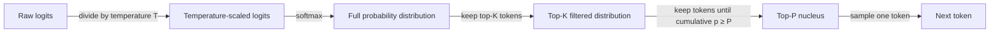

# Temperature, Top-K, Top-P

## Definition

Temperature, Top-K und Top-P sind Sampling-Parameter, die steuern, wie ein LLM das nächste Token während der Textgenerierung auswählt. Nachdem das Modell eine Wahrscheinlichkeitsverteilung über sein gesamtes Vokabular berechnet hat (via Softmax über Logits), formen diese Parameter, welche Tokens als Kandidaten für die Auswahl in Frage kommen und wie wahrscheinlich jeder Kandidat ausgewählt wird. Zusammen steuern sie den Kompromiss zwischen Determinismus und Vielfalt: Niedrige Werte machen das Modell vorhersehbar und fokussiert, hohe Werte machen es kreativ und abwechslungsreich.

**Temperature** skaliert die rohen Logits vor dem Softmax-Schritt neu und verflacht oder schärft damit die Wahrscheinlichkeitsverteilung effektiv. Eine Temperature von 1,0 lässt die Verteilung unverändert. Werte unter 1,0 machen die Verteilung spitzer — das Modell wählt fast immer das Token mit der höchsten Wahrscheinlichkeit. Werte über 1,0 verflachen die Verteilung — mehr Tokens werden zu plausiblen Kandidaten, was überraschendere und vielfältigere Ausgaben erzeugt. Bei Temperature 0 wird die Generierung deterministisch (Argmax-Dekodierung).

**Top-K** und **Top-P** sind Trunkierungsstrategien, die nach der Temperature-Skalierung angewendet werden. Top-K behält nur die K wahrscheinlichsten Tokens und verteilt die Wahrscheinlichkeitsmasse unter ihnen, wobei alle anderen verworfen werden. Top-P (auch Nucleus Sampling genannt) wählt dynamisch den kleinsten Satz von Tokens aus, deren kumulative Wahrscheinlichkeitsmasse einen Schwellenwert P erreicht, und sampelt dann aus diesem Satz. Top-P wird generell Top-K vorgezogen, weil die Größe des Kandidatensatzes sich an die Form der Verteilung anpasst: Wenn das Modell zuversichtlich ist, ist der Nucleus klein; wenn das Modell unsicher ist, expandiert der Nucleus, um mehr Alternativen einzuschließen.

## Funktionsweise



Die Parameter werden sequenziell angewendet: zuerst Temperature-Skalierung, dann Top-K-Trunkierung, dann Top-P-Nucleus-Auswahl, dann Sampling. In der Praxis wenden die meisten APIs nur temperature + Top-P (OpenAI-Standard) oder temperature + Top-K (Anthropic-Standard) an; das gleichzeitige Anwenden von sowohl Top-K als auch Top-P ist möglich, aber unüblich.

### Temperature

Temperature `T` teilt jeden rohen Logit `z_i` vor dem Softmax: `p_i = softmax(z / T)`. Wenn `T < 1`, werden die Logit-Unterschiede verstärkt — das Token mit der höchsten Wahrscheinlichkeit erhält einen noch größeren Anteil der Wahrscheinlichkeitsmasse. Wenn `T > 1`, schrumpfen die Logit-Unterschiede — die Wahrscheinlichkeitsmasse verteilt sich gleichmäßiger. Gängige Voreinstellungen: `T = 0` für deterministische Extraktionsaufgaben, `T = 0,2–0,4` für sachliche Fragen und Antworten, `T = 0,7–1,0` für kreatives Schreiben, `T > 1,0` für maximale Vielfalt (obwohl die Qualität bei extremen Werten abnimmt).

### Top-K

Top-K Sampling schränkt den Kandidatenpool auf die K Tokens mit der höchsten Wahrscheinlichkeit nach der Temperature-Skalierung ein. Alle Tokens außerhalb der Top-K werden vor der Renormalisierung auf Wahrscheinlichkeit null gesetzt. Die entscheidende Einschränkung ist, dass K unabhängig davon fest ist, wie die Verteilung aussieht: Wenn das Modell sehr zuversichtlich ist, kann selbst K=50 viele Tokens mit nahezu null Wahrscheinlichkeit einschließen, die Rauschen einführen; wenn das Modell unsicher ist, kann ein kleines K vernünftige Alternativen abschneiden. Die API von Anthropic stellt `top_k` als direkten Parameter bereit; die API von OpenAI unterstützt es nativ nicht.

### Top-P (Nucleus Sampling)

Top-P Sampling baut den Kandidatensatz dynamisch auf. Beginnend mit dem wahrscheinlichsten Token und nach unten arbeitend werden Tokens zum Nucleus hinzugefügt, bis ihre kumulative Wahrscheinlichkeit den Schwellenwert P erreicht. Nur Tokens im Nucleus werden für das Sampling in Betracht gezogen. Mit `P = 0,9` sampelt das Modell aus den Tokens, die zusammen 90% der Wahrscheinlichkeitsmasse ausmachen. Weil sich der Nucleus zusammenzieht, wenn das Modell zuversichtlich ist (einige Tokens dominieren), und expandiert, wenn es unsicher ist (Wahrscheinlichkeitsmasse ist dünn verteilt), passt sich Top-P natürlich an den internen Zustand des Modells an. Top-P wird sowohl von OpenAI (`top_p`) als auch von Anthropic (`top_p`) APIs unterstützt.

## Wann verwenden / Wann NICHT verwenden

| Szenario | Empfohlene Einstellungen | Vermeiden |
|----------|--------------------------|-----------|
| Sachliche Fragen, Datenextraktion, Klassifikation | `temperature=0–0,2`, `top_p=1,0` für nahezu deterministische Ausgabe | Hohe Temperature; führt Halluzinationen und Format-Fehler ein |
| Kreatives Schreiben, Brainstorming, Ideenfindung | `temperature=0,8–1,0`, `top_p=0,95` für diverse, neuartige Ausgaben | Temperature=0; erzeugt repetitiven, vorhersehbaren Text |
| Code-Generierung | `temperature=0,2–0,4`, `top_p=0,95`; etwas Variation hilft, lokale Optima zu vermeiden | Temperature > 0,8; Syntaxfehler und Logikdrift nehmen zu |
| Self-Consistency (mehrere Denkpfade) | `temperature=0,6–1,0`; Vielfalt ist beabsichtigt | Temperature=0; alle Pfade wären identisch und würden den Zweck zunichte machen |
| Strukturierte Ausgabeextraktion (JSON, Tabellen) | `temperature=0`, `top_p=1,0` für strikte Schema-Adhärenz | Top-P < 0,9 kombiniert mit hoher Temperature; Schema-Verletzungen steigen |
| Dialog / Chatbots | `temperature=0,5–0,7`, `top_p=0,9`; balanciert Kohärenz mit Natürlichkeit | Extreme Temperature in beiden Richtungen; zu roboterhaft oder zu inkohärent |

## Code-Beispiele

### OpenAI — Temperature und Top-P

```python
# OpenAI API call with temperature and top_p
# pip install openai

import os
from openai import OpenAI

client = OpenAI(api_key=os.environ["OPENAI_API_KEY"])


def generate(prompt: str, temperature: float = 0.7, top_p: float = 0.95) -> str:
    """Generate text with configurable sampling parameters."""
    response = client.chat.completions.create(
        model="gpt-4o",
        messages=[{"role": "user", "content": prompt}],
        temperature=temperature,
        top_p=top_p,
        max_tokens=512,
    )
    return response.choices[0].message.content


if __name__ == "__main__":
    # Deterministic factual extraction
    factual = generate(
        "List the three primary colors.",
        temperature=0.0,
        top_p=1.0,
    )
    print("Factual:", factual)

    # Creative brainstorming
    creative = generate(
        "Suggest five unusual names for a café that serves only breakfast.",
        temperature=0.9,
        top_p=0.95,
    )
    print("Creative:", creative)
```

### Anthropic — Temperature und Top-K

```python
# Anthropic API call with temperature and top_k
# pip install anthropic

import os
import anthropic

client = anthropic.Anthropic(api_key=os.environ["ANTHROPIC_API_KEY"])


def generate(prompt: str, temperature: float = 0.7, top_k: int = 50) -> str:
    """Generate text with configurable temperature and top-k sampling."""
    message = client.messages.create(
        model="claude-opus-4-5",
        max_tokens=512,
        temperature=temperature,
        top_k=top_k,
        messages=[{"role": "user", "content": prompt}],
    )
    return message.content[0].text


if __name__ == "__main__":
    # Near-deterministic output for structured tasks
    deterministic = generate(
        "Translate 'hello world' into French, German, and Japanese.",
        temperature=0.0,
        top_k=1,
    )
    print("Deterministic:", deterministic)

    # Creative output with broader candidate pool
    creative = generate(
        "Write the opening sentence of a science fiction novel set on Europa.",
        temperature=1.0,
        top_k=250,
    )
    print("Creative:", creative)
```

## Praktische Ressourcen

- [OpenAI — API-Referenz: Temperature und Top-P](https://platform.openai.com/docs/api-reference/chat/create) — Offizielle Parameterdokumentation mit gültigen Bereichen und Standards
- [Anthropic — API-Referenz: Temperature, Top-K, Top-P](https://docs.anthropic.com/en/api/messages) — Anthropics Parameterreferenz einschließlich Top-K (nicht in OpenAI verfügbar)
- [Das Nucleus Sampling Paper (Holtzman et al., 2020)](https://arxiv.org/abs/1904.09751) — Originalpaper, das Top-P / Nucleus Sampling mit Motivation und empirischen Ergebnissen einführt
- [Hugging Face — Textgenerierungsstrategien](https://huggingface.co/docs/transformers/generation_strategies) — Umfassender Leitfaden zu Sampling-Strategien einschließlich greedy, Beam Search, Temperature, Top-K und Top-P
- [Lilian Weng — Steuerbare Textgenerierung](https://lilianweng.github.io/posts/2021-01-02-controllable-text-generation/) — Tiefgreifender Blogbeitrag zu Sampling-Methoden im Kontext steuerbarer Generierung

## Siehe auch

- [Prompt Engineering](/docs/prompt-engineering)
- [Max Tokens und Stop-Sequenzen](/docs/prompt-engineering/max-tokens-stop-sequences)
- [Strukturierte Ausgaben](/docs/prompt-engineering/structured-outputs)
- [Self-Consistency](/docs/prompt-engineering/self-consistency)
- [Chain-of-Thought](/docs/reasoning-patterns/cot)
- [LLMs](/docs/llms)
