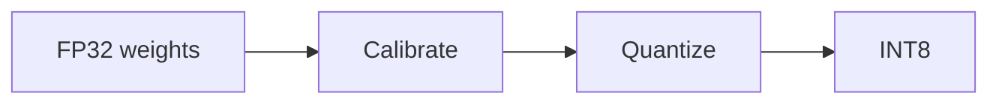

# Quantisierung

## Definition

Quantisierung repräsentiert Gewichte und optional Aktivierungen in niedrigerer Präzision (z. B. 8-bit anstatt 32-bit float) to reduce memory and speed up inference mit minimalem accuracy loss.

Es ist one of die wichtigsten [model compression](/docs/model-compression) levers for [LLMs](/docs/llms) and vision models. INT8 is common; INT4 and lower are used for aggressive compression. Deploy on [infrastructure](/docs/infrastructure) that supports quantized ops (z. B. GPU tensor cores, dedicated inference chips).

## Funktionsweise

**FP32 weights** (und optional activations) werden auf einen diskreten Bereich abgebildet (z. B. INT8). **Calibrate**: run a representative dataset to collect activation statistics and choose **scales and zero-points** sodass das quantized values approximate the original range. **Quantize**: convert weights (und optional activations at runtime) to INT8. **Post-training quantization (PTQ)** does this ohne Neutraining; **quantization-aware training (QAT)** fine-tunes with simulated quantization sodass das model adapts. The **INT8** model is then run on hardware that supports low-precision ops for faster inference and lower memory.

## Anwendungsfälle

Quantization is die wichtigsten lever for reducing memory and speeding inference mit begrenztem accuracy loss (Edge, Cloud, Kosten).

- Running LLMs and vision models on consumer GPUs or edge devices
- Reducing memory and speeding inference mit minimalem accuracy loss
- INT8 or lower precision for production serving

## Externe Dokumentation

- [PyTorch – Quantization](https://pytorch.org/docs/stable/quantization.html)
- [TensorFlow Lite – Quantization](https://www.tensorflow.org/lite/performance/quantization)

## Siehe auch

- [Model compression](/docs/model-compression)
- [Infrastructure](/docs/infrastructure)
