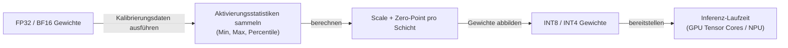
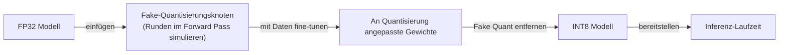

# Quantisierung

## Definition

Quantisierung ist der Prozess, neuronale Netzwerkgewichte — und optional Aktivierungen — in niedrigerer numerischer Präzision als das ursprüngliche Trainingsformat (typischerweise FP32 oder BF16) darzustellen. Durch das Abbilden von Gleitkommazahlen auf einen diskreten Ganzzahlbereich (INT8, INT4, INT2) reduziert Quantisierung den Modellspeicher um 2–8x und ermöglicht schnellere Inferenz auf Hardware mit Integer-Recheneinheiten wie GPU-Tensor-Kernen, NPUs und dedizierten Inferenz-Beschleunigern.

In der Praxis ist Quantisierung die am häufigsten angewendete [Modellkomprimierungs](/docs/model-compression)-Technik für [LLMs](/docs/llms), da sie keine Architekturänderungen erfordert, post-Training funktioniert und Speicherreduzierungen liefert, die groß genug sind, um ein Modell von server-gradiger Hardware auf Consumer-Hardware zu verlagern. Ein 70B-Parameter-Modell in FP16 benötigt ungefähr 140 GB VRAM; dasselbe Modell auf INT4 quantisiert passt in etwa 35 GB, was es auf einer Dual-GPU-Workstation ausführbar macht. Die Genauigkeitskosten sind typischerweise klein (1–3% bei Downstream-Benchmarks) für INT8 und beherrschbar für INT4 mit kalibrierungsbewussten Methoden.

Quantisierung existiert auf einem Spektrum von Ansätzen: **Post-Training-Quantisierung (PTQ)** wendet die Konvertierung nach dem Training unter Verwendung eines kleinen Kalibrierungsdatensatzes an, während **Quantisierungsbewusstes Training (QAT)** das Modell mit simulierter Quantisierung fine-tuned, sodass Gewichte lernen, robust gegenüber der Präzisionsreduzierung zu sein. Moderne LLM-Quantisierungsschemata wie GPTQ, AWQ und GGUF integrieren Kalibrierungs- und Packstrategien, die über naives Gewichtsrunden hinausgehen und die Genauigkeit auch bei INT4-Präzision bewahren.

## Funktionsweise

### Post-Training-Quantisierung (PTQ)



### Quantisierungsbewusstes Training (QAT)



### Gängige Quantisierungsschemata

| Schema | Präzision | Methode | Am besten für |
|--------|-----------|--------|---------|
| Dynamic INT8 | INT8 | Aktivierungen zur Laufzeit quantisieren | CPU-Inferenz, NLP |
| Static INT8 | INT8 | Aktivierungen offline kalibrieren | Niedrig-Latenz GPU-Serving |
| GPTQ | INT4 | Zweite-Ordnung Gewichtsquantisierung | LLM-Serving auf Consumer-GPUs |
| AWQ | INT4 | Aktivierungsbewusste Gewichtsquantisierung | LLM-Serving, geringer Genauigkeitsverlust |
| GGUF (llama.cpp) | INT2–INT8 | Mixed-Precision pro Tensor | Lokale Inferenz auf CPU / Apple Silicon |
| QAT | INT8 | Training mit simulierter Quantisierung | Höchste Genauigkeit bei INT8 |

## Wann verwenden / Wann NICHT verwenden

| Szenario | Quantisierung verwenden | Quantisierung NICHT verwenden |
|----------|-----------------|------------------------|
| Großes LLM auf Consumer-GPU ausführen | Ja — INT4 reduziert Speicher 4–8x | |
| Inferenzlatenz in der Produktion reduzieren | Ja — INT8 beschleunigt Durchsatz auf moderner Hardware | |
| Modelle auf mobiler oder Edge-Hardware bereitstellen | Ja — TFLite und ONNX unterstützen INT8 nativ | |
| Maximale Genauigkeit auf gut ausgestattetem Server | | FP16 oder BF16 bei ausreichendem Speicher und Kosten bedienen |
| Sehr kleine Modelle mit signifikantem Genauigkeitsverlust | | Destillation oder Pruning möglicherweise angemessener |
| Modelle mit ungewöhnlichen Aktivierungsverteilungen | | Standard PTQ kann versagen; QAT oder aktivierungsbewusste Methoden erforderlich |

## Vor- und Nachteile

| Vorteile | Nachteile |
|------|------|
| Große Speicherreduzierung (2–8x) mit minimalem Genauigkeitsverlust | Genauigkeitsverschlechterung steigt bei aggressiver Präzision (INT2/INT3) |
| PTQ erfordert kein Neutraining — schnell anzuwenden | Kalibrierungsqualität beeinflusst Genauigkeit; benötigt repräsentative Daten |
| Weit unterstützt durch Laufzeitumgebungen (TFLite, ONNX, vLLM) | Hardware-Unterstützung für Integer-Operationen erforderlich, um Speedups zu sehen |
| Ermöglicht LLM-Bereitstellung auf Consumer- und Edge-Hardware | Aktivierungsquantisierung schwieriger als gewichtsbasierte Quantisierung |

## Code-Beispiele

```python
# Static INT8 post-training quantization with PyTorch
import torch
import torch.quantization

model = MyModel()
model.load_state_dict(torch.load("model.pt"))
model.eval()  # set to inference mode

# Fuse BatchNorm and Conv for quantization efficiency
model_fused = torch.quantization.fuse_modules(model, [["conv", "bn", "relu"]])

# Set quantization config (fbgemm for x86, qnnpack for ARM/mobile)
model_fused.qconfig = torch.quantization.get_default_qconfig("fbgemm")
torch.quantization.prepare(model_fused, inplace=True)

# Calibration pass — run representative data to collect activation statistics
with torch.no_grad():
    for x_batch, _ in calibration_loader:
        model_fused(x_batch)

# Convert weights and activations to INT8
quantized_model = torch.quantization.convert(model_fused, inplace=True)

# Verify size reduction
original_params = sum(p.numel() for p in model.parameters())
quantized_params = sum(p.numel() for p in quantized_model.parameters())
print(f"Parameter count: {original_params:,} (same; precision changed, not count)")
print("INT8 model ready — memory footprint reduced ~4x vs FP32")

# Save quantized model
torch.save(quantized_model.state_dict(), "model_int8.pt")
```

## Praktische Ressourcen

- [PyTorch — Quantisierung](https://pytorch.org/docs/stable/quantization.html) — PTQ, QAT und dynamische Quantisierungs-API
- [TensorFlow Lite — Quantisierungsleitfaden](https://www.tensorflow.org/lite/performance/quantization) — Post-Training und QAT für Mobile
- [GPTQ Paper](https://arxiv.org/abs/2210.17323) — Genaue Post-Training-Quantisierung für generative vortrainierte Transformer
- [AWQ Paper](https://arxiv.org/abs/2306.00978) — Aktivierungsbewusste Gewichtsquantisierung für On-Device LLMs
- [llama.cpp GGUF Format](https://github.com/ggerganov/llama.cpp) — Lokale Inferenz mit flexibler Per-Tensor Mixed-Precision

## Siehe auch

- [Modellkomprimierung](/docs/model-compression)
- [Pruning](/docs/pruning)
- [Wissensdestillation](/docs/knowledge-distillation)
- [Lokale Inferenz](/docs/local-inference)
- [Edge Reasoning](/docs/edge-reasoning)
- [Infrastruktur](/docs/infrastructure)
