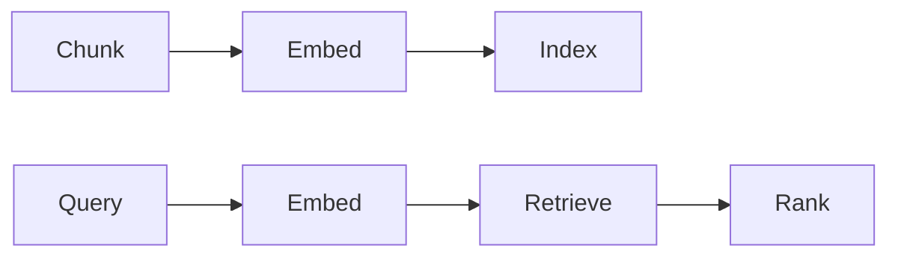

# RAG-Architektur

## Definition

RAG-Architektur umfasst, wie Sie Dokumente aufteilen,, choose embeddings and vector stores, run Abruf (dense, sparse, or hybrid), and combine context mit dem LLM (prompt Entwurf, reranking).

Design-Entscheidungen here beeinflussen direkt [RAG](/docs/rag) quality and latency. Trade-offs include chunk size (larger = more context per chunk, less precision), [embedding](/docs/rag/embeddings) model (quality vs cost), and whether to add a reranker or hybrid search. See [vector databases](/docs/rag/vector-databases) for indexing options.

## Funktionsweise

**Chunking:** Dokumente werden in Segmente aufgeteilt (nach Absatz, Satz oder fester Größe); Überlappung und Metadaten können hinzugefügt werden. **Embed** and **index:** Chunks are turned into vectors via an [embedding](/docs/rag/embeddings) model and stored in a [vector database](/docs/rag/vector-databases). **Query:** At query time the query is embedded; **retrieve** fetches the top-k similar chunks (dense search), optionally combined with keyword (sparse) for hybrid. **Rank:** An optional reranker (z. B. cross-encoder) rescores the top candidates. The chosen chunks are then formatted into the LLM prompt. Advanced setups add query rewriting, multi-hop Abruf, and citation extraction.

## Anwendungsfälle

Architecture choices (chunking, Abruf, reranking) beeinflussen direkt answer quality and latency in production RAG.

- Designing chunking and indexing for long documents or codebases
- Choosing dense vs. sparse or hybrid Abruf for domain data
- Adding reranking and citation for production RAG systems

## Externe Dokumentation

- [LangChain – RAG architecture](https://python.langchain.com/docs/use_cases/question_answering/)
- [LlamaIndex – Document processing and indexing](https://docs.llamaindex.ai/en/stable/module_guides/loading/)

## Siehe auch

- [RAG](/docs/rag)
- [Vector databases](/docs/rag/vector-databases)
- [Embeddings](/docs/rag/embeddings)
