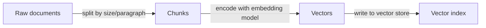
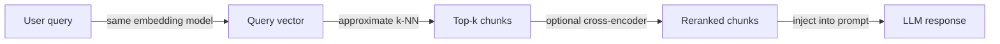

# RAG-Architektur

## Definition

Die RAG-Architektur (Retrieval-Augmented Generation) definiert, wie rohe Dokumente in abrufbares Wissen umgewandelt werden und wie dieses Wissen zur Inferenzzeit in ein LLM eingefügt wird. Die Pipeline hat zwei Hauptphasen: eine offline **Indizierungs**-Phase, die Dokumente verarbeitet und speichert, und eine online **Abruf**-Phase, die für jede Benutzeranfrage relevanten Kontext abruft.

Entwurfsentscheidungen in dieser Architektur beeinflussen direkt die Qualität, Latenz und Kosten des Endystems. Die Chunk-Größe steuert, wie viel Kontext jedes abgerufene Segment trägt — kleinere Chunks sind präziser, können aber an Kontext mangeln, während größere Chunks den Abruf-Recall reduzieren. Die Wahl des [Einbettungs](/docs/rag/embeddings)-Modells bestimmt, wie semantisch bedeutsam der Vektorraum ist, und ob dichte, spärliche oder hybride Abfragen verwendet werden, beeinflusst die Abdeckung für semantische und schlüsselwortbasierte Anfragen.

Erweiterte Setups erweitern die Basispipeline um Query-Rewriting (Umformulierung von Anfragen vor der Einbettung), Multi-Hop-Abruf (Verkettung mehrerer Abrufe), Reranking (ein Cross-Encoder, der top-k Kandidaten neu bewertet) und Zitationsextraktion (Zuweisung von Antworten zu Quell-Chunks). Jede Erweiterung fügt Latenz und Komplexität hinzu, kann aber die Antwortqualität für anspruchsvolle Anwendungsfälle erheblich verbessern. Siehe [Vektordatenbanken](/docs/rag/vector-databases) für Indizierungsoptionen.

## Funktionsweise

### Indizierungsphase

Dokumente werden aufgenommen, in Chunks aufgeteilt und in einem Vektorindex gespeichert.



### Abrufphase

Zur Abfragezeit wird die Anfrage eingebettet, und ähnliche Chunks werden abgerufen und optional neu geordnet.



**Chunk:** Dokumente werden in Segmente aufgeteilt (nach Absatz, Satz oder fester Token-Anzahl); Überlappung und Metadaten können jedem Chunk hinzugefügt werden. **Einbetten und indizieren:** Chunks werden über ein [Einbettungs](/docs/rag/embeddings)-Modell in Vektoren kodiert und in einer [Vektordatenbank](/docs/rag/vector-databases) gespeichert. **Abfrage:** Die Anfrage des Benutzers wird mit demselben Encoder eingebettet; **Abruf** holt die top-k ähnlichen Chunks mittels dichter oder hybrider Suche. **Rang:** Ein optionaler Reranker (z. B. Cross-Encoder) bewertet die besten Kandidaten neu, bevor sie in den LLM-Prompt formatiert werden.

## Wann verwenden / Wann NICHT verwenden

| Szenario | Verwenden | Nicht verwenden |
|---|---|---|
| Wissensbasis ist groß und wird häufig aktualisiert | Ja — Chunking + Indizierung bewältigt die Skalierung | Nein — Feintuning ist teuer im Neutraining |
| Antworten benötigen Quellenangaben | Ja — Chunks tragen Herkunfts-Metadaten | Nein — Vanilla-LLM-Generierung verliert Attributierung |
| Anfragen sind stark schlüsselwortspezifisch | Ja — hybride Abfrage kombiniert dicht + spärlich | Nein — reine dichte Abfrage kann exakte Übereinstimmungen verpassen |
| Wissen passt in das Kontextfenster | Vielleicht — einfacher, nur den Prompt zu füllen | Ja — keine Abrufschicht erforderlich |
| Echtzeit-Latenz ist kritisch | Mit Optimierungen — Caching, kleinere Modelle | Reranking + Multi-Hop bei sehr niedrigen Latenzbudgets vermeiden |

## Vergleiche

| Ansatz | Chunk-Größe | Abruftyp | Reranker | Typischer Einsatz |
|---|---|---|---|---|
| Naives RAG | Feste 512 Token | Nur dicht | Keiner | Prototyping |
| Erweitertes RAG | Semantisch / überlappend | Hybrid (dicht + BM25) | Cross-Encoder | Produktions-Q&A |
| Modulares RAG | Variabel, mit Metadaten | Hybrid + Filter | Gelernter Reranker | Enterprise-Suche |
| Multi-Hop RAG | Klein für Präzision | Dicht pro Hop | Optional | Komplexes Schlussfolgern |

## Vor- und Nachteile

| Vorteile | Nachteile |
|---|---|
| Hält Wissen aktuell ohne Neutraining | Fügt Indizierungs- und Abruflatenz hinzu |
| Bietet Quellenangaben für Antworten | Chunking-Strategie beeinflusst die Qualität erheblich |
| Skaliert auf Millionen von Dokumenten | Erfordert die Pflege eines Vektorindex |
| Kombinierbar mit Reranking und Filterung | Anfrage-Dokument-Mismatch kann den Recall beeinträchtigen |

## Codebeispiele

```python
from langchain_openai import OpenAIEmbeddings, ChatOpenAI
from langchain_community.vectorstores import Chroma
from langchain.text_splitter import RecursiveCharacterTextSplitter
from langchain.chains import RetrievalQA

# --- Indexing ---
splitter = RecursiveCharacterTextSplitter(chunk_size=512, chunk_overlap=64)
docs = splitter.create_documents([open("document.txt").read()])

embeddings = OpenAIEmbeddings()
vectorstore = Chroma.from_documents(docs, embeddings)

# --- Retrieval + Generation ---
retriever = vectorstore.as_retriever(search_kwargs={"k": 4})
qa_chain = RetrievalQA.from_chain_type(
    llm=ChatOpenAI(model="gpt-4o-mini"),
    retriever=retriever,
    return_source_documents=True,
)

result = qa_chain.invoke({"query": "What does the document say about X?"})
print(result["result"])
```

## Praktische Ressourcen

- [LangChain – RAG architecture](https://python.langchain.com/docs/use_cases/question_answering/) — End-to-End-RAG-Walkthrough mit LangChain-Komponenten
- [LlamaIndex – Document processing and indexing](https://docs.llamaindex.ai/en/stable/module_guides/loading/) — Aufnahme-, Chunking- und Indizierungs-Pipelines
- [Anthropic – RAG best practices](https://docs.anthropic.com/en/docs/build-with-claude/retrieval-augmented-generation) — Claude-spezifische RAG-Anleitung und Tipps

## Siehe auch

- [RAG](/docs/rag)
- [Vektordatenbanken](/docs/rag/vector-databases)
- [Einbettungen](/docs/rag/embeddings)
