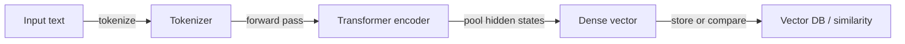
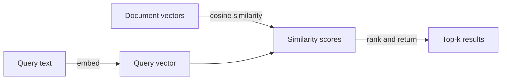

# Einbettungen

## Definition

Einbettungen sind dichte, fest dimensionierte numerische Vektoren, die die semantische Bedeutung von Text (oder anderen Datenmodalitäten wie Bilder und Audio) kodieren. Wenn Text durch ein Encoder-Modell verarbeitet wird, erzeugt semantisch ähnlicher Inhalt Vektoren, die im hochdimensionalen Raum geometrisch nahe beieinander liegen — so werden Phrasen wie „Kundensupport" und „Helpdesk" nahe Vektoren haben, wenn sie auf ähnlichen Daten trainiert wurden.

Sie sind die Brücke zwischen Rohtext und [Vektordatenbanken](/docs/rag/vector-databases). Sowohl Dokumente als auch Anfragen müssen mit dem **gleichen Encoder** eingebettet werden, damit ihre Vektoren im selben Raum leben und bedeutungsvolle Ähnlichkeitsvergleiche möglich sind. Das häufigste Ähnlichkeitsmaß ist die **Kosinus-Ähnlichkeit**, obwohl Skalarprodukt und euklidische Distanz je nach Indexkonfiguration ebenfalls verwendet werden.

Die Wahl des Einbettungsmodells ist eine der Entscheidungen mit dem höchsten Einfluss in einem [RAG](/docs/rag)-System. Faktoren umfassen Vektordimensionalität (höher = ausdrucksstärker, aber mehr Speicher), Kontextfenster (wie viel Text der Encoder auf einmal verarbeitet), Domänenspezifität (ein juristisches oder biomedizinisches Modell kann ein Allzweckmodell übertreffen), mehrsprachige Unterstützung und Kosten (API vs. selbst gehostet). Beliebte Optionen umfassen OpenAI `text-embedding-3-large`, Cohere Embed und das Open-Source-Modell `sentence-transformers`. Siehe [RAG-Architektur](/docs/rag/architecture) dafür, wie Einbettungen in die vollständige Pipeline passen.

## Funktionsweise

### Encoding-Pipeline



### Ähnlichkeitssuche



**Text** (ein Satz, Absatz oder Chunk) wird in einen **Encoder** (z. B. OpenAI Embeddings, Cohere oder Open-Source-Sentence-Transformers) eingegeben. Der Encoder gibt einen fest dimensionierten **Vektor** (z. B. 768 oder 1536 Dimensionen) aus. Das Training verwendet kontrastive oder ähnliche Ziele, damit semantisch verwandte Texte nahe Vektoren erhalten. Zur Abfragezeit wird die Ähnlichkeit als Kosinus oder Skalarprodukt zwischen dem Anfragevektor und gespeicherten Dokumentenvektoren berechnet. Modelle können mehrsprachig oder domänenspezifisch sein. Für [RAG](/docs/rag) immer denselben Encoder für Dokumente und Anfragen verwenden, damit Abstände bedeutsam sind.

## Wann verwenden / Wann NICHT verwenden

| Szenario | Einbettungen verwenden | Einbettungen nicht verwenden |
|---|---|---|
| Semantische Suche („ähnliche Bedeutung finden") | Ja — Einbettungen erfassen semantische Absicht | Nein — Schlüsselwortsuche, wenn exakte Zeichenkettenübereinstimmung benötigt wird |
| Mehrsprachiges Retrieval | Ja — mehrsprachige Encoder bilden Sprachen auf denselben Raum ab | Nein — sprachspezifisches BM25, wenn nur eine Sprache vorhanden ist |
| Kurze Anfragen gegen lange Dokumente | Ja — Anfrage und aufgeteilte Dokumente einbetten | Nein — das Einbetten ganzer langer Dokumente ohne Aufteilung verliert Präzision |
| Exakte Suche nach ID oder strukturiertem Feld | Nein — eine relationale DB oder Metadatenfilter verwenden | Ja — Einbettungen nicht für exakte Übereinstimmungen benötigt |
| Geringe Latenz, begrenzte Rechenkapazität | Kleinere Modelle in Betracht ziehen (z. B. MiniLM) | Große API-basierte Modelle für jede Anfrage vermeiden |

## Vergleiche

| Modell | Dimensionen | Kontext | Mehrsprachig | Kosten | Am besten für |
|---|---|---|---|---|---|
| OpenAI `text-embedding-3-large` | 3072 | 8191 Token | Ja | API (kostenpflichtig) | Hochpräzisions-Produktions-RAG |
| OpenAI `text-embedding-3-small` | 1536 | 8191 Token | Ja | API (kostengünstig) | Kostensensible Apps |
| Cohere Embed v3 | 1024 | 512 Token | Ja | API (kostenpflichtig) | Reranking + Retrieval |
| `sentence-transformers/all-MiniLM-L6-v2` | 384 | 256 Token | Nein | Selbst gehostet (kostenlos) | Geringe Latenz oder offline |
| `BAAI/bge-large-en-v1.5` | 1024 | 512 Token | Nein | Selbst gehostet (kostenlos) | Hochqualitatives Open-Source |

## Vor- und Nachteile

| Vorteile | Nachteile |
|---|---|
| Erfasst semantische Bedeutung, nicht nur Schlüsselwörter | Vektorraum variiert je nach Modell; Encoder können nicht gemischt werden |
| Ermöglicht sprachübergreifendes Retrieval mit mehrsprachigen Modellen | Dimensionalität erhöht Speicher- und Rechenkosten |
| Wiederverwendbar: dieselben Vektoren dienen Suche, Clustering, Deduplizierung | Qualität hängt stark von Modellwahl und Domäneneignung ab |
| Schnell zur Abfragezeit mit ANN-Indizes | Keine Interpretierbarkeit — schwer zu debuggen, warum ein Chunk zurückgegeben wurde |

## Codebeispiele

```python
from openai import OpenAI

client = OpenAI()

def embed(text: str) -> list[float]:
    response = client.embeddings.create(
        model="text-embedding-3-small",
        input=text,
    )
    return response.data[0].embedding

# Embed a document chunk and a query
doc_vec = embed("The refund policy allows returns within 30 days.")
query_vec = embed("How long do I have to return a product?")

# Cosine similarity (manual)
import numpy as np
def cosine_sim(a, b):
    a, b = np.array(a), np.array(b)
    return float(np.dot(a, b) / (np.linalg.norm(a) * np.linalg.norm(b)))

print(f"Similarity: {cosine_sim(doc_vec, query_vec):.4f}")
```

## Praktische Ressourcen

- [OpenAI – Embeddings guide](https://platform.openai.com/docs/guides/embeddings) — API-Nutzung, Modellvergleich und Best Practices
- [Hugging Face – Sentence Transformers](https://www.sbert.net/) — Open-Source-Einbettungsmodelle und Evaluierungs-Benchmarks
- [MTEB leaderboard](https://huggingface.co/spaces/mteb/leaderboard) — Massive Text Embedding Benchmark zum Vergleich von Modellen über Aufgaben
- [Cohere – Embed API](https://docs.cohere.com/docs/embeddings) — Cohere Einbettungsmodelle mit retrieval-optimierten Varianten

## Siehe auch

- [RAG](/docs/rag)
- [Vektordatenbanken](/docs/rag/vector-databases)
- [RAG-Architektur](/docs/rag/architecture)
- [Semantische Suche](/docs/semantic-search)
