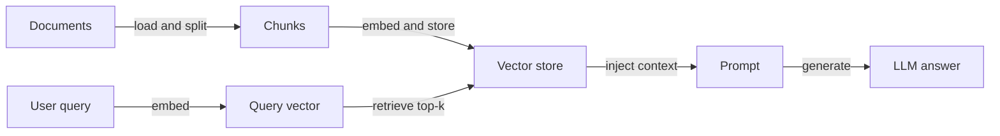
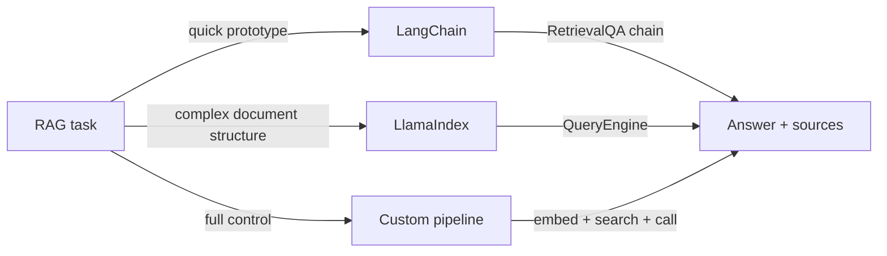

# RAG-Beispiele

## Definition

Diese Seite sammelt konkrete RAG-Beispiele: einfache Q&A, Dokument-QA und hybride Suche mit anpassbarem Code. Jedes Beispiel demonstriert einen vollständigen, ausführbaren Ablauf von der Dokumentenaufnahme bis zur Antworterzeugung.

Jedes Beispiel folgt demselben [RAG](/docs/rag)-Ablauf — Dokumente indizieren, Anfrage einbetten, abrufen, generieren — aber mit unterschiedlichen Frameworks oder Optionen. Ziel ist es, Ausgangspunkte bereitzustellen, die Sie in Ihr eigenes Projekt einbinden und erweitern können. Passen Sie [Chunking](/docs/rag/architecture), [Einbettungen](/docs/rag/embeddings) und den [Vektorspeicher](/docs/rag/vector-databases) an Ihr Datenvolumen, Ihre Domäne und Ihre Latenzanforderungen an.

Die Wahl des richtigen Beispiels hängt von Ihrem Stack ab: LangChain eignet sich gut für schnelle Prototypen mit vielen integrierten Integrationen; LlamaIndex eignet sich hervorragend für strukturierte Dokumentenaufnahme und Multi-Index-Abfragen; eine benutzerdefinierte Pipeline bietet maximale Kontrolle auf Kosten von mehr Boilerplate. Alle drei Ansätze erzeugen dieselbe konzeptionelle Ausgabe — abgerufener Kontext, der in einen LLM-Aufruf eingefügt wird.

## Funktionsweise

### Pipeline-Überblick



### Framework-Auswahl



## Wann verwenden / Wann NICHT verwenden

| Szenario | Diese Beispiele verwenden | Nicht verwenden |
|---|---|---|
| Schnelles Prototyping eines Q&A-Bots | Ja — LangChain-Beispiel ist minimal | Nein — das Bauen einer benutzerdefinierten Pipeline von Grund auf kostet unnötig Zeit |
| Produktions-App mit benutzerdefiniertem Chunking | Ja — benutzerdefiniertes Pipeline-Beispiel | Nein — Framework-Standardwerte entsprechen möglicherweise nicht Ihrer Chunking-Strategie |
| Multi-Dokument-Recherche über strukturierte Daten | Ja — LlamaIndex-Beispiel | Nein — die generische LangChain-Kette kann die Dokumentstruktur verfehlen |
| Einzelnes Dokument, das in das Kontextfenster passt | Nein — Dokument einfach direkt übergeben | Ja — Abruf-Pipeline ist unnötiger Overhead |
| Hybride Suche (semantisch + Schlüsselwort) | Ja — Chroma oder Weaviate mit BM25 verwenden | Nein — Einzelvektorsuche kann schlüsselwortkritische Anfragen verpassen |

## Codebeispiele

### Beispiel 1: minimales RAG mit LangChain

```python
from langchain_openai import OpenAIEmbeddings, ChatOpenAI
from langchain_community.vectorstores import Chroma
from langchain.text_splitter import RecursiveCharacterTextSplitter
from langchain.chains import RetrievalQA
from langchain_community.document_loaders import TextLoader

# Load and chunk
loader = TextLoader("my_document.txt")
docs = loader.load()
splitter = RecursiveCharacterTextSplitter(chunk_size=500, chunk_overlap=50)
chunks = splitter.split_documents(docs)

# Index
vectorstore = Chroma.from_documents(chunks, OpenAIEmbeddings())

# Retrieve and generate
qa = RetrievalQA.from_chain_type(
    llm=ChatOpenAI(model="gpt-4o-mini"),
    retriever=vectorstore.as_retriever(search_kwargs={"k": 4}),
    return_source_documents=True,
)

result = qa.invoke({"query": "Summarize the main points."})
print(result["result"])
for doc in result["source_documents"]:
    print("Source:", doc.metadata)
```

### Beispiel 2: Dokument-QA mit LlamaIndex

```python
from llama_index.core import VectorStoreIndex, SimpleDirectoryReader

# Load all documents from a folder
documents = SimpleDirectoryReader("./docs_folder").load_data()

# Build index (embeds and stores automatically)
index = VectorStoreIndex.from_documents(documents)

# Query
query_engine = index.as_query_engine()
response = query_engine.query("What is the refund policy?")
print(response)
```

### Beispiel 3: Hybridsuche (dicht + Schlüsselwort)

```python
from langchain_community.retrievers import BM25Retriever
from langchain.retrievers import EnsembleRetriever
from langchain_community.vectorstores import Chroma
from langchain_openai import OpenAIEmbeddings

# Dense retriever
vectorstore = Chroma.from_documents(chunks, OpenAIEmbeddings())
dense_retriever = vectorstore.as_retriever(search_kwargs={"k": 4})

# Sparse (BM25) retriever
bm25_retriever = BM25Retriever.from_documents(chunks)
bm25_retriever.k = 4

# Hybrid: combine both with equal weight
hybrid_retriever = EnsembleRetriever(
    retrievers=[bm25_retriever, dense_retriever],
    weights=[0.5, 0.5],
)

results = hybrid_retriever.invoke("product return window")
for r in results:
    print(r.page_content[:200])
```

## Praktische Ressourcen

- [LangChain – Question answering](https://python.langchain.com/docs/use_cases/question_answering/) — Vollständiger Walkthrough von RAG mit LangChain-Komponenten
- [LlamaIndex – RAG tutorial](https://docs.llamaindex.ai/en/stable/getting_started/starter_example/) — Startbeispiel für Dokumentenindizierung und -abfrage
- [Chroma – Quickstart](https://docs.trychroma.com/getting-started) — Einrichten eines lokalen Vektorspeichers für die Entwicklung
- [OpenAI Cookbook – RAG](https://cookbook.openai.com/examples/question_answering_using_embeddings) — Schrittweises RAG-Beispiel mit OpenAI-Einbettungen

## Siehe auch

- [RAG](/docs/rag)
- [RAG-Architektur](/docs/rag/architecture)
- [Tools: LangChain](/docs/tools/langchain)
- [Tools: LlamaIndex](/docs/tools/llamaindex)
