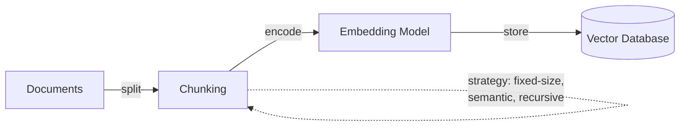
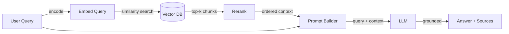

# Retrieval-augmented generation (RAG)

## Definition

**Retrieval-augmented generation (RAG)** ist eine Technik, die ein großes Sprachmodell um einen externen Abrufschritt erweitert: Bei einer Benutzeranfrage ruft das System zunächst relevante Dokumente aus einer Wissensquelle (typischerweise einem Vektorspeicher oder Suchindex) ab und übergibt diese Dokumente dann als Kontext an das LLM, um eine fundierte Antwort zu generieren. Dieser Ansatz reduziert Halluzinationen, indem er die Ausgabe des Modells in echten, überprüfbaren Daten verankert, anstatt sich ausschließlich auf im Vortraining kodiertes Wissen zu stützen.

RAG entstand als praktischer Mittelweg zwischen zwei Extremen — die Verwendung eines Allzweck-LLMs ohne Domänenwissen und das Feintuning eines Modells auf domänenspezifischen Daten. Die ursprüngliche RAG-Architektur wurde von [Lewis et al. (2020)](https://arxiv.org/abs/2005.11401) bei Facebook AI vorgeschlagen und kombiniert einen Retriever (basierend auf Dense Passage Retrieval) mit einem Sequenz-zu-Sequenz-Generator (BART). Seitdem hat sich das Muster zu einem weit verbreiteten Architekturmuster mit vielen Variationen bei Chunking-Strategien, Abrufmethoden und Generierungstechniken entwickelt.

RAG ist besonders wichtig in Unternehmens- und Produktionsumgebungen, weil es Organisationen ermöglicht, proprietäre oder sich häufig ändernde Daten zu nutzen, ohne die Kosten und Komplexität des Modell-Feintunings. Es ermöglicht auch **Quellenangaben** — das System kann auf die genauen Dokumente verweisen, die seine Antwort informierten, was für Vertrauen, Compliance und Prüfbarkeit in Bereichen wie Recht, Gesundheitswesen und Finanzen entscheidend ist.

## Funktionsweise

### Indizierung (offline)

Bevor RAG Anfragen beantworten kann, muss Ihre Wissensbasis indiziert werden. Dokumente werden in Abschnitte (Absätze, Sektionen oder gleitende Fenster) aufgeteilt, jeder Abschnitt wird mit einem [Einbettungsmodell](/docs/rag/embeddings) in einen dichten Vektor umgewandelt, und die resultierenden Vektoren werden in einer [Vektordatenbank](/docs/rag/vector-databases) gespeichert. Die Chunking-Strategie beeinflusst die Abrufqualität erheblich — zu große Abschnitte verwässern die Relevanz, zu kleine verlieren den Kontext.



### Abruf (zur Abfragezeit)

Wenn ein Benutzer eine Anfrage sendet, wird sie mit demselben Modell eingebettet, und das System führt eine Ähnlichkeitssuche (Kosinus oder Skalarprodukt) gegen die Vektordatenbank durch, um die top-k relevantesten Abschnitte abzurufen. Erweiterte RAG-Pipelines fügen nach dem ersten Abruf einen **Reranking**-Schritt hinzu, um die Präzision zu verbessern — ein Cross-Encoder-Modell bewertet jeden abgerufenen Abschnitt gegen die Anfrage und ordnet sie neu.

### Generierung (zur Abfragezeit)

Die abgerufenen Abschnitte werden zusammen mit der ursprünglichen Anfrage als Kontext in den LLM-Prompt eingefügt. Das LLM generiert eine Antwort, die in diesem Kontext verankert ist. Das Prompt-Design ist hier wichtig — Anweisungen wie „Antworten Sie nur mit dem bereitgestellten Kontext" helfen, Halluzinationen zu reduzieren, während „Wenn der Kontext die Antwort nicht enthält, sagen Sie es" Erfindungen verhindert.



## Wann verwenden / Wann NICHT verwenden

| Verwenden wenn | Vermeiden wenn |
|----------|------------|
| Wissen ändert sich häufig (Dokumente, FAQs, Richtlinien) und Neutraining ist nicht praktikabel | Das Wissen ist statisch und klein genug, um vollständig in das Prompt-Kontextfenster zu passen |
| Antworten benötigt werden, die in privaten oder domänenspezifischen Daten verankert sind | Das Modell ein neues Verhalten oder einen neuen Stil erlernen soll (Feintuning ist besser) |
| Quellenangaben und Prüfbarkeit Anforderungen sind | Latenz extrem kritisch ist und der Abrufschritt inakzeptable Verzögerungen hinzufügt |
| Kosten niedrig gehalten werden sollen — kein Trainings-Rechenaufwand erforderlich | Die Domäne Schlussfolgerungen über das gesamte Korpus erfordert, nicht nur über abgerufene Abschnitte |
| Mehrere Datenquellen abgefragt werden müssen (Multi-Index RAG) | Die Daten meist strukturiert/tabellarisch sind (SQL oder strukturierte Abfragen können besser geeignet sein) |

## Vergleiche

| Kriterium | RAG | Feintuning |
|----------|-----|-------------|
| Wissens-Aktualisierungsgeschwindigkeit | Sofort (Index aktualisieren) | Langsam (Modell neu trainieren) |
| Kosten | Niedrig (Inferenz + Einbettung) | Hoch (Trainings-Rechenaufwand + Hosting) |
| Halluzinationskontrolle | Stark (verankert in abgerufenen Dokumenten) | Moderat (abhängig von der Trainingsdatenqualität) |
| Quellenangaben | Nativ (abgerufene Abschnitte sind nachverfolgbar) | Nicht unterstützt |
| Benutzerdefiniertes Verhalten / Stil | Begrenzt | Stark |
| Setup-Komplexität | Moderat (Chunking + Vektor-DB + Abruf) | Hoch (Datensatz-Kuration + Trainings-Pipeline) |

## Vor- und Nachteile

| Vorteile | Nachteile |
|------|------|
| Reduziert Halluzinationen durch Verankerung in echten Daten | Abrufqualität hängt stark von Chunking- und Einbettungsentscheidungen ab |
| Kein Neutraining nötig, wenn sich das Wissen ändert | Fügt Latenz durch den Abrufschritt hinzu |
| Ermöglicht Quellenangaben für Vertrauen und Compliance | Erfordert die Pflege einer Vektordatenbank und Indizierungs-Pipeline |
| Funktioniert mit jedem LLM (API oder selbst gehostet) | Kontextfenstergrenzen schränken ein, wie viele Abschnitte übergeben werden können |
| Geringere Kosten als Feintuning für die meisten Anwendungsfälle | „Garbage in, garbage out" — schlechte Dokumentenqualität überträgt sich auf Antworten |

## Benchmarks

- [RAGAS](https://docs.ragas.io/) — Framework zur Bewertung von RAG-Pipelines (Treue, Antwortrelevanz, Kontextpräzision/-recall)
- [MTEB Leaderboard](https://huggingface.co/spaces/mteb/leaderboard) — Einbettungsmodell-Benchmarks relevant für die RAG-Abrufqualität
- [RGB Benchmark](https://arxiv.org/abs/2309.01431) — Benchmarking von retrieval-augmented generation über Rauschen, Ablehnung, Integration und kontrafaktische Szenarien

## Codebeispiele

### Grundlegende RAG-Pipeline mit LangChain (Python)

```python
from langchain_community.vectorstores import Chroma
from langchain_openai import OpenAIEmbeddings, ChatOpenAI
from langchain_core.prompts import ChatPromptTemplate

# 1. Index documents (one-time or incremental)
embeddings = OpenAIEmbeddings(model="text-embedding-3-small")
vectorstore = Chroma.from_documents(documents, embeddings)

# 2. Retrieve relevant chunks
query = "What is retrieval-augmented generation?"
docs = vectorstore.similarity_search(query, k=4)
context = "\n\n".join(d.page_content for d in docs)

# 3. Generate grounded answer
prompt = ChatPromptTemplate.from_messages([
    ("system", "Answer using only the context below. If the context "
               "doesn't contain the answer, say 'I don't know'.\n\n{context}"),
    ("human", "{question}"),
])

llm = ChatOpenAI(model="gpt-4o")
chain = prompt | llm
answer = chain.invoke({"context": context, "question": query})
print(answer.content)
```

### RAG mit LlamaIndex (Python)

```python
from llama_index.core import VectorStoreIndex, SimpleDirectoryReader

# 1. Load and index documents
documents = SimpleDirectoryReader("./data").load_data()
index = VectorStoreIndex.from_documents(documents)

# 2. Query with built-in retrieval + generation
query_engine = index.as_query_engine(similarity_top_k=4)
response = query_engine.query("What is RAG?")
print(response)

# Access source nodes for citation
for node in response.source_nodes:
    print(f"Source: {node.metadata['file_name']} (score: {node.score:.3f})")
```

## Praktische Ressourcen

- [RAG paper — Lewis et al. (2020)](https://arxiv.org/abs/2005.11401) — Das originale Forschungspapier, das retrieval-augmented generation einführt
- [LangChain RAG tutorial](https://python.langchain.com/docs/tutorials/rag/) — Schritt-für-Schritt-Anleitung zum Aufbau einer RAG-Pipeline mit LangChain
- [LlamaIndex RAG guide](https://docs.llamaindex.ai/en/stable/understanding/rag/) — Offizielle LlamaIndex-Dokumentation zu RAG-Konzepten und -Implementierung
- [Vertex AI RAG and grounding](https://cloud.google.com/vertex-ai/docs/generative-ai/grounding/overview) — RAG auf Google Cloud mit Vertex AI
- [Pinecone RAG guide](https://www.pinecone.io/learn/retrieval-augmented-generation/) — Praktischer Leitfaden für Chunking-, Einbettungs- und Abrufstrategien

## Siehe auch

- [RAG-Architektur](/docs/rag/architecture)
- [Vektordatenbanken](/docs/rag/vector-databases)
- [Einbettungen](/docs/rag/embeddings)
- [RAG-Beispiele](/docs/rag/examples)
- [LLMs](/docs/llms)
- [LangChain](/docs/tools/langchain)
- [LlamaIndex](/docs/tools/llamaindex)
