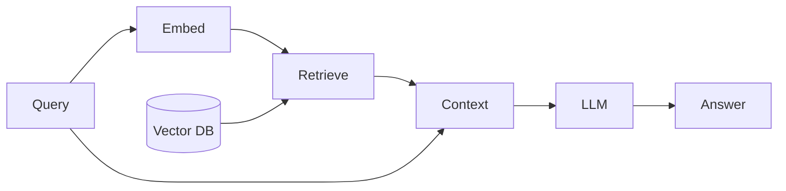

# Retrieval-Augmented Generation (RAG)

## Definition

**Retrieval-Augmented Generation (RAG)** erweitert ein großes Sprachmodell um einen Abrufschritt: bei einer Anfrage werden relevante Dokumente abgerufen (from a vector store or search index), und dann als Kontext an das LLM übergeben, um eine Antwort zu generieren. Dies reduziert Halluzinationen und hält Antworten in Ihren Daten verankert.

RAG wird oft preferred over Feinabstimmung wenn Sie need to **Wissen häufig aktualisieren muss** (z. B. interne Dokumente, Support-Artikel) ohne Neutraining, wenn Sie have **domain-specific or private data** that shouldn't be baked into weights, or wenn Sie want to **cite sources** in the model's answer. Fine-tuning is better wenn die desired behavior or style is stable and you can afford training and hosting.

## Funktionsweise

1. **Index:** Documents are chunked and embedded; vectors are stored in a [vector database](/docs/rag/vector-databases).
2. **Abfrage:** Die Benutzerabfrage wird eingebettet; das System ruft die Top-k ähnlichsten Chunks ab (siehe [Embeddings](/docs/rag/embeddings) and [RAG architecture](/docs/rag/architecture)).
3. **Generate:** The LLM empfängt die Abfrage plus abgerufenen Text und erzeugt die endgültige Antwort.

Das Diagramm unten zeigt the query-time flow: **query** and **vector DB** fließen in **embed** and **retrieve**; retrieved text becomes **context** and is passed mit dem query to the **LLM** to produce the **answer**. Indexing (chunking, embedding, storing) is done offline or incrementally; Abruf and generation run zur Abfragezeit. Quality depends on chunking, [embedding](/docs/rag/embeddings) choice, and how the prompt includes context.



### Simple RAG pipeline (Python)

```python
from langchain_community.vectorstores import Chroma
from langchain_openai import OpenAIEmbeddings, ChatOpenAI
from langchain_core.prompts import ChatPromptTemplate

# Index documents (one-time or incremental)
embeddings = OpenAIEmbeddings()
vectorstore = Chroma.from_documents(documents, embeddings)

# Query
query = "What is RAG?"
docs = vectorstore.similarity_search(query, k=4)
context = "\n\n".join(d.page_content for d in docs)

prompt = ChatPromptTemplate.from_messages([
    ("system", "Answer using only the context below.\n\n{context}"),
    ("human", "{question}"),
])
llm = ChatOpenAI(model="gpt-4")
chain = prompt | llm
answer = chain.invoke({"context": context, "question": query})
```

## Anwendungsfälle

RAG passt zu jeder Anwendung, bei der answers must be grounded in up-to-date or private documents anstatt the model’s training data.

- Customer support chatbots that answer from a knowledge base
- Internal wiki and document Q&A
- Legal or contract search and summarization
- Product and FAQ search with cited answers

## Vor- und Nachteile

| Pros | Cons |
|------|------|
| Reduces hallucination | Retrieval quality depends on chunks and embeddings |
| No need to retrain for new docs | Latency from Abruf + generation |
| Easy to update knowledge | Need good chunking and indexing strategy |

## Externe Dokumentation

- [RAG paper (Lewis et al.)](https://arxiv.org/abs/2005.11401) — Original Abruf-augmented generation
- [LangChain – Question answering / RAG](https://python.langchain.com/docs/use_cases/question_answering/)
- [LlamaIndex – RAG](https://docs.llamaindex.ai/en/stable/module_guides/deploying/rag/)
- [Vertex AI – RAG and grounding](https://cloud.google.com/vertex-ai/docs/generative-ai/grounding/overview) — RAG on Google Cloud

## Siehe auch

- [RAG architecture](/docs/rag/architecture)
- [Vector databases](/docs/rag/vector-databases)
- [Embeddings](/docs/rag/embeddings)
- [LLMs](/docs/llms)
