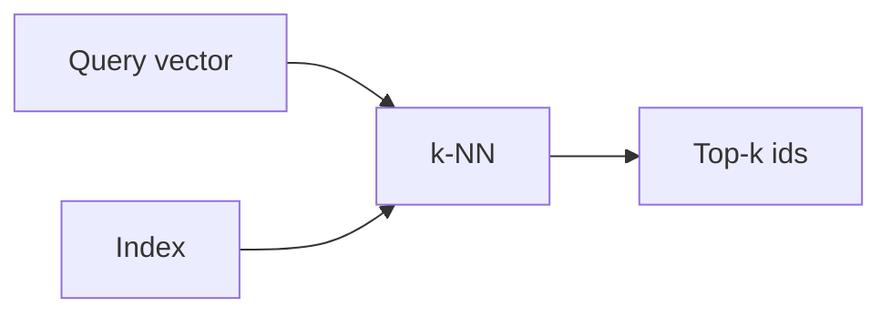

# Vektordatenbanken

## Definition

Vektordatenbanken speichern hochdimensionale Vektoren (Einbettungen) und unterstützen schnelle Ähnlichkeitssuche (z. B. k-NN, approximate nearest neighbor). Sie sind the backbone of Abruf in RAG.

Sie befinden sich between [embeddings](/docs/rag/embeddings) (die die Vektoren erzeugen) and the [RAG](/docs/rag) retriever (das die Top-k-Chunks benötigt). Im Gegensatz zu keyword search, they support semantic similarity: “customer support” can nachzuahmen “help desk” if the [embedding](/docs/rag/embeddings) model maps them close together. See [RAG architecture](/docs/rag/architecture) for how the index fits into die vollständige pipeline.

## Funktionsweise

Documents are [embedded](/docs/rag/embeddings) und ihre Vektoren werden in einen geschrieben **index** (z. B. HNSW, IVF, or flat for small datasets). At query time, the **query vector** is compared against the index via **k-NN** (or approximate k-NN for scale); the index returns **top-k ids** (und optional the vectors or stored metadata). You then fetch the corresponding chunks and pass them to the LLM. Options include Pinecone, Weaviate, Chroma, pgvector, and others; choice depends on scale, latency, and whether you need metadata filtering.

## Anwendungsfälle

Vector stores werden immer verwendet, wenn you need fast similarity search over many embeddings (RAG, recommendations, dedup).

- Storing and querying document embeddings for RAG
- Real-time similarity search at scale (z. B. recommendations, dedup)
- Combining vector search with metadata filters (z. B. by date, category)

## Externe Dokumentation

- [Chroma – Get started](https://docs.trychroma.com/getting-started)
- [Pinecone – Vector database docs](https://docs.pinecone.io/)
- [pgvector](https://github.com/pgvector/pgvector) — Vector similarity search in PostgreSQL

## Siehe auch

- [RAG](/docs/rag)
- [Embeddings](/docs/rag/embeddings)
- [Semantic search](/docs/semantic-search)
