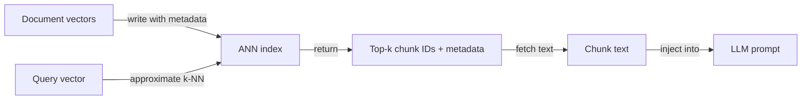
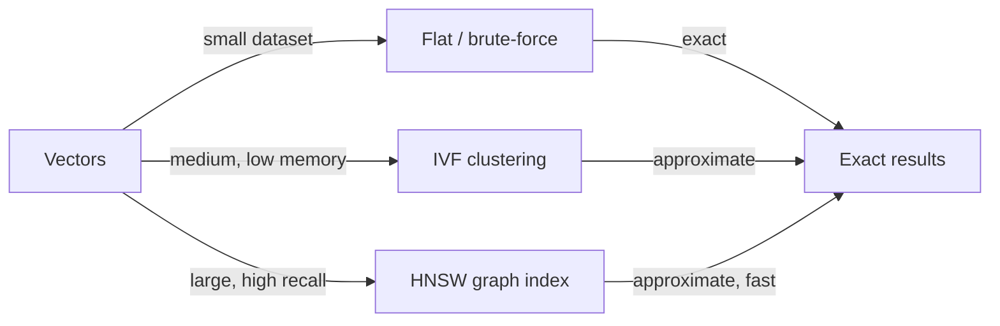

# Vektordatenbanken

## Definition

Vektordatenbanken speichern hochdimensionale Vektoren ([Einbettungen](/docs/rag/embeddings)) und unterstützen schnelle Ähnlichkeitssuche mittels Algorithmen wie k-Nearest-Neighbor (k-NN) und Approximate Nearest Neighbor (ANN). Sie bilden das Rückgrat der Abrufschicht in [RAG](/docs/rag)-Systemen und ermöglichen semantische Suche im großen Maßstab über Millionen von Dokumentenabschnitten.

Sie befinden sich zwischen [Einbettungen](/docs/rag/embeddings) (die die Vektoren erzeugen) und dem [RAG](/docs/rag)-Retriever (der die top-k Chunks für eine gegebene Anfrage benötigt). Im Gegensatz zu herkömmlichen schlüsselwortbasierten Datenbanken messen Vektordatenbanken **semantische Distanz**: „Kundensupport" kann „Helpdesk" entsprechen, wenn das Einbettungsmodell sie nahe zusammen platziert. Die meisten Vektordatenbanken unterstützen auch Metadatenfilterung — Sie können den Abruf auf Dokumente aus einem bestimmten Datum, einer Kategorie oder einer Quelle beschränken.

Die Wahl der richtigen Vektordatenbank hängt von Ihren Anforderungen ab: verwaltet vs. selbst gehostet, Skalierung (Tausende vs. Hunderte von Millionen Vektoren), Metadatenfilterfähigkeiten, hybride Suchunterstützung (dicht + spärlich) und ob Sie Multi-Tenancy oder Zugangskontrolle benötigen. Siehe [RAG-Architektur](/docs/rag/architecture) dafür, wie der Index in die vollständige Pipeline passt.

## Funktionsweise

### Indizierung und Abfrage



### Indextypen



Dokumente werden [eingebettet](/docs/rag/embeddings) und ihre Vektoren werden in einen **Index** (z. B. HNSW, IVF oder flach für kleine Datensätze) geschrieben. Zur Abfragezeit wird der **Anfrage-Vektor** über **k-NN** (oder approximatives k-NN für Skalierung) gegen den Index verglichen; der Index gibt **top-k IDs** und optional gespeicherte Metadaten zurück. Sie holen dann die entsprechenden Chunks und übergeben sie an das LLM. HNSW (Hierarchical Navigable Small World) ist der beliebteste ANN-Algorithmus — er bietet sub-lineare Abfragezeit mit hohem Recall. Flache Indizes sind exakt, aber O(n) und nur für kleine Datensätze geeignet.

## Wann verwenden / Wann NICHT verwenden

| Szenario | Vektordatenbank verwenden | Vektordatenbank nicht verwenden |
|---|---|---|
| Semantische Suche über große Dokumentkorpora | Ja — ANN-Indizes bewältigen Skalierung | Nein — Schlüsselwortsuche, wenn nur exaktes Phrasen-Matching benötigt wird |
| RAG mit Millionen von Chunks | Ja — speziell für Vektorskalierung gebaut | Nein — relationale DBs mit pgvector können unterhalb von ~1M Vektoren ausreichen |
| Hybride Suche (semantisch + BM25) | Ja — Weaviate, Qdrant unterstützen Hybrid nativ | Nein — rein dicht, wenn Anfragen immer semantisch sind |
| Multi-Tenant SaaS mit isolierten Namespaces | Ja — Pinecone und Weaviate unterstützen Namespacing | Nein — selbst gehostetes FAISS hat kein Multi-Tenancy |
| Offline, lokale Entwicklung | Ja — Chroma oder FAISS ohne Infrastruktur | Nein — verwaltete Cloud-DBs fügen Kosten und Netzwerklatenz für die Entwicklung hinzu |

## Vergleiche

| Datenbank | Hosting | Skalierung | Hybridsuche | Metadatenfilter | Am besten für |
|---|---|---|---|---|---|
| **Pinecone** | Verwaltete Cloud | Sehr groß (Milliarden) | Ja (sparse + dense) | Ja | Produktion im großen Maßstab, kein Infra-Management |
| **Chroma** | Selbst gehostet / eingebettet | Klein–mittel | Nein (nur dicht) | Ja | Lokale Entwicklung, Prototyping, Python-nativ |
| **Weaviate** | Selbst gehostet oder Cloud | Groß | Ja (BM25 + dense) | Ja | Produktion mit Hybridsuche |
| **FAISS** | Selbst gehostet (Bibliothek) | Groß | Nein | Nein | Forschung, Offline-Batch-Suche |
| **pgvector** | PostgreSQL-Erweiterung | Mittel | Partiell (mit FTS) | Ja (SQL) | Teams, die bereits Postgres nutzen |
| **Qdrant** | Selbst gehostet oder Cloud | Groß | Ja | Ja | Geringe Latenz, Rust-basiert, Open-Source |

## Vor- und Nachteile

| Vorteile | Nachteile |
|---|---|
| Sub-lineare Abfragezeit mit ANN-Indizes | ANN führt Recall-Kompromiss gegenüber exakter Suche ein |
| Unterstützt semantische Ähnlichkeit out of the box | Vektorspeicher ist bei sehr hohen Dimensionen teuer |
| Metadatenfilter ermöglichen die Kombination von semantischen + strukturierten Abfragen | Verwaltete Dienste fügen laufende Cloud-Kosten hinzu |
| Skaliert horizontal für große Korpora | Kein natives Textverständnis — hängt von der Einbettungsqualität ab |

## Codebeispiele

```python
import chromadb
from openai import OpenAI

openai_client = OpenAI()
chroma_client = chromadb.Client()
collection = chroma_client.create_collection("my_docs")

# Helper: embed text
def embed(text: str) -> list[float]:
    return openai_client.embeddings.create(
        model="text-embedding-3-small",
        input=text,
    ).data[0].embedding

# Index documents
documents = [
    "Returns are accepted within 30 days of purchase.",
    "Shipping takes 3–5 business days.",
    "Contact support at support@example.com.",
]
collection.add(
    documents=documents,
    embeddings=[embed(d) for d in documents],
    ids=[f"doc_{i}" for i in range(len(documents))],
)

# Query
query = "What is the return window?"
results = collection.query(
    query_embeddings=[embed(query)],
    n_results=2,
)
for doc in results["documents"][0]:
    print(doc)
```

## Praktische Ressourcen

- [Chroma – Get started](https://docs.trychroma.com/getting-started) — Eingebetteter Vektorspeicher für Python, ideal für lokale Entwicklung
- [Pinecone – Vector database docs](https://docs.pinecone.io/) — Verwaltete Cloud-Vektordatenbank mit serverlosen und pod-basierten Optionen
- [Weaviate – Documentation](https://weaviate.io/developers/weaviate) — Open-Source-Vektordatenbank mit nativem Hybrid-Suche
- [FAISS – GitHub](https://github.com/facebookresearch/faiss) — Facebook AI Similarity Search-Bibliothek für lokale, hochleistungsfähige Indizierung
- [pgvector – GitHub](https://github.com/pgvector/pgvector) — Vektorähnlichkeitssuch-Erweiterung für PostgreSQL

## Siehe auch

- [RAG](/docs/rag)
- [Einbettungen](/docs/rag/embeddings)
- [RAG-Architektur](/docs/rag/architecture)
- [Semantische Suche](/docs/semantic-search)
