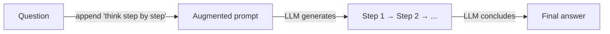
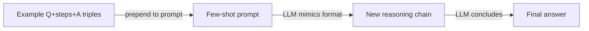

# Chain-of-Thought (CoT)

## Definition

Chain-of-Thought (CoT) Prompting fordert das Modell auf, Zwischenschritte des Schlussfolgerens vor der endgültigen Antwort auszugeben. Dies verbessert häufig die Genauigkeit bei Mathematik-, Logik- und mehrstufigen Aufgaben, indem das Modell gezwungen wird, sein Schlussfolgern explizit zu machen, anstatt direkt zu einem Schluss zu springen.

CoT funktioniert, weil Sprachmodelle autoregressiv sind: jedes generierte Token beachtet vorherige Tokens. Indem zunächst eine Kette von Schlussfolgerungsschritten generiert wird, konditioniert das Modell seine endgültige Antwort im Wesentlichen auf einen strukturierteren und ausgearbeiteten Kontext — was Fehler durch das Überspringen von Schritten oder das Machen impliziter Annahmen reduziert.

Es ist eines der einfachsten [Reasoning-Muster](/docs/reasoning-patterns): keine Tools oder Suche, nur Prompting. Verwenden Sie es, wenn die Aufgabe von expliziten Schritten profitiert (z. B. Arithmetik, Deduktion) und Sie [Feintuning](/docs/llms/fine-tuning) vermeiden möchten. Für das Erkunden mehrerer Lösungspfade, siehe [Tree of Thoughts](/docs/reasoning-patterns/tot); für werkzeugnutzende Agenten, siehe [ReAct](/docs/reasoning-patterns/react).

## Funktionsweise

### Zero-Shot CoT



### Few-Shot CoT



Sie geben dem Modell eine **Frage** (oder Aufgabe) und bitten es, Schritt für Schritt zu schlussfolgern. Das Modell erzeugt **Schritt 1**, **Schritt 2**, … (Zwischen-Schlussfolgerungen) und dann die **Antwort**. **Zero-Shot CoT**: „Lass uns Schritt für Schritt denken" (oder ähnliches) zum Prompt hinzufügen — keine Beispiele benötigt. **Few-Shot CoT**: Beispiel-(Frage, Schritte, Antwort)-Triplets einschließen, damit das Modell das Format imitiert. Das Modell generiert die vollständige Sequenz in einem Durchgang; Sie können die Schritte optional parsen und überprüfen oder bewerten. Die Qualität hängt von [Prompt Engineering](/docs/prompt-engineering) und Modellkapazität ab.

## Wann verwenden / Wann NICHT verwenden

| Szenario | CoT verwenden | CoT nicht verwenden |
|---|---|---|
| Mehrstufige Arithmetik oder Algebra | Ja — Zwischenschritte verhindern Rechenfehler | Nein — einfache einstufige Mathematik braucht es nicht |
| Logische Deduktion oder Schlussfolgerung | Ja — explizite Schritte machen das Schlussfolgern prüfbar | Nein — Faktenabfrageaufgaben profitieren nicht |
| Code-Planung oder Entwurfsentscheidungen | Ja — Schritte vor dem Code aufschreiben reduziert Fehler | Nein — Boilerplate aus einer Vorlage generieren |
| Hochvolumen-Inferenz mit geringer Latenz | Nein — extra Tokens erhöhen Kosten und Latenz | Ja — bei einfacher Klassifikation oder Extraktion vermeiden |
| Modell mit starkem eingebautem Schlussfolgern | Vielleicht — neuere Modelle schlussfolgern intern (o1, o3) | Ja — explizites CoT bei Denkmodellen erzwingen fügt Redundanz hinzu |

## Vergleiche

| Kriterium | CoT | Self-Consistency | Step-back Prompting |
|---|---|---|---|
| Kernidee | Einzelne Schlussfolgerungskette | Mehrere CoT-Pfade + Mehrheitsvoting | Abstrakte Frage zuerst, dann Antwort |
| Zuverlässigkeit | Moderat — ein Pfad kann irren | Hoch — Voting filtert Fehler | Hoch — Abstraktion reduziert Verwirrung |
| Kosten (API-Aufrufe) | 1 Aufruf | N Aufrufe (typisch 5–20) | 2 Aufrufe |
| Am besten für | Mathematik, Logik, mehrstufige Aufgaben | Aufgaben mit überprüfbaren Antworten | Wissensintensive, komplexe Fragen |
| Kombinierbarkeit | Eigenständig oder als Baustein | Baut auf CoT auf | Baut auf CoT auf |

## Vor- und Nachteile

| Vorteile | Nachteile |
|---|---|
| Einfach zu implementieren — nur Prompt Engineering | Erhöht Ausgabelänge und Token-Kosten |
| Kein Feintuning oder spezielles Training erforderlich | Modell kann plausible aber falsche Schritte generieren |
| Macht Schlussfolgern inspizierbar und debuggbar | Hilft nicht bei Aufgaben, die externe Informationen benötigen |
| Funktioniert über viele Domänen (Mathematik, Logik, Code) | Geringerer Nutzen bei kleinen Modellen vs. großen |

## Codebeispiele

```python
from openai import OpenAI

client = OpenAI()

SYSTEM_PROMPT = (
    "You are a careful reasoning assistant. "
    "When solving problems, always show your reasoning step by step "
    "before giving the final answer."
)

def cot_query(question: str) -> str:
    response = client.chat.completions.create(
        model="gpt-4o-mini",
        messages=[
            {"role": "system", "content": SYSTEM_PROMPT},
            {"role": "user", "content": question},
        ],
    )
    return response.choices[0].message.content

# Few-shot example
FEW_SHOT = """
Q: Roger has 5 tennis balls. He buys 2 more cans of tennis balls. Each can has 3 balls. How many does he have?
A: Roger starts with 5 balls. He buys 2 cans × 3 balls = 6 balls. Total: 5 + 6 = 11 balls.

Q: {question}
A:"""

def few_shot_cot(question: str) -> str:
    response = client.chat.completions.create(
        model="gpt-4o-mini",
        messages=[{"role": "user", "content": FEW_SHOT.format(question=question)}],
    )
    return response.choices[0].message.content

print(cot_query("A store has 40 apples. They sell 15 and receive 3 new shipments of 10. How many are left?"))
```

## Praktische Ressourcen

- [Chain-of-Thought Prompting (Wei et al.)](https://arxiv.org/abs/2201.11903) — Originalpaper, das CoT Prompting einführt
- [OpenAI – Prompt engineering](https://platform.openai.com/docs/guides/prompt-engineering) — Enthält Schlussfolgern- und schrittweise Anleitung
- [Self-consistency improves CoT (Wang et al.)](https://arxiv.org/abs/2203.11171) — Mehrheitsvoting über mehrere CoT-Pfade für höhere Zuverlässigkeit

## Siehe auch

- [Reasoning-Muster](/docs/reasoning-patterns)
- [Tree of Thoughts](/docs/reasoning-patterns/tot)
- [Prompt Engineering](/docs/prompt-engineering)
- [Self-Consistency](/docs/prompt-engineering/self-consistency)
- [Step-back Prompting](/docs/prompt-engineering/step-back-prompting)
