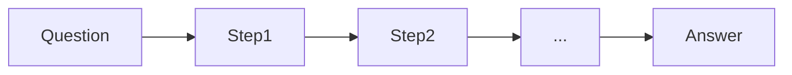

# Chain-of-Thought (CoT)

## Definition

Chain-of-Thought (CoT) Prompting fordert das Modell auf, Zwischenschritte der Argumentation auszugeben before die endgültige Antwort. Thwird oft improves accuracy on math, logic, and multi-step tasks.

Es ist one of the simplest [Schlussfolgern patterns](/docs/reasoning-patterns): keine Tools oder Suche, nur Prompting. Verwenden Sie es, wenn die Aufgabe von expliziten Steps (z. B. arithmetic, deduction) and you want to avoid [Feinabstimmung](/docs/llms/fine-tuning). For exploring multiple solution paths, see [tree of thoughts](/docs/reasoning-patterns/tot); for tool-using agents, see [ReAct](/docs/reasoning-patterns/react).

## Funktionsweise

You give the model a **question** (or task) and ask it to reason Schritt für Schritt. The model erzeugt **Step1**, **Step2**, … (intermediate Schlussfolgern) and then the **answer**. **Zero-shot CoT**: add “Let’s think Schritt für Schritt” (or similar) to the prompt. **Few-shot CoT**: include example (question, steps, answer) triples sodass das model mimics the format. The model generates the sequence in one pass; you can optionally parse the steps and verify or score them. Quality depends on [prompt engineering](/docs/llms/prompt-engineering) and model capability.

## Anwendungsfälle

Chain-of-thought is most useful wenn die task benefits from explicit intermediate steps (Mathematik, Logik, Code).

- Math and arithmetic where intermediate steps improve accuracy
- Logic puzzles and multi-step deduction
- Code or Entwurf Schlussfolgern where showing steps aids debugging

## Externe Dokumentation

- [Chain-of-Thought Prompting (Wei et al.)](https://arxiv.org/abs/2201.11903) — CoT paper
- [OpenAI – Prompt engineering](https://platform.openai.com/docs/guides/prompt-engineering) — Includes Schlussfolgern and schrittweise guidance

## Siehe auch

- [Tree of thoughts](/docs/reasoning-patterns/tot)
- [Prompt engineering](/docs/llms/prompt-engineering)
