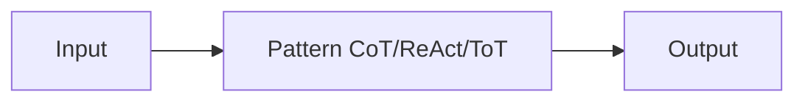

# Reasoning-Muster

## Definition

Reasoning-Muster sind strukturierte Wege, um Modell-Reasoning zu entlocken oder zu organisieren: chain-of-thought (schrittweise), tree-of-thoughts (explore branches), ReAct (reason + act), and RDD (Abruf-Entscheidung-Entwurf), among others. Using a clear pattern improves **reliability** (more consistent Schlussfolgern) and **debuggability** (you can inspect steps or actions).

Sie sind used in [prompt engineering](/docs/llms/prompt-engineering) (z. B. CoT) and inside [agents](/docs/agents) (z. B. ReAct, RDD). Choosing a pattern depends auf dem task: CoT for math/Schlussfolgern, ReAct for tool use, ToT for search/planning, RDD for spec compliance.

## Funktionsweise

You feed **input** (question, task) into a **pattern**: the pattern constrains how the model reasons or acts (z. B. “think Schritt für Schritt”, or thought–action–observation loops). The model erzeugt an **output** (answer, action sequence). Prompts or system Entwurf encourage the model to show Schlussfolgern (z. B. “Think Schritt für Schritt”) or to interleave thought and action. Patterns kombiniert werden kann (z. B. [CoT](/docs/reasoning-patterns/cot) inside an [agent](/docs/agents) loop). Siehe die verlinkten Seiten für jeden pattern’s details.

## Anwendungsfälle

Different patterns suit different needs: CoT for stepwise Schlussfolgern, ReAct for tool use, ToT for search and planning.

- CoT: math, logic, and multi-step Schlussfolgern tasks
- ReAct: tool-using agents that reason before each action
- ToT: search and planning over multiple solution branches

## Externe Dokumentation

- [Chain-of-Thought Prompting (Wei et al.)](https://arxiv.org/abs/2201.11903) — CoT paper
- [ReAct: Synergizing Reasoning and Acting (Yao et al.)](https://arxiv.org/abs/2210.03629) — ReAct paper
- [Tree of Thoughts (Yao et al.)](https://arxiv.org/abs/2305.10601) — ToT paper

## Siehe auch

- [Chain-of-thought](/docs/reasoning-patterns/cot)
- [Tree of thoughts](/docs/reasoning-patterns/tot)
- [ReAct](/docs/reasoning-patterns/react)
- [RDD](/docs/reasoning-patterns/rdd)
