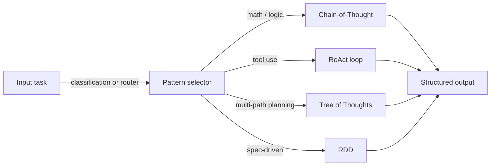
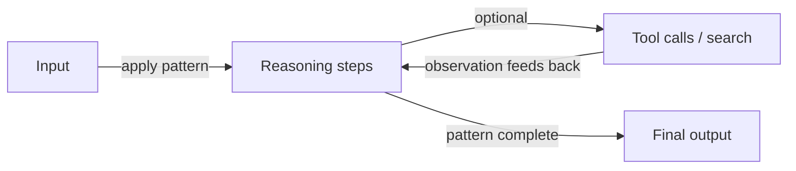

# Reasoning-Muster

## Definition

Reasoning-Muster sind strukturierte Wege, Modell-Schlussfolgerungen zu entlocken oder zu organisieren: Chain-of-Thought (Schritt für Schritt), Tree-of-Thoughts (Zweige erkunden), ReAct (Schlussfolgern + Handeln) und RDD (Abruf-Entscheidung-Entwurf), unter anderem. Die Verwendung eines klaren Musters verbessert die **Zuverlässigkeit** (konsistenteres Schlussfolgern) und die **Debuggbarkeit** (Sie können Schritte oder Aktionen inspizieren).

Sie werden im [Prompt Engineering](/docs/prompt-engineering) (z. B. CoT) und innerhalb von [Agenten](/docs/agents) (z. B. ReAct, RDD) verwendet. Ohne ein Reasoning-Muster neigen Modelle dazu, flache, unstrukturierte Antworten zu produzieren, die Schritte überspringen — ein Reasoning-Muster fungiert als Gerüst, das den Denkprozess des Modells explizit, inspizierbar und korrigierbar macht. Muster können auch kombiniert werden: CoT kann innerhalb des Gedankenschritts eines ReAct-Agenten laufen, und ToT kann Kandidaten in eine RDD-Entscheidungsschleife einspeisen.

Die Wahl eines Musters hängt von der Aufgabenkomplexität, dem verfügbaren Rechenaufwand und davon ab, ob das System Zugang zu externen Werkzeugen oder Wissen hat. CoT ist der kostengünstigste Ausgangspunkt; ReAct fügt Werkzeugnutzung hinzu; ToT fügt die Suche über mehrere Pfade hinzu; RDD fügt spezifikationsgesteuerte Compliance hinzu. Die meisten Produktionssysteme kombinieren mindestens zwei Muster.

## Funktionsweise

### Musterauswahl



### Generische Reasoning-Schleife



Sie speisen **Input** (Frage, Aufgabe) in ein **Muster** ein: das Muster schränkt ein, wie das Modell schlussfolgert oder handelt (z. B. „Denke Schritt für Schritt" oder Gedanken-Aktion-Beobachtungs-Schleifen). Das Modell erzeugt einen **Output** (Antwort, Aktionsfolge). Prompts oder System-Design ermutigen das Modell, Schlussfolgerungen zu zeigen oder Gedanken und Handlungen zu verschränken. Muster können kombiniert werden (z. B. [CoT](/docs/reasoning-patterns/cot) in einer [Agenten](/docs/agents)-Schleife). Siehe die verlinkten Seiten für Details zu jedem Muster.

## Wann verwenden / Wann NICHT verwenden

| Szenario | Reasoning-Muster verwenden | Nicht verwenden |
|---|---|---|
| Mehrstufige Mathematik, Logik oder Programmierung | Ja — CoT verbessert die Genauigkeit erheblich | Nein — Single-Shot-Prompting scheitert oft bei komplexem Schlussfolgern |
| Werkzeugnutzende Agenten | Ja — ReAct strukturiert jede Aktion mit einem Gedanken | Nein — direkter Werkzeugaufruf ohne Schlussfolgern erhöht Fehler |
| Planung über viele Lösungszweige | Ja — ToT erkundet und bewertet Alternativen | Nein — CoT ist günstiger, wenn ein Pfad normalerweise korrekt ist |
| Aufgaben, die Spezifikations-Compliance erfordern | Ja — RDD erzwingt abgerufene Spezifikationen | Nein — freie Generierung für kreative, offene Aufgaben |
| Einfache Faktensuchen | Nein — Reasoning-Muster fügen unnötige Kosten hinzu | Ja — direkter Abruf oder Suche ist schneller |

## Vergleiche

| Muster | Kernmechanismus | Kosten | Bester Aufgabentyp | Kombinierbar mit |
|---|---|---|---|---|
| Chain-of-Thought (CoT) | Sequentielle Reasoning-Schritte | Niedrig (1 Aufruf) | Mathematik, Logik, Deduktion | ReAct, ToT, RDD |
| Tree of Thoughts (ToT) | Verzweigen, bewerten, erweitern | Hoch (N Aufrufe) | Planung, Suche, Kreatives | CoT pro Zweig |
| ReAct | Gedanken-Aktion-Beobachtungs-Schleife | Mittel (1 Aufruf + Werkzeuge) | Werkzeugnutzende Agenten | CoT, RDD |
| RDD | Spec abrufen → entscheiden → generieren → validieren | Mittel–hoch | Compliance, spezifikationsgesteuerte Generierung | ReAct, RAG |

## Vor- und Nachteile

| Vorteile | Nachteile |
|---|---|
| Macht Modell-Schlussfolgerungen explizit und inspizierbar | Fügt Tokens hinzu (Kosten und Latenz) |
| Verbessert die Genauigkeit bei strukturierten Aufgaben erheblich | Falsches Reasoning-Muster für die Aufgabe kann die Qualität beeinträchtigen |
| Ermöglicht Debugging durch Inspektion von Zwischenschritten | Nicht alle Modelle folgen Mustern zuverlässig |
| Kombinierbar — Muster können verschachtelt oder kombiniert werden | Komplexe Kombinationen erhöhen den Prompt-Engineering-Aufwand |

## Codebeispiele

```python
from openai import OpenAI

client = OpenAI()

def chain_of_thought(question: str) -> str:
    """Zero-shot CoT: append 'Let's think step by step' to elicit reasoning."""
    response = client.chat.completions.create(
        model="gpt-4o-mini",
        messages=[
            {
                "role": "user",
                "content": f"{question}\n\nLet's think step by step.",
            }
        ],
    )
    return response.choices[0].message.content

answer = chain_of_thought("If a train travels 60 km/h for 2.5 hours, how far does it go?")
print(answer)
```

## Praktische Ressourcen

- [Chain-of-Thought Prompting (Wei et al.)](https://arxiv.org/abs/2201.11903) — Originales CoT-Paper, das schrittweises Schlussfolgern etabliert
- [ReAct: Synergizing Reasoning and Acting (Yao et al.)](https://arxiv.org/abs/2210.03629) — ReAct-Paper, das Gedanken-Aktion-Beobachtungs-Schleifen einführt
- [Tree of Thoughts (Yao et al.)](https://arxiv.org/abs/2305.10601) — ToT-Paper über mehrstufiges Schlussfolgern und Suche
- [Anthropic – Prompt engineering overview](https://docs.anthropic.com/en/docs/build-with-claude/prompt-engineering/overview) — Praktischer Leitfaden zu CoT und strukturiertem Schlussfolgern

## Siehe auch

- [Chain-of-thought](/docs/reasoning-patterns/cot)
- [Tree of thoughts](/docs/reasoning-patterns/tot)
- [ReAct](/docs/reasoning-patterns/react)
- [RDD](/docs/reasoning-patterns/rdd)
