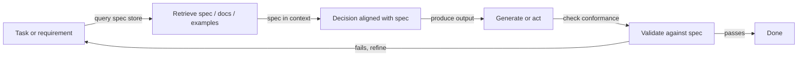
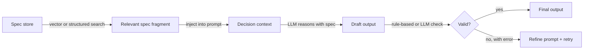

# Retrieval-Decision-Design (RDD)

## Definition

**RDD (Retrieval-Decision-Design)** ist ein Reasoning-Muster, das **Abruf** (Abrufen relevanter Spezifikationen, Dokumente oder Beispiele), **Entscheidung** (Treffen von Entscheidungen im Einklang mit Spezifikationen oder Richtlinien) und **Entwurf** (Erzeugen von Ausgaben, die Anforderungen erfüllen) miteinander verbindet. Es wird oft in der spezifikationsgesteuerten Entwicklung verwendet: Das Verhalten wird durch explizite Spezifikationen gesteuert, die während der Generierung abgerufen und durchgesetzt werden.

Im Gegensatz zu [CoT](/docs/reasoning-patterns/cot), das Schlussfolgerungen aus dem internen Wissen des Modells generiert, oder [ReAct](/docs/reasoning-patterns/react), das Schlussfolgerungen mit beliebigen Werkzeugaufrufen verschränkt, schränkt RDD jede Entscheidung gegen eine abgerufene Wahrheitsquelle ein. Dies macht es besonders geeignet für regulierte Domänen (Recht, Compliance, Sicherheit) oder Engineering-Workflows, bei denen Code oder Konfigurationen mit dokumentierten Spezifikationen übereinstimmen müssen.

RDD kann als einmalige Pipeline (abrufen → entscheiden → generieren → validieren) oder als Schleife in einem [Agenten](/docs/agents) implementiert werden, bei der fehlgeschlagene Validierung erneutes Abrufen und Verfeinerung auslöst. Das Muster ist kombinierbar: RDDs Abrufschritt kann von einer [RAG](/docs/rag)-Pipeline gespeist werden, und seine Agentenschleife kann [ReAct](/docs/reasoning-patterns/react) für schrittweises Schlussfolgern verwenden.

## Funktionsweise

### RDD-Zyklus



### Detaillierte Schritte



1. **Abruf:** Bei der aktuellen Aufgabe werden relevante Spezifikationsfragmente, Beispiele oder Einschränkungen abgerufen (z. B. aus einem Vektorspeicher oder strukturierten Spezifikationen).
2. **Entscheidung:** Der abgerufene Kontext wird verwendet, um nächste Schritte, erlaubte Aktionen oder das Ausgabeformat zu entscheiden — die Spezifikation ist immer im Kontext während des Schlussfolgerens.
3. **Entwurf:** Gemäß der Spezifikation generieren oder ausführen; optional Ausgaben gegen die Spezifikation validieren, bevor zurückgegeben wird.

Dies kann in einer [Agenten](/docs/agents)-Schleife implementiert werden: Spezifikation abrufen → mit Spezifikation im Kontext schlussfolgern → handeln oder generieren → validieren → wiederholen. Fehlgeschlagene Validierung löst erneutes Abrufen (möglicherweise mit einer anderen Anfrage) oder Prompt-Verfeinerung aus.

## Wann verwenden / Wann NICHT verwenden

| Szenario | RDD verwenden | RDD nicht verwenden |
|---|---|---|
| Code generieren, der einer API-Spezifikation entsprechen muss | Ja — Spezifikation abrufen, generieren, validieren | Nein — freie Programmierung ohne formale Einschränkungen |
| Compliance-gesteuertes Dokumentenerzeugen | Ja — Richtlinie abrufen, konforme Ausgabe generieren | Nein — kreatives Schreiben ohne feste Regeln |
| Agenten in regulierten Domänen (Recht, Sicherheit) | Ja — jede Entscheidung ist in abgerufener Richtlinie verankert | Nein — gelegentliche Q&A ohne Compliance-Anforderungen |
| Engineering mit versionierten Entwurfsdokumenten | Ja — Spezifikationen ändern sich; RDD ruft immer die neueste ab | Nein — einfaches CRUD ohne formale Spezifikation |
| Echtzeit-Inferenz mit engen Latenzbudgets | Nein — Abruf + Validierung fügt Latenz hinzu | Ja — direkte Generierung ist schneller für unkonstrained Aufgaben |

## Vergleiche

| Muster | Verwendet abgerufenes Wissen | Validiert Ausgabe | Spezifikationsgesteuert | Am besten für |
|---|---|---|---|---|
| CoT | Nein (internes Modellwissen) | Nein | Nein | Mathematik, Logik |
| ReAct | Via Werkzeugaufrufe | Nein | Nein | Allgemeine werkzeugnutzende Agenten |
| RAG | Ja (Dokumente) | Nein | Nein | Wissens-Q&A |
| RDD | Ja (Spezifikationen und Dokumente) | Ja | Ja | Compliance, spezifikationsgesteuerte Generierung |

## Vor- und Nachteile

| Vorteile | Nachteile |
|---|---|
| Ausgaben stimmen mit explizit abgerufenen Spezifikationen überein | Erfordert gut gepflegten, abfragbaren Spezifikationsspeicher |
| Reduziert Drift und Ad-hoc-Verhalten | Extra Abruf und Validierung erhöhen Kosten und Latenz |
| Prüfpfad: Spezifikationsfragmente sind in der Ausgabe nachverfolgbar | Lücken in der Spezifikationsabdeckung führen zu unzureichend eingeschränkten Entscheidungen |
| Kombinierbar mit RAG und ReAct | Spezifikationsentwurf und -pflege ist eine eigene laufende Arbeitslast |
| Passt zu regulierten oder sicherheitskritischen Workflows | Validierungslogik muss mit Spezifikationsaktualisierungen synchron gehalten werden |

## Codebeispiele

```python
from openai import OpenAI
from langchain_community.vectorstores import Chroma
from langchain_openai import OpenAIEmbeddings

client = OpenAI()
# Assume a Chroma vector store pre-loaded with spec fragments
spec_store = Chroma(
    collection_name="api_spec",
    embedding_function=OpenAIEmbeddings(),
)

def rdd_generate(task: str) -> str:
    # 1. Retrieve relevant spec fragments
    spec_docs = spec_store.similarity_search(task, k=3)
    spec_context = "\n\n".join(d.page_content for d in spec_docs)

    # 2. Decision + Design: generate with spec in context
    prompt = (
        f"You must follow the specifications below exactly.\n\n"
        f"SPECIFICATIONS:\n{spec_context}\n\n"
        f"TASK: {task}\n\n"
        f"Generate an output that strictly complies with the specifications."
    )
    response = client.chat.completions.create(
        model="gpt-4o-mini",
        messages=[{"role": "user", "content": prompt}],
    )
    draft = response.choices[0].message.content

    # 3. Validate (simple: ask model to check conformance)
    validation_prompt = (
        f"Check if the following output complies with the spec. "
        f"Reply with PASS or FAIL and a brief reason.\n\n"
        f"SPEC:\n{spec_context}\n\nOUTPUT:\n{draft}"
    )
    validation = client.chat.completions.create(
        model="gpt-4o-mini",
        messages=[{"role": "user", "content": validation_prompt}],
    ).choices[0].message.content

    if "FAIL" in validation.upper():
        return f"[Validation failed: {validation}]\nDraft:\n{draft}"
    return draft

result = rdd_generate("Generate a JSON API request to create a new user.")
print(result)
```

## Praktische Ressourcen

- [RAG paper (Lewis et al.)](https://arxiv.org/abs/2005.11401) — Abrufkomponente, die als Grundlage für RDDs Spezifikations-Abrufschritt dient
- [LangChain – Agents and tools](https://python.langchain.com/docs/concepts/agents/) — Orchestrierungsmuster für den Aufbau von RDD-artigen Schleifen
- [Constitutional AI (Anthropic)](https://arxiv.org/abs/2212.08073) — Verwandte Idee: Abgerufene Prinzipien zur Führung und Validierung von Modellausgaben verwenden

## Siehe auch

- [Spezifikationsgesteuerte Entwicklung](/docs/spec-driven-development)
- [RAG](/docs/rag)
- [Agenten](/docs/agents)
- [ReAct](/docs/reasoning-patterns/react)
