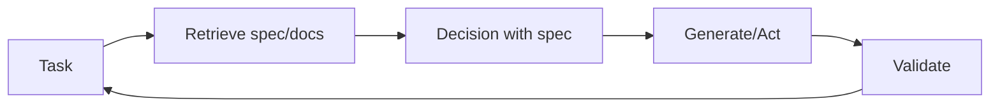

# Retrieval-Decision-Design (RDD)

## Definition

**RDD (Retrieval-Decision-Design)** ist ein Reasoning-Muster that ties together **Abruf** (Abrufen relevanter Spezifikationen, Dokumentationen oder Beispiele), **Entscheidung** (making choices aligned with specs or policies), and **Entwurf** (producing outputs that satisfy requirements). It wird oft used in spec-driven development: behavior is guided by explicit specifications that are retrieved and enforced während der Generierung.

## Funktionsweise

1. **Retrieval:** Given the current task, retrieve relevant specification fragments, examples, or constraints (z. B. from a vector store or structured specs).
2. **Decision:** Use the retrieved context to decide next steps, allowed actions, or output format.
3. **Design:** Generate or execute in line mit dem spec; optionally validate outputs against the spec.

Dies kann in einer [Agenten](/docs/agents)-Schleife implementiert werden: Spezifikation abrufen → mit Spezifikation im Kontext schlussfolgern → handeln oder generieren → validate → repeat. Das Diagramm unten zeigt the cycle: **task** triggers **retrieve**; retrieved spec feeds **Entscheidung**; **generate/act** erzeugt output; **validate** checks against the spec and can loop back to the task (z. B. retry or refine).

## Anwendungsfälle

RDD passt, wenn outputs must align with retrievable specs (compliance, policy, or documented requirements).

- Spec-driven agents that retrieve requirements and validate outputs
- Compliance and policy-aware generation (z. B. legal, safety)
- Code or config generation aligned with documented specs

## Vor- und Nachteile

| Pros | Cons |
|------|------|
| Outputs align with specs | Requires good spec coverage and Abruf |
| Reduces drift and ad-hoc behavior | Extra Abruf and validation cost |
| Fits regulated or safety-critical flows | Spec Entwurf and maintenance overhead |

## Externe Dokumentation

- [RAG paper (Lewis et al.)](https://arxiv.org/abs/2005.11401) — Retrieval component used in RDD
- [LangChain – Agents and tools](https://python.langchain.com/docs/concepts/agents/) — Orchestration patterns

## Siehe auch

- [Spec-driven development](/docs/spec-driven-development)
- [RAG](/docs/rag)
- [Agents](/docs/agents)
- [ReAct](/docs/reasoning-patterns/react)
