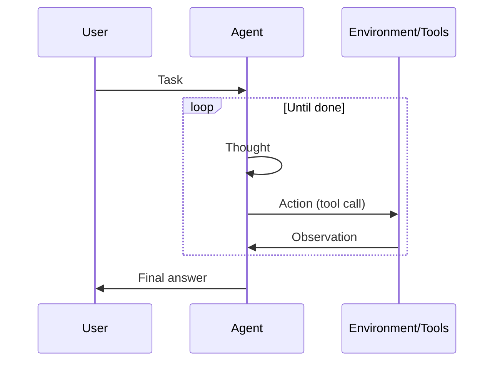

# ReAct (Reasoning + Acting)

## Definition

ReAct ist ein Paradigma, bei dem das Modell **Reasoning** abwechselt (was als Nächstes zu tun ist, warum) and **acting** (Tool-Aufrufe). The observation aus dem environment feeds back into the next Schlussfolgern step, forming a loop until the task is done.

Es ist the standard pattern for [agents](/docs/agents) that use tools: each action is preceded by a thought, was reduziert blind or repetitive tool use. Often combined with [chain-of-thought](/docs/reasoning-patterns/cot) (Schlussfolgern inside the thought) and with [RDD](/docs/reasoning-patterns/rdd) when specs guide Entscheidungs.

## Funktionsweise

Prompt-Format ist **Gedanke → Aktion → Beobachtung → Gedanke → … → Endgültige Antwort**. Der **Benutzer** gibt eine **Aufgabe**; der **Agent** erzeugt a **thought** (Schlussfolgern about what to do), then an **action** (z. B. tool call). The **environment/tools** return an **observation**, which is appended to the context für den next thought. The loop continues until the agent outputs a final answer. The model decides when to call tools and when to conclude, was reduziert arbitrary or repetitive actions. The sequence diagram below summarizes this flow; frameworks like LangChain implement ReAct-style agents with tool registration and message handling.

## Anwendungsfälle

ReAct fits agent workflows where each tool call should be preceded by a clear Schlussfolgern step.

- Agents that use tools (search, calculator, API) with explicit Schlussfolgern
- Reducing arbitrary or repetitive Tool-Aufrufe by interleaving thought
- Debuggable agent behavior via visible thought–action–observation traces

## Externe Dokumentation

- [ReAct: Synergizing Reasoning and Acting in LLMs (Yao et al.)](https://arxiv.org/abs/2210.03629) — Original ReAct paper
- [LangChain – ReAct agent](https://python.langchain.com/docs/concepts/agents/) — ReAct-style agents in LangChain

## Siehe auch

- [Agents](/docs/agents)
- [Chain-of-thought](/docs/reasoning-patterns/cot)
- [RDD](/docs/reasoning-patterns/rdd)
