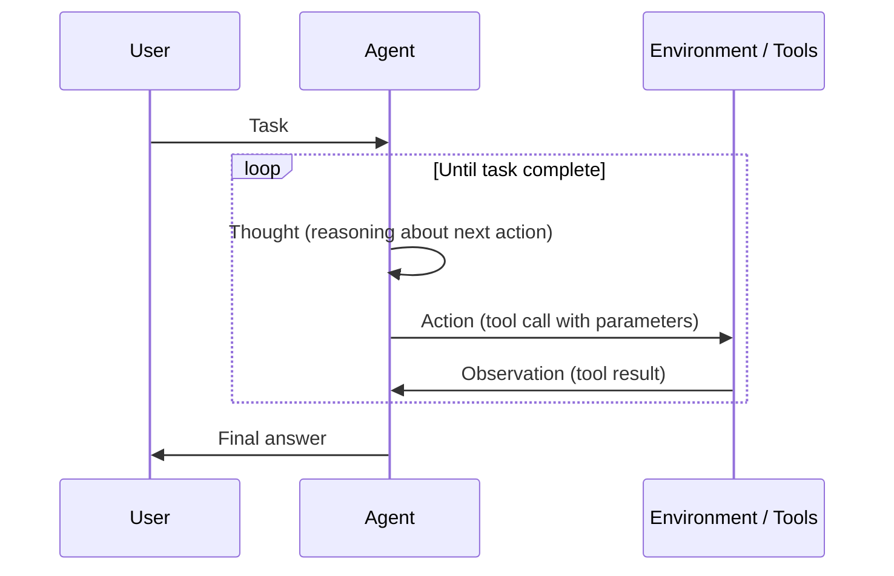
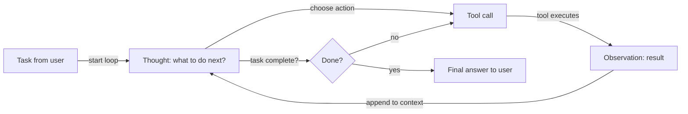

# ReAct (Reasoning + Acting)

## Definition

ReAct ist ein Paradigma, bei dem das Modell abwechselnd **denkt** (was als nächstes zu tun ist, warum) und **handelt** (Werkzeugaufrufe). Die Beobachtung aus der Umgebung fließt zurück in den nächsten Denkschritt und bildet eine Schleife, bis die Aufgabe erledigt ist. Diese Verschränkung reduziert Fehler durch blindes oder repetitives Werkzeugnutzen, da jeder Aktion eine explizite Begründung vorangeht.

Der Kernbeitrag des ReAct-Papers ist die Erkenntnis, dass die Kombination von Denk- und Handlungsschritten in einem einzigen LLM-Aufruf beide einzeln übertrifft: reines Denken (CoT) verfehlt faktische Verankerung, und reines Handeln (Werkzeugaufruf ohne Gedanken) ist fehleranfällig und schwer zu debuggen. Durch das Sichtbarmachen der Gedanken erzeugt ReAct auch interpretierbare Agenten-Traces, die Menschen inspizieren und korrigieren können.

Es ist das Standardmuster für [Agenten](/docs/agents), die Werkzeuge nutzen. Oft kombiniert mit [Chain-of-Thought](/docs/reasoning-patterns/cot) (Denken innerhalb des Gedankenschritts) und mit [RDD](/docs/reasoning-patterns/rdd), wenn abgerufene Spezifikationen jede Entscheidung leiten sollen.

## Funktionsweise

### Gedanke–Aktion–Beobachtung-Schleife



### Agenten-Entscheidungsfluss



Das Prompt-Format ist **Gedanke → Aktion → Beobachtung → Gedanke → … → Endgültige Antwort**. Der **Benutzer** gibt eine **Aufgabe**; der **Agent** erzeugt einen **Gedanken** (Überlegung, was zu tun ist), dann eine **Aktion** (z. B. Werkzeugaufruf). Die **Umgebung/Werkzeuge** geben eine **Beobachtung** zurück, die dem Kontext für den nächsten Gedanken hinzugefügt wird. Das Modell entscheidet, wann Werkzeuge aufzurufen sind und wann ein Fazit zu ziehen ist. Frameworks wie LangChain und LlamaIndex implementieren ReAct-artige Agenten mit Werkzeugregistrierung und Nachrichtenverarbeitung.

## Wann verwenden / Wann NICHT verwenden

| Szenario | ReAct verwenden | ReAct nicht verwenden |
|---|---|---|
| Agent nutzt mehrere Werkzeuge (Suche, Rechner, API) | Ja — Gedanke vor Aktion reduziert Werkzeugmissbrauch | Nein — wenn nur ein Werkzeug benötigt wird, reicht einfacher Funktionsaufruf |
| Debuggbares Agentenverhalten erforderlich | Ja — Gedanken-Traces sind inspizierbar und protokollierbar | Nein — für Black-Box-Pipelines, bei denen keine Traces benötigt werden |
| Mehrstufige Recherche mit sich entwickelndem Kontext | Ja — jede Beobachtung informiert den nächsten Gedanken | Nein — einmaliges Abrufen + Generieren ist schneller und günstiger |
| Hochzuverlässige Aufgaben (z. B. Codeausführung) | Ja — Denken vor dem Handeln fängt wahrscheinliche Fehler ab | Nein — für einfache CRUD-Aufgaben ohne Mehrdeutigkeit |
| Sehr niedrige Latenzanforderungen | Nein — Gedankengenerierung fügt Token pro Schritt hinzu | Ja — direkter Funktionsaufruf ist schneller, wenn Denken unnötig ist |

## Vergleiche

| Muster | Hat expliziten Gedanken | Hat Werkzeugnutzung | Schleife | Am besten für |
|---|---|---|---|---|
| CoT | Ja | Nein | Nein | Statische Reasoning-Aufgaben |
| ReAct | Ja | Ja | Ja | Werkzeugnutzende Agenten |
| Funktionsaufruf (ohne Gedanken) | Nein | Ja | Nein | Einfache, deterministische Werkzeugaufrufe |
| RDD | Ja (spezifikationsgelenkt) | Ja | Ja | Compliance- und spezifikationsgesteuerte Agenten |

## Vor- und Nachteile

| Vorteile | Nachteile |
|---|---|
| Reduziert blinde oder repetitive Werkzeugaufrufe | Extra Tokens pro Schritt (Gedanken-Overhead) |
| Erzeugt interpretierbare, debuggbare Traces | Schleife kann zu lang laufen, wenn Abbruchkriterien schwach sind |
| Funktioniert gut mit LangChain/LlamaIndex out of the box | Erfordert gut definierte Werkzeug-Schemas und Fehlerbehandlung |
| Behandelt mehrstufige Aufgaben auf natürliche Weise | Gedankenqualität hängt vom zugrunde liegenden Modell ab |

## Code-Beispiele

```python
from langchain_openai import ChatOpenAI
from langchain.agents import create_react_agent, AgentExecutor
from langchain_community.tools import DuckDuckGoSearchRun
from langchain import hub

# Load a pre-built ReAct prompt template
prompt = hub.pull("hwchase17/react")

# Define tools
tools = [DuckDuckGoSearchRun()]

# Create ReAct agent
llm = ChatOpenAI(model="gpt-4o-mini", temperature=0)
agent = create_react_agent(llm=llm, tools=tools, prompt=prompt)
executor = AgentExecutor(agent=agent, tools=tools, verbose=True, max_iterations=5)

# Run — the agent will produce Thought/Action/Observation traces
result = executor.invoke({"input": "What is the current population of Tokyo?"})
print(result["output"])
```

## Praktische Ressourcen

- [ReAct: Synergizing Reasoning and Acting in LLMs (Yao et al.)](https://arxiv.org/abs/2210.03629) — Originales ReAct-Paper mit Benchmarks auf HotpotQA, Fever und ALFWorld
- [LangChain – ReAct agent](https://python.langchain.com/docs/concepts/agents/) — ReAct-artige Agenten mit Werkzeugregistrierung in LangChain
- [Anthropic – Tool use guide](https://docs.anthropic.com/en/docs/build-with-claude/tool-use) — Claudes native Werkzeugnutzung, die ReAct-artige Gedanke-Handlung-Muster folgt

## Siehe auch

- [Agenten](/docs/agents)
- [Reasoning-Muster](/docs/reasoning-patterns)
- [Chain-of-Thought](/docs/reasoning-patterns/cot)
- [RDD](/docs/reasoning-patterns/rdd)
