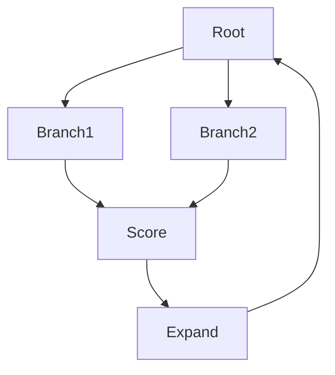

# Tree of thoughts (ToT)

## Definition

Tree of Thoughts erweitert CoT durch Pflege mehrerer Argumentationszweige. At each step, the model generates several continuations; a heuristic (or another model) scores them and guides search (z. B. best-first, beam).

Verwenden Sie es, wenn ein einzelnes [chain-of-thought](/docs/reasoning-patterns/cot) path might get stuck (z. B. game moves, multi-step planning) and you can afford multiple LLM calls. It trades compute for better search over the space of solutions. See [Schlussfolgern patterns](/docs/reasoning-patterns) for die vollständige set of options.

## Funktionsweise

Start from a **root** (z. B. die Frage oder der Anfangszustand). **Branch**: bei jedem Schritt, generate several continuations (z. B. next Schlussfolgern steps or moves). **Score** each branch with a heuristic or a separate model (z. B. “how promising is this partial solution?”). **Expand** the best node(s) and repeat; prune low-scoring branches to limit cost. Search strategy (best-first, beam, BFS) and branching factor control exploration vs compute. The tree is built incrementally until a solution is found or a depth/budget limit is reached.

## Anwendungsfälle

Tree-of-thoughts is useful wenn Sie want to explore and score multiple solution paths anstatt ein einzelnes chain.

- Game playing and planning where multiple moves need evaluation
- Math or logic with several solution paths to explore
- Creative or Entwurf tasks where generating and scoring options helps

## Externe Dokumentation

- [Tree of Thoughts (Yao et al.)](https://arxiv.org/abs/2305.10601) — ToT paper
- [LangChain – Tree of thoughts](https://python.langchain.com/docs/concepts/agents/) — ToT and related patterns

## Siehe auch

- [Chain-of-thought](/docs/reasoning-patterns/cot)
- [Reasoning patterns](/docs/reasoning-patterns)
