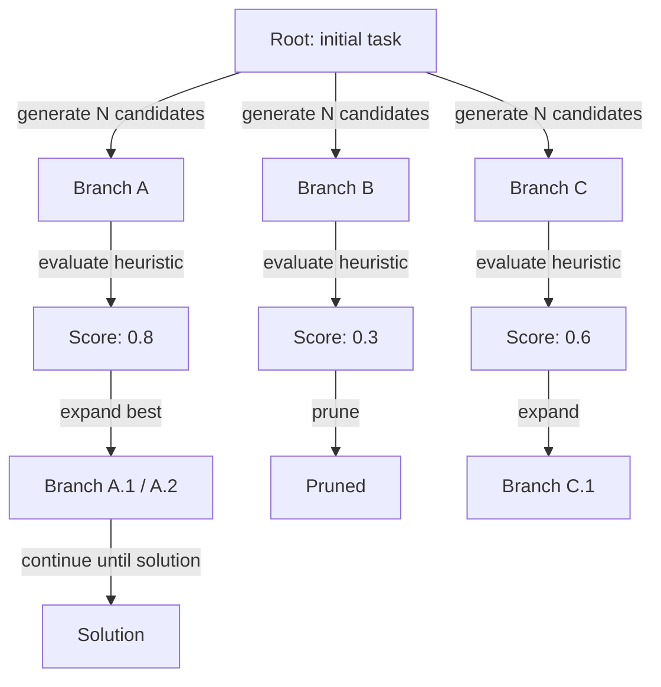
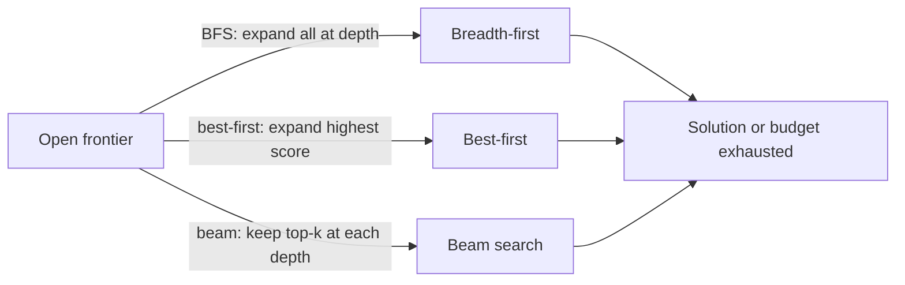

# Tree of thoughts (ToT)

## Definition

Tree of Thoughts (ToT) erweitert CoT durch die gleichzeitige Pflege mehrerer Reasoning-Zweige. Bei jedem Schritt generiert das Modell mehrere Kandidaten-Fortsetzungen; eine Heuristik oder ein separates Bewertungsmodell bewertet sie, und ein Suchalgorithmus (Best-First, Beam Search oder BFS) entscheidet, welche Zweige weiter ausgebaut werden.

Die zentrale Erkenntnis ist, dass schwierige Probleme — Planung, Spielen, komplexe Beweise — möglicherweise Rückverfolgung oder Exploration von Alternativen erfordern, bevor eine Entscheidung getroffen wird. Ein einzelner [Chain-of-Thought](/docs/reasoning-patterns/cot)-Pfad hat keinen Mechanismus, um sich von einem schlechten Zwischenschritt zu erholen; ToT pflegt explizit eine Frontier vielversprechender Zweige und beschneidet unversprechende, ähnlich wie klassische Baumsuchalgorithmen (MCTS, A*), die auf die Sprachgenerierung angewendet werden.

Verwenden Sie es, wenn ein einzelner [Chain-of-Thought](/docs/reasoning-patterns/cot)-Pfad stecken bleiben könnte (z. B. Spielzüge, mehrstufige Planung) und Sie mehrere LLM-Aufrufe leisten können. Es tauscht Rechenaufwand gegen bessere Suche über den Lösungsraum. Siehe [Reasoning-Muster](/docs/reasoning-patterns) für den vollständigen Satz an Optionen.

## Funktionsweise

### Baum-Expansion und Beschneidung



### Suchstrategien



Start von einer **Wurzel** (z. B. die Frage oder der Anfangszustand). **Verzweigung**: Bei jedem Schritt werden mehrere Fortsetzungen generiert (z. B. nächste Reasoning-Schritte oder Züge). **Bewertung** jedes Zweigs mit einer Heuristik oder einem separaten Modellaufruf (z. B. "Wie vielversprechend ist diese Teillösung auf einer Skala von 1–10?"). **Expansion** des besten Knotens/der besten Knoten und Wiederholung; Beschneidung niedrig bewerteter Zweige zur Kostenbegrenzung. Der Baum wird inkrementell aufgebaut, bis eine Lösung gefunden wird oder ein Tiefen-/Budget-Limit erreicht ist. Verzweigungsfaktor und maximale Tiefe sind wichtige Hyperparameter, die den Kosten-Qualitäts-Kompromiss steuern.

## Wann verwenden / Wann NICHT verwenden

| Szenario | ToT verwenden | ToT nicht verwenden |
|---|---|---|
| Spielen oder Rätsel lösen mit vielen Zügen | Ja — Zweige zu erkunden ist wesentlich | Nein — CoT reicht für einpfadige Rätsel |
| Komplexe mehrstufige Planung mit Rückverfolgung | Ja — ToT kann sich von Sackgassen erholen | Nein — einfachere Aufgaben benötigen keine Rückverfolgung |
| Kreative Generierung mit vielen gültigen Optionen | Ja — mehrere Entwürfe generieren und bewerten | Nein — einzelne kreative Ausgabe benötigt es nicht |
| Produktionsinferenz mit hohem Volumen | Nein — mehrere LLM-Aufrufe sind teuer | Ja — stattdessen CoT oder direkte Prompts verwenden |
| Harte Echtzeit-Anforderungen | Nein — ToT-Latenz ist hoch | Ja — nicht geeignet für Sub-Sekunden-Antworten |

## Vergleiche

| Ansatz | Erkundete Pfade | Bewertung | Kosten | Am besten für |
|---|---|---|---|---|
| CoT | 1 | Keine | Niedrig (1 Aufruf) | Lineare mehrstufige Aufgaben |
| Selbstkonsistenz | N (parallel) | Mehrheitsvoting | Mittel (N Aufrufe) | Aufgaben mit verifizierbaren Antworten |
| ToT | N (sequenziell, beschnitten) | Heuristik / Modell | Hoch (N+ Aufrufe) | Planung, Suche, Kreativität |
| MCTS (klassisch) | N (Simulation) | Belohnungssignal | Sehr hoch | Spiel-KI mit klarer Belohnung |

## Vor- und Nachteile

| Vorteile | Nachteile |
|---|---|
| Erkundet und erholt sich von Sackgassen | Sehr hohe Token- und API-Kosten |
| Erzeugt hochwertigere Lösungen für schwierige Aufgaben | Erfordert eine gute Bewertungs-/Evaluierungsfunktion |
| Spiegelt klassische Suche wider — prinzipientreu und anpassbar | Komplexer zu implementieren als CoT |
| Verzweigungsfaktor ist für Kosten-Qualitäts-Kompromiss einstellbar | Nicht alle Aufgaben profitieren von mehrpfadiger Suche |

## Code-Beispiele

```python
from openai import OpenAI

client = OpenAI()

def generate_thoughts(state: str, n: int = 3) -> list[str]:
    """Generate N candidate next steps from the current state."""
    response = client.chat.completions.create(
        model="gpt-4o-mini",
        messages=[
            {
                "role": "user",
                "content": (
                    f"Current reasoning state:\n{state}\n\n"
                    f"Generate {n} distinct possible next reasoning steps. "
                    "Number each one."
                ),
            }
        ],
    )
    raw = response.choices[0].message.content
    # Simple parse: split on numbered lines
    return [line.strip() for line in raw.split("\n") if line.strip() and line[0].isdigit()]

def score_thought(state: str, thought: str) -> float:
    """Score a thought's promise on a 0-1 scale."""
    response = client.chat.completions.create(
        model="gpt-4o-mini",
        messages=[
            {
                "role": "user",
                "content": (
                    f"Rate how promising this reasoning step is for solving the task "
                    f"(0 = dead end, 1 = very promising).\n\n"
                    f"State: {state}\nThought: {thought}\n\nScore (0.0–1.0):"
                ),
            }
        ],
    )
    try:
        return float(response.choices[0].message.content.strip())
    except ValueError:
        return 0.5

# Simple best-first ToT (depth 2, branching factor 3)
task = "Plan 3 steps to build a minimal RAG chatbot."
candidates = generate_thoughts(task, n=3)
scored = [(thought, score_thought(task, thought)) for thought in candidates]
best = max(scored, key=lambda x: x[1])
print("Best next step:", best[0])
```

## Praktische Ressourcen

- [Tree of Thoughts (Yao et al.)](https://arxiv.org/abs/2305.10601) — Originales ToT-Paper mit Game-of-24 und Creative-Writing-Benchmarks
- [LangChain – Agents and planning](https://python.langchain.com/docs/concepts/agents/) — ToT und verwandte Planungsmuster
- [Princeton NLP – ToT repository](https://github.com/princeton-nlp/tree-of-thought-llm) — Referenzimplementierung der Paper-Autoren

## Siehe auch

- [Chain-of-Thought](/docs/reasoning-patterns/cot)
- [Reasoning-Muster](/docs/reasoning-patterns)
- [Agenten](/docs/agents)
