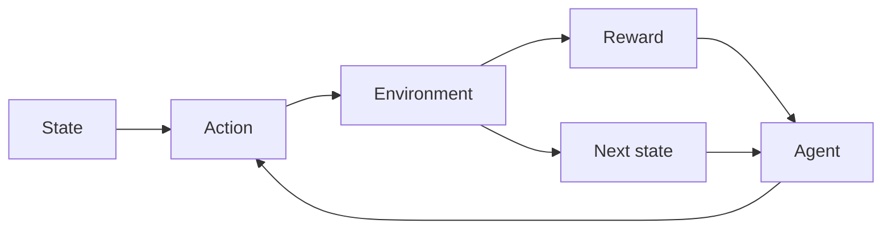

# Reinforcement learning (RL)

## Definition

Bestärkendes Lernen trainiert Agenten, kumulative Belohnung zu maximieren in an environment. The agent takes actions, receives observations and rewards, and improves its policy (z. B. value-based, policy gradient, actor-critic).

Es unterscheidet sich von [supervised](/docs/fundamentals/machine-learning) and [unsupervised](/docs/fundamentals/machine-learning) learning weil das Feedback sparse and delayed (rewards), and the agent must explore. Used in games, robotics, and [LLM](/docs/llms) alignment (RLHF). For high-dimensional states/actions, see [deep RL](/docs/drl).

## Funktionsweise

Die Situation ist normalerweise ein **MDP**: der **Agent** sieht einen **Zustand**, wählt eine **Aktion**, und die **Umgebung** gibts a **reward** and **next state**. The agent improves its policy (mapping from state to action) to maximize cumulative reward. **Value-based** methods (z. B. Q-learning, DQN) learn a value function and derive the policy; **policy gradient** methods (z. B. PPO, SAC) optimize the policy directly. Exploration (z. B. epsilon-greedy, entropy bonus) is needed because rewards are only observed for actions taken. Algorithms differ in how they handle off-policy data, continuous actions, and scaling to large state spaces.

## Anwendungsfälle

Reinforcement learning applies wherever an agent learns from rewards and sequential Entscheidungs (games, control, alignment).

- Game playing (z. B. Atari, Go, poker) and simulation
- Robotics control and continuous control (z. B. manipulation)
- LLM alignment (z. B. RLHF) and sequential Entscheidung systems

## Externe Dokumentation

- [Reinforcement Learning (Sutton & Barto)](http://incompleteideas.net/book/the-book-2nd.html) — Free online book
- [Spinning Up in Deep RL (OpenAI)](https://spinningup.openai.com/)

## Siehe auch

- [Deep RL](/docs/drl)
- [Machine learning](/docs/fundamentals/machine-learning)
- [Agents](/docs/agents)
