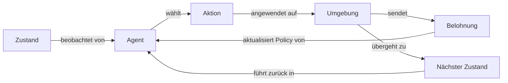

# Reinforcement Learning (RL)

## Definition

Reinforcement Learning (RL) ist ein Machine-Learning-Paradigma, bei dem ein Agent lernt, Entscheidungen zu treffen, indem er mit einer Umgebung interagiert und Rückmeldung in Form von Belohnungen oder Strafen erhält. Im Gegensatz zu überwachtem Lernen gibt es keine beschrifteten Eingabe-Ausgabe-Paare; der Agent muss durch Versuch und Irrtum herausfinden, welche Aktionen die meiste kumulative Belohnung einbringen. Das Kernziel ist es, eine **Policy** zu finden — eine Abbildung von Zuständen auf Aktionen — die die langfristige Belohnung maximiert.

Das mathematische Framework, das den meisten RL-Problemen zugrunde liegt, ist der **Markov Decision Process (MDP)**: ein Tupel aus Zuständen, Aktionen, Übergangswahrscheinlichkeiten und Belohnungen. Bei jedem Zeitschritt beobachtet der Agent den aktuellen Zustand, wählt eine Aktion und geht in einen neuen Zustand über, während er ein Belohnungssignal erhält. Da Feedback spärlich und verzögert ist (eine Belohnung kann lange nach der verantwortlichen Aktion ankommen), muss der Agent über **Kreditzuweisung** über die Zeit nachdenken.

RL unterscheidet sich grundlegend von [überwachtem](/docs/fundamentals/machine-learning) und [unüberwachtem](/docs/fundamentals/machine-learning) Lernen, weil die Aktionen des Agenten zukünftige Beobachtungen beeinflussen, was Explorationsstrategien (z. B. Epsilon-Greedy, Entropie-Boni) erfordert, um bessere Policies zu entdecken. Es wird bei Spielen, Robotik, Scheduling und [LLM](/docs/llms)-Ausrichtung über RLHF angewendet. Wenn Zustands- oder Aktionsräume hochdimensional werden, verwendet [Deep RL](/docs/drl) neuronale Netze zur Funktionsapproximation.

## Funktionsweise

### Die MDP-Schleife

Bei jedem Schritt beobachtet der **Agent** einen **Zustand**, wählt eine **Aktion**, und die **Umgebung** gibt eine **Belohnung** und den **nächsten Zustand** zurück. Dieser Zyklus wiederholt sich bis zur Beendigung oder Konvergenz.



### Wertbasierte Methoden

Methoden wie Q-Learning und DQN lernen eine **Wertfunktion** Q(s, a) — die erwartete kumulative Belohnung für Aktion *a* in Zustand *s* — und leiten die Policy ab, indem sie gierig bezüglich Q handeln. Die Bellman-Gleichung wird verwendet, um Q-Schätzungen iterativ mit beobachteten Übergängen zu aktualisieren.

### Policy-Gradient-Methoden

Algorithmen wie PPO und SAC parametrisieren und optimieren die Policy direkt mit Gradientenaufstieg auf der erwarteten Rendite. Sie handhaben kontinuierliche Aktionsräume natürlich und werden in Robotik und LLM-Fine-Tuning (RLHF) bevorzugt. Actor-Critic-Methoden (z. B. A3C, SAC) kombinieren eine Wertfunktion (Kritiker) mit einer direkten Policy (Akteur), um die Varianz zu reduzieren.

### Exploration

Da Belohnungen nur für tatsächlich ausgeführte Aktionen beobachtet werden, muss der Agent **erkunden**: Zustände besuchen, die er noch nicht gesehen hat, um potenziell bessere Policies zu entdecken. Gängige Strategien umfassen Epsilon-Greedy (zufällige Aktion mit Wahrscheinlichkeit ε), Upper-Confidence-Bound (UCB) und entropiebasierte Boni.

## Wann verwenden / Wann NICHT verwenden

| Szenario | RL verwenden | RL vermeiden |
|---|---|---|
| Sequenzielle Entscheidungen mit verzögertem Feedback | Ja — RL ist dafür konzipiert | Nein — überwachtes Lernen bevorzugen wenn Labels vorhanden |
| Simulator oder Umgebung für Training verfügbar | Ja — sichere Exploration in der Simulation | Nein — nur reale Welt mit hohen Fehlerkosten |
| Belohnungssignal klar definiert werden kann | Ja — klar spezifizierte Belohnung leitet das Lernen | Nein — wenn Belohnung mehrdeutig oder multi-objektiv ohne sorgfältige Gestaltung |
| Großer beschrifteter Datensatz vorhanden | Nein — überwachtes Lernen ist einfacher und schneller | — |
| Einmalige Vorhersage (keine Zeitdimension) | Nein — Regression oder Klassifizierung reicht aus | — |

## Vergleiche

| Paradigma | Feedback-Typ | Datenquelle | Exploration erforderlich |
|---|---|---|---|
| Überwachtes Lernen | Beschriftete Paare | Statischer Datensatz | Nein |
| Unüberwachtes Lernen | Keine Labels | Statischer Datensatz | Nein |
| Reinforcement Learning | Belohnungssignal | Agenten-Interaktionen | Ja |
| Imitation Learning | Experten-Demonstrationen | Menschliche Trajektorien | Minimal |

## Vor- und Nachteile

| Vorteile | Nachteile |
|---|---|
| Lernt aus Interaktion ohne beschriftete Daten | Stichprobenineeffizient — benötigt viele Umgebungsschritte |
| Kann übermenschliche Strategien entdecken (z. B. AlphaGo) | Belohnungsgestaltung ist nicht trivial; fehlspezifizierte Belohnung führt zu schlechtem Verhalten |
| Gilt für sequenzielle, langfristige Probleme | Trainingsinstabilität; hyperparameter-sensitiv |
| Ermöglicht kontinuierliche Verbesserung aus Erfahrung | Exploration in gefährlichen realen Umgebungen ist kostspielig |

## Code-Beispiele

Grundlegendes Q-Learning auf einer einfachen Gitterumgebung mit Python:

```python
import numpy as np

# Environment: 5-state chain, action 0 = left, action 1 = right
n_states, n_actions = 5, 2
Q = np.zeros((n_states, n_actions))
alpha, gamma, epsilon = 0.1, 0.9, 0.1

def step(state, action):
    """Returns (next_state, reward)."""
    next_state = max(0, state - 1) if action == 0 else min(n_states - 1, state + 1)
    reward = 1.0 if next_state == n_states - 1 else 0.0
    return next_state, reward

for episode in range(500):
    state = 0
    for _ in range(20):
        # Epsilon-greedy action selection
        if np.random.rand() < epsilon:
            action = np.random.randint(n_actions)
        else:
            action = np.argmax(Q[state])

        next_state, reward = step(state, action)

        # Bellman update
        td_target = reward + gamma * np.max(Q[next_state])
        Q[state, action] += alpha * (td_target - Q[state, action])
        state = next_state

print("Learned Q-table:\n", Q)
```

## Praktische Ressourcen

- [Reinforcement Learning: An Introduction (Sutton & Barto)](http://incompleteideas.net/book/the-book-2nd.html) — Das kanonische kostenlose Lehrbuch über MDP-Theorie, TD-Lernen und Policy-Gradienten
- [Spinning Up in Deep RL (OpenAI)](https://spinningup.openai.com/) — Praktischer Leitfaden mit Implementierungen von PPO, SAC und DDPG
- [Gymnasium (ehemals OpenAI Gym)](https://gymnasium.farama.org/) — Standard-Python-API für RL-Umgebungen
- [Stable-Baselines3](https://stable-baselines3.readthedocs.io/) — Produktionsreife Implementierungen von PPO, SAC, DQN und mehr

## Siehe auch

- [Deep RL](/docs/drl)
- [Machine Learning](/docs/fundamentals/machine-learning)
- [Agenten](/docs/agents)
