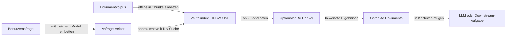

# Semantische Suche

## Definition

Semantische Suche ist ein Retrieval-Paradigma, das Ergebnisse basierend auf Bedeutung und Absicht statt auf exaktem Keyword-Matching zurückgibt. Eine Benutzeranfrage und die Dokumente im Korpus werden beide in dichte Vektorrepräsentationen (Embeddings) kodiert, und Retrieval wird durch Finden der Dokumente durchgeführt, deren Vektoren dem Anfrage-Vektor am ähnlichsten sind — typischerweise mit Kosinus-Ähnlichkeit oder Skalarprodukt. Da der Embedding-Raum aus großen Korpora gelernt wird, findet eine Anfrage wie „günstiges Unterkommen" korrekt Dokumente, die „billige Hotels" enthalten, obwohl sie keine Keywords teilen.

Die Kernidee ist, dass ein gut trainiertes Embedding-Modell semantisch ähnlichen Text nahe beieinander liegenden Punkten in einem hochdimensionalen Vektorraum zuordnet. Dies wird durch kontrastive Trainingsziele erreicht: Ähnliche Sätze werden zusammengezogen und unähnliche auseinandergedrückt. Modelle wie Sentence-BERT, OpenAI Ada und Cohere Embed sind speziell für Retrieval-Aufgaben trainiert und lernen, subtile Bedeutungsunterschiede zu unterscheiden, die ein Bag-of-Words-Modell vermissen würde. Die Dimensionalität des Embeddings (häufig 768 bis 3072) bestimmt die Ausdrucksstärke der Repräsentation, während die Wahl der Ähnlichkeitsfunktion und des Approximate-Nearest-Neighbor (ANN)-Index die Retrieval-Geschwindigkeit und -Genauigkeit bestimmt.

Semantische Suche ist das Retrieval-Rückgrat von [RAG (Retrieval-Augmented Generation)](/docs/rag): Benutzeranfragen werden eingebettet und gegen eine Bibliothek vorindizierter Dokument-Chunks abgeglichen, und die Top-Ergebnisse werden in das Kontextfenster des LLMs eingefügt. Es unterstützt auch Empfehlungssysteme („ähnliche Artikel"), Deduplizierungs-Pipelines und Clustering. Hybride Suche — Kombination semantischen (dichten) Retrievals mit Keyword-basiertem (sparsem, BM25) Retrieval und Re-Ranking der kombinierten Ergebnisse — übertrifft oft jeden Ansatz allein, besonders bei Anfragen, die natürliche Sprachintention mit spezifischen technischen Begriffen oder Bezeichnern mischen.

## Funktionsweise

### Embedding und Indexierung

Dokumente werden in Chunks aufgeteilt (für Langform-Inhalte), mit einem Bi-Encoder-Modell eingebettet und in einem Vektorindex gespeichert. Der Index kann ein flacher Brute-Force-Index (für kleine Korpora) oder ein Approximate-Nearest-Neighbor-Index wie HNSW (Hierarchical Navigable Small World) oder IVF (Inverted File Index) für groß angelegtes Retrieval sein.

### Abfrageausführung



### Hybride Suche und Re-Ranking

Reine semantische Suche kann Ergebnisse verpassen, bei denen exakte Begriffe wichtig sind (Produktcodes, Namen, technische Bezeichner). Hybride Suche führt sowohl Dense- (semantisches) als auch Sparse- (BM25 Keyword-) Retrieval aus und fusioniert Ergebnisse mit Reciprocal Rank Fusion oder einer gelernten Kombination. Ein Cross-Encoder-Re-Ranker bewertet dann die Top-Kandidaten, indem er Anfrage und jedes Dokument gemeinsam kodiert — genauer, aber langsamer als der Bi-Encoder-Retrieval-Schritt.

## Wann verwenden / Wann NICHT verwenden

| Verwenden wenn | Vermeiden wenn |
|----------|------------|
| Benutzer Absicht in natürlicher Sprache ausdrücken und exaktes Keyword-Matching schlechten Recall erzeugt | Benutzer immer mit exakten Produktcodes, IDs oder strukturierten Filtern suchen |
| Korpus paraphrasierte oder vielfältige Formulierungen für dieselben Konzepte enthält | Korpus klein genug ist, dass Volltext-Suche mit guter Tokenisierung ausreicht |
| RAG-Pipelines gebaut werden, die relevantes Kontext-Retrieval benötigen | Latenzanforderungen keinen Vektorindex-Lookup erlauben |
| Empfehlungs- und „ähnliche Artikel"-Funktionen in benutzerseitigen Produkten | Datenschutzeinschränkungen das Einbetten von Dokumenten in Drittanbieter-Modellen verhindern |

## Vergleiche

| Methode | Matching-Strategie | Stärken | Einschränkungen |
|--------|------------------|-----------|-------------|
| Keyword (BM25) | Exakte Termhäufigkeit | Schnell, interpretierbar, handhabt seltene Begriffe | Vermisst Synonyme und Paraphrasen |
| Semantisch (dense) | Embedding-Ähnlichkeit | Handhabt Synonymie, Absicht, Kontext | Vermisst seltene Exact-Match-Begriffe; benötigt Embedding-Modell |
| Hybrid (BM25 + dense) | Kombiniertes Ranking | Das Beste aus beiden Welten | Mehr Infrastruktur-Komplexität |
| Cross-Encoder Re-Ranker | Gemeinsame Anfrage-Dok-Bewertung | Höchste Genauigkeit | Langsam; nur für Top-k-Kandidaten |

## Vor- und Nachteile

| Vorteile | Nachteile |
|------|------|
| Verarbeitet natürliche Sprachanfragen robust | Erfordert Embedding-Modell und Vektorindex-Infrastruktur |
| Funktioniert über Sprachen hinweg mit einem mehrsprachigen Modell | Embedding-Qualität bestimmt Retrieval-Obergrenze; schlechte Modelle produzieren schlechte Ergebnisse |
| Skaliert auf Millionen von Dokumenten mit ANN-Indizes | ANN-Indizes führen Recall-Latenz-Kompromisse ein |
| Ermöglicht leistungsstarke RAG- und Empfehlungssysteme | Chunking-Strategie und Embedding-Granularität erfordern sorgfältiges Tuning |

## Code-Beispiele

### Semantische Suche mit Sentence-BERT und FAISS (Python)

```python
from sentence_transformers import SentenceTransformer
import faiss
import numpy as np

model = SentenceTransformer("all-MiniLM-L6-v2")

# Index a small corpus
corpus = [
    "How to fine-tune a transformer model on a custom dataset",
    "Introduction to reinforcement learning from human feedback",
    "Best practices for deploying machine learning models to production",
    "Understanding attention mechanisms in neural networks",
    "Data augmentation techniques for computer vision tasks",
]

corpus_embeddings = model.encode(corpus, convert_to_numpy=True)
corpus_embeddings = corpus_embeddings / np.linalg.norm(corpus_embeddings, axis=1, keepdims=True)

# Build a FAISS index (inner product = cosine similarity on normalized vectors)
index = faiss.IndexFlatIP(corpus_embeddings.shape[1])
index.add(corpus_embeddings.astype(np.float32))

# Query
query = "how to deploy ML models"
query_embedding = model.encode([query], convert_to_numpy=True)
query_embedding = query_embedding / np.linalg.norm(query_embedding)

scores, indices = index.search(query_embedding.astype(np.float32), k=3)

print(f"Query: {query}\nTop results:")
for rank, (score, idx) in enumerate(zip(scores[0], indices[0])):
    print(f"  {rank + 1}. [{score:.3f}] {corpus[idx]}")
```

## Praktische Ressourcen

- [Sentence-BERT (SBERT)](https://www.sbert.net/) — Dense-Retrieval-Modelle, Dokumentation und vortrainierte Checkpoints
- [FAISS Dokumentation (Meta AI)](https://faiss.ai/) — Effiziente Ähnlichkeitssuche und Clustering-Bibliothek
- [LangChain – Vektorspeicher](https://python.langchain.com/docs/concepts/vectorstores/) — Semantische Suche in RAG-Pipelines integrieren
- [Pinecone – Was ist semantische Suche?](https://www.pinecone.io/learn/semantic-search/) — Praktische Erklärung mit Beispielen
- [Cohere – Embed API](https://docs.cohere.com/reference/embed) — Mehrsprachige Embeddings für Retrieval

## Siehe auch

- [Embeddings](/docs/rag/embeddings)
- [Vektordatenbanken](/docs/rag/vector-databases)
- [RAG](/docs/rag)
