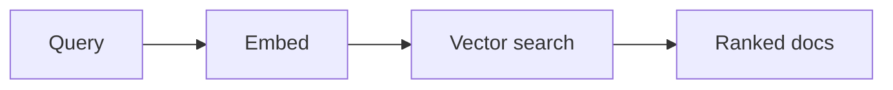

# Semantische Suche

## Definition

Semantische Suche ruft Elemente nach Bedeutung statt nach exakten Schlüsselwörtern ab. Query and documents are embedded; Abruf returns the most similar vectors (z. B. cosine similarity or ANN search).

Es ist the Abruf backbone of [RAG](/docs/rag): see [embeddings](/docs/rag/embeddings) and [vector databases](/docs/rag/vector-databases) for how vectors are produced and stored. Verwenden Sie es, wenn users express intent in natural language and you want “similar meaning” anstatt literal keyword nachzuahmen. Combines well with keyword (hybrid search) when exact terms matter.

## Funktionsweise

The **query** (und optional filters) is sent to an **embedding** model das einen Vektor ausgibt. **Vector search** (z. B. k-NN or approximate k-NN over an index of document vectors) returns the **ranked docs** (or chunk IDs) with highest similarity (z. B. cosine or dot product). Embedding models are trained so that semantically similar text maps to nearby vectors; the same model is used for queries and documents. Indexing can be offline (batch) or incremental; scale and latency determine whether you need an approximate index (HNSW, IVF) and a dedicated [vector database](/docs/rag/vector-databases).

## Anwendungsfälle

Semantic search wird immer verwendet, wenn you need to find items by meaning anstatt exact keywords (RAG, recommendations, dedup).

- RAG Abruf: finding relevant chunks for a user query
- Recommendation and “similar item” search
- Duplicate or near-duplicate detection in document sets

## Externe Dokumentation

- [Sentence-BERT](https://www.sbert.net/) — Dense Abruf models
- [LangChain – Vector stores](https://python.langchain.com/docs/concepts/vectorstores/)

## Siehe auch

- [Embeddings](/docs/rag/embeddings)
- [Vector databases](/docs/rag/vector-databases)
- [RAG](/docs/rag)
