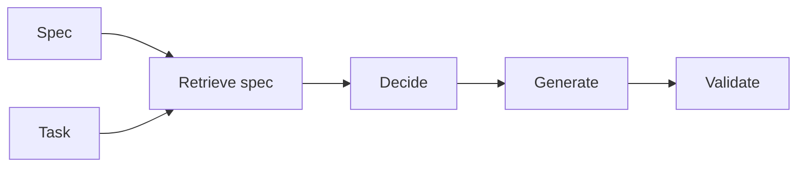

# Spezifikationsgetriebene Entwicklung

## Definition

Spezifikationsgetriebene Entwicklung baut KI-Systeme (Agenten, Pipelines, Tools) aus expliziten Spezifikationen: requirements, output formats, allowed actions, and constraints. Specs are retrieved and used at runtime (z. B. in RDD) so behavior stays aligned with intent.

Es ist especially useful for [agents](/docs/agents) and [RDD](/docs/reasoning-patterns/rdd): anstatt enProgrammierung all rules in weights or prompts, you maintain specs (z. B. in docs or a knowledge base) and retrieve them at runtime. Fits regulated domains and teams that want behavior to be auditable and updatable ohne Neutraining.

## Funktionsweise

You **write specs** (natural language, schemas, or structured rules) and index them for Abruf (z. B. in a vector store or structured repo). At runtime, the **task** (und optional the current state) is used to **retrieve** relevant spec fragments. The model or agent **decides** (z. B. next step, allowed actions) and **generates** (output, tool call) mit dem spec in context. **Validate** checks the output against the spec (z. B. schema, rules); if validation fails, you can retry or surface an error. This keeps generation and Entscheidungs aligned mit dem spec without baking everything into [prompt engineering](/docs/prompt-engineering) or [Feinabstimmung](/docs/llms/fine-tuning).

## Anwendungsfälle

Spec-driven development passt, wenn behavior must stay aligned with retrievable requirements (RDD, compliance, or safety).

- Building agents that retrieve and follow specs (z. B. RDD pattern)
- Enforcing output format and constraints (JSON, allowed actions)
- Regulated or safety-critical flows where behavior must nachzuahmen requirements

## Externe Dokumentation

- [LangChain – Structured output](https://python.langchain.com/docs/concepts/output_parsers/) — Enforcing output format from LLMs
- [OpenAI – Structured outputs](https://platform.openai.com/docs/guides/structured-outputs)

## Siehe auch

- [RDD](/docs/reasoning-patterns/rdd)
- [Agents](/docs/agents)
- [Prompt engineering](/docs/prompt-engineering)
