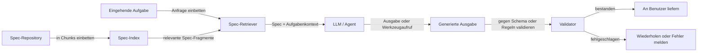

# Spec-Driven Development

## Definition

Spec-Driven Development ist ein Ansatz zum Aufbau von KI-Systemen — Agenten, Pipelines, Werkzeuge und Workflows — bei dem das Verhalten in expliziten, lesbaren Spezifikationen begründet ist, anstatt vollständig in Modellgewichten oder handgefertigten Prompt-Strings kodiert zu sein. Eine Spezifikation definiert, was das System tun soll, welche Ausgaben erlaubt sind, welche Aktionen zulässig sind, welche Einschränkungen gelten müssen und wie Erfolg aussieht. Diese Spezifikationen können viele Formen annehmen: natürliche Sprachdokumente, JSON-Schemas, OpenAPI-Definitionen, formale Regeln oder strukturierte Anforderungssätze — und sie werden als First-Class-Artefakte behandelt, die versioniert, gegen getestet und zur Laufzeit abgerufen werden.

Die Kernidee ist, die Definition des Verhaltens von seiner Implementierung zu trennen. Anstatt alle Regeln in einen monolithischen System-Prompt oder ein fine-getunedes Modell zu backen, pflegt man eine lebende Spezifikation, die unabhängig aktualisiert, geprüft und abgerufen werden kann. Im [RDD (Retrieval-Driven Development)](/docs/reasoning-patterns/rdd)-Muster werden Spezifikationen in einem Vektorspeicher oder Dokumentenrepository indexiert; zur Laufzeit ruft der Agent die relevanten Spec-Fragmente für die aktuelle Aufgabe ab und begründet seine Entscheidungen damit. Dies macht das Verhalten überprüfbar, korrigierbar ohne Neutraining und ausgerichtet auf die Spezifikation, die Domänenexperten oder Compliance-Teams lesen und genehmigen können.

Spec-Driven Development ist besonders wertvoll für [Agenten](/docs/agents) in regulierten oder sicherheitskritischen Domänen, wo die Kosten des falsch ausgerichteten Verhaltens hoch sind und Compliance-Teams verifizieren müssen, was das System tun darf. Es ergänzt auch [Prompt Engineering](/docs/prompt-engineering) — Spezifikationen liefern den stabilen semantischen Inhalt; Prompts orchestrieren, wie das Modell darüber nachdenkt und sie anwendet. Der Ansatz steht im Gegensatz zum [Vibe Coding](/docs/vibe-coding), bei dem Verhalten iterativ aus loser Absicht entsteht anstatt aus expliziten Anforderungen.

## Funktionsweise

### Spec-Erstellung und Indexierung

Spezifikationen werden in einem strukturierten, aber menschenlesbaren Format geschrieben. Für einen Agenten könnte eine Spec erlaubte Werkzeugaufrufe, erforderliches Ausgabeformat, Einschränkungen bezüglich welcher Informationen offenbart werden können, und Erfolgskriterien definieren. Diese Spezifikationen werden in Chunks aufgeteilt und indexiert — in einem Vektorspeicher für semantisches Retrieval oder in einer strukturierten Datenbank für exaktes Lookup — sodass relevante Fragmente zur Inferenzzeit abgerufen werden können.

### Retrieval, Generierung und Validierung



### Validierung und Korrektur

Der Validator prüft, ob die generierte Ausgabe oder Aktion der Spec entspricht: Schema-Validierung für strukturierte Ausgaben (JSON Schema, Pydantic), regelbasierte Prüfungen für Einschränkungen oder ein sekundärer Modellaufruf, der die Konformität verifiziert. Falls die Validierung fehlschlägt, kann das System mit der Verletzungsbeschreibung im Kontext erneut versuchen, an einen Menschen eskalieren oder einen strukturierten Fehler ausgeben. Diese geschlossene Schleife hält das Verhalten mit der Spec ausgerichtet, auch wenn das Modell anderweitig abweichen würde.

## Wann verwenden / Wann NICHT verwenden

| Verwenden wenn | Vermeiden wenn |
|----------|------------|
| Agenten-Verhalten überprüfbar sein und dokumentierten Anforderungen entsprechen muss | Anforderungen völlig unbekannt sind und iterativ entdeckt werden müssen |
| Compliance- oder Sicherheitsteams das Systemverhalten genehmigen und überprüfen müssen | Die Aufgabe exploratives Prototyping ist, wo sich die Spec bei jeder Iteration ändern würde |
| Verhalten ohne Neutraining aktualisiert werden muss (durch Änderung der Spec) | Die Spec zu komplex oder mehrdeutig für ein Modell ist, um sie zur Laufzeit zuverlässig anzuwenden |
| Ausgabeformat und Einschränkungen zuverlässig durchgesetzt werden müssen | Latenz aus Spec-Retrieval + Validierung für den Anwendungsfall inakzeptabel ist |

## Vergleiche

| Ansatz | Verhalten definiert durch | Ohne Neutraining aktualisierbar | Überprüfbar |
|----------|-------------------|------------------------------|-----------|
| Spec-Driven (RDD) | Explizite zur Laufzeit abgerufene Specs | Ja | Ja |
| Prompt Engineering | System-Prompt und Beispiele | Teilweise (Prompt-Änderungen) | Begrenzt |
| Fine-Tuning | Modellgewichte | Nein | Schwer |
| Vibe Coding | Iterativer Benutzer-Modell-Dialog | Nicht anwendbar (explorativ) | Nein |

## Vor- und Nachteile

| Vorteile | Nachteile |
|------|------|
| Verhalten ist überprüfbar und menschenlesbar ohne Gewichtsinspektion | Spec-Retrieval und Validierung fügen Latenz und Infrastruktur-Komplexität hinzu |
| Specs können von Domänenexperten ohne Neutraining aktualisiert werden | Modell kann abgerufene Spec-Fragmente falsch interpretieren oder unvollständig anwenden |
| Ermöglicht Compliance-Überprüfung und Signoff für Systemverhalten | Erfordert Disziplin, um Spec-Qualität und -Abdeckung bei sich entwickelnden Anforderungen zu pflegen |
| Validierung fängt Spec-Verletzungen ab, bevor sie Benutzer erreichen | Nicht geeignet für Aufgaben, bei denen Anforderungen inhärent fuzzy oder emergent sind |

## Code-Beispiele

### Strukturierte Ausgabe mit Spec-Validierung mit Pydantic und OpenAI (Python)

```python
from pydantic import BaseModel, field_validator
from openai import OpenAI
import json

client = OpenAI()

# Define the output spec as a Pydantic model
class SupportResponse(BaseModel):
    category: str  # "billing", "technical", "account", "other"
    priority: str  # "low", "medium", "high"
    summary: str
    suggested_action: str

    @field_validator("category")
    @classmethod
    def validate_category(cls, v: str) -> str:
        allowed = {"billing", "technical", "account", "other"}
        if v not in allowed:
            raise ValueError(f"category must be one of {allowed}")
        return v

    @field_validator("priority")
    @classmethod
    def validate_priority(cls, v: str) -> str:
        allowed = {"low", "medium", "high"}
        if v not in allowed:
            raise ValueError(f"priority must be one of {allowed}")
        return v

# System spec retrieved at runtime
spec = """
You are a support ticket classifier. Classify the ticket according to these rules:
- category: billing (payment issues), technical (bugs/errors), account (login/access), other
- priority: high (data loss, service outage), medium (degraded functionality), low (cosmetic/minor)
- summary: one sentence describing the issue
- suggested_action: one sentence recommending next steps
Output ONLY valid JSON matching the schema.
"""

ticket = "I can't log in to my account and my subscription payment failed this morning."

response = client.chat.completions.create(
    model="gpt-4o-mini",
    messages=[
        {"role": "system", "content": spec},
        {"role": "user", "content": ticket},
    ],
    response_format={"type": "json_object"},
)

raw = response.choices[0].message.content
parsed = SupportResponse(**json.loads(raw))
print(parsed.model_dump_json(indent=2))
```

## Praktische Ressourcen

- [OpenAI – Strukturierte Ausgaben](https://platform.openai.com/docs/guides/structured-outputs) — Native JSON-Schema-Durchsetzung in der API
- [LangChain – Ausgabe-Parser](https://python.langchain.com/docs/concepts/output_parsers/) — LLM-Ausgaben gegen Schemas parsen und validieren
- [Pydantic Dokumentation](https://docs.pydantic.dev/) — Datenvalidierung und Schema-Definition in Python
- [Instructor Bibliothek](https://python.useinstructor.com/) — Strukturierte LLM-Ausgaben mit Pydantic, Wiederholungslogik und Validierung
- [Guardrails AI](https://www.guardrailsai.com/) — Framework für spec-gesteuerte Ausgabevalidierung und -korrektur

## Siehe auch

- [RDD](/docs/reasoning-patterns/rdd)
- [Agenten](/docs/agents)
- [Prompt Engineering](/docs/prompt-engineering)
