# Spracherkennung

## Definition

Spracherkennung, formell als Automatische Spracherkennung (ASR) bekannt, ist die Technologie, die gesprochenes Audio in geschriebenen Text umwandelt. Es ist einer der ältesten und kommerziell reifsten Bereiche der KI und treibt heute Sprachassistenten, Live-Untertitelung, Meeting-Transkription, Call-Center-Analytik und Barrierefreiheits-Werkzeuge an. Über die Transkription hinaus umfasst die Sprachdomäne Sprecher-Identifizierung (wer spricht?), gesprochenes Sprachverstehen (SLU, Absicht und Entitäten aus Sprache extrahieren) und Sprachsynthese — Text-to-Speech (TTS) — was die inverse Aufgabe ist, natürlich klingendes Audio aus Text zu generieren.

Moderne ASR-Systeme sind überwiegend End-to-End-neuronale Modelle. Das dominante Paradigma hat sich von traditionellen Pipeline-Systemen (Akustikmodell → Sprachmodell → Decoder, jedes separat trainiert) zu End-to-End-Modellen wie Whisper (OpenAI) und wav2vec 2.0 (Meta) verschoben, die lernen, rohes Audio oder Spektrogramme direkt in einem einzelnen Modell auf Text abzubilden. Selbst-überwachtes Vor-Training auf großen unbeschrifteten Audio-Korpora — Repräsentationen ohne Transkriptions-Labels lernen — hat den Bedarf an beschrifteten Daten zur Erreichung hoher Genauigkeit über diverse Sprachen und Akzente hinweg drastisch reduziert. Modelle wie Whisper, trainiert auf 680.000 Stunden mehrsprachigem Audio, schneiden bei Sprachen, für die sie nicht explizit optimiert wurden, im Zero-Shot gut ab.

Spracherkennung liegt an der Schnittstelle von [multimodaler KI](/docs/multimodal-ai) (Audio ist eine von Text und Vision verschiedene Modalität) und [NLP](/docs/nlp) (die Ausgabe von ASR ist Text, der in nachgelagerte Sprachverständnis-Aufgaben fließt). Herausforderungen umfassen verrauschte Umgebungen, akzentbehaftete Sprache, domänenspezifisches Vokabular, Code-Switching (Sprachmischung im Satz) und die Rechenkosten der Echtzeit-Streaming-Inferenz. Sprecher-Diarisierung — Segmentierung, wer wann gesprochen hat — ist eine eng verwandte Aufgabe, die oft mit ASR in Meeting- oder Call-Center-Anwendungen kombiniert wird.

## Funktionsweise

### Feature-Extraktion

Rohes Audio (eine Wellenform bei 16 kHz oder höher gesampelt) wird in eine Feature-Repräsentation umgewandelt. Traditionelle Systeme berechnen Mel-Frequency Cepstral Coefficients (MFCCs) oder Filter-Bank-Features. Moderne End-to-End-Modelle wie Whisper akzeptieren Mel-Spektrogramme, berechnet mit einer Short-Time Fourier Transformation; wav2vec 2.0 lernt Repräsentationen direkt aus rohen Wellenformen mit einem CNN-Feature-Encoder.

### Akustische Modellierung und Dekodierung

```mermaid
flowchart LR
  Waveform[Audio-Wellenform] -->|STFT / Mel-Filterbank| Spectrogram[Mel-Spektrogramm]
  Spectrogram -->|CNN oder Conformer Encoder| AcousticRep[Akustische Repräsentationen]
  AcousticRep -->|selbst-überwachtes Vor-Training| Pretrained[Vortrainierter Encoder]
  Pretrained -->|Fine-Tuning auf beschrifteten ASR-Daten| AcousticModel[Akustisches Modell]
  AcousticModel -->|CTC / Attention-Decoder| Tokens[Subwort-Token]
  Tokens -->|Sprachmodell-Rescoring| Text[Endtranskript]
```



### Dekodierungsstrategien

Es gibt drei Haupt-Dekodierungsarchitekturen. **CTC (Connectionist Temporal Classification)** richtet Ausgabe-Token auf Frames aus, ohne explizite Ausrichtungs-Labels zu benötigen, was schnelles, streaming-fähiges Dekodieren ermöglicht. **RNN-T (Recurrent Neural Network Transducer)** erweitert CTC mit einem Vorhersage-Netzwerk, das Streaming-Inferenz mit starker Sprachmodellierung ermöglicht. **Attention-basierter Encoder-Decoder** (in Whisper verwendet) verarbeitet das vollständige Audio mit einem Encoder und generiert Token autogressiv mit einem Decoder, was die höchste Genauigkeit erzeugt, aber das vollständige Audio im Voraus benötigt.

## Wann verwenden / Wann NICHT verwenden

| Verwenden wenn | Vermeiden wenn |
|----------|------------|
| Eingabe gesprochenes Audio ist und Ausgabe Text sein muss (Transkription, Untertitel, Sprachbefehle) | Audioqualität so schlecht ist, dass auch menschliche Transkribenten es nicht verstehen können |
| Sprachschnittstellen oder Barrierefreiheits-Werkzeuge erstellt werden | Eine textbasierte Schnittstelle einfacher ist und den Benutzerbedürfnissen entspricht |
| Meeting-Aufzeichnungen oder Call-Center-Audio im großen Maßstab verarbeitet werden | Echtzeit-Latenzanforderungen mit Encoder-Decoder-Inferenz inkompatibel sind |
| Sprecher-Identifizierung oder Diarisierung neben Transkription benötigt wird | Domänen-Vokabular so spezialisiert ist, dass allgemeine Modelle kostspielige Anpassung benötigen |

## Vergleiche

| Modell / Ansatz | Stärken | Einschränkungen |
|-----------------|-----------|-------------|
| Whisper (OpenAI) | Mehrsprachig, robust, Zero-Shot | Nicht streaming-nativ; langsamer für Echtzeit |
| wav2vec 2.0 | Selbst-überwacht, wenig beschriftete Daten | Fine-Tuning pro Domäne/Sprache erforderlich |
| Google Cloud Speech-to-Text | Produktionsreife API, Streaming | Proprietär, Pro-Minuten-Kosten |
| Traditionelles HMM-DNN | Gut verstanden, Streaming | Erfordert umfangreiches Feature-Engineering; niedrigere Genauigkeit |

## Vor- und Nachteile

| Vorteile | Nachteile |
|------|------|
| Ausgereifte Technologie mit starken Open-Source- und Cloud-Optionen | Genauigkeit verschlechtert sich bei Rauschen, Akzenten oder domänenspezifischen Begriffen |
| Selbst-überwachtes Vor-Training reduziert den Bedarf an beschrifteten Daten | Echtzeit-Streaming fügt Latenz und Komplexität hinzu |
| Ermöglicht Barrierefreiheitsfunktionen in großem Maßstab | Sprecher-Diarisierung und überlappende Sprache bleiben schwere Probleme |
| Mehrsprachige Modelle decken Hunderte von Sprachen ab | Große Modelle sind teuer für On-Device- oder Edge-Betrieb |

## Code-Beispiele

### Transkription mit OpenAI Whisper (Python)

```python
import whisper

# Load model (options: tiny, base, small, medium, large-v3)
model = whisper.load_model("base")

# Transcribe an audio file
result = model.transcribe("meeting.mp3", language="en", word_timestamps=True)

print(f"Transcript:\n{result['text']}\n")

# Print word-level timestamps
for segment in result["segments"]:
    for word_info in segment.get("words", []):
        start = word_info["start"]
        end = word_info["end"]
        word = word_info["word"]
        print(f"  [{start:.2f}s - {end:.2f}s] {word}")
```

## Praktische Ressourcen

- [wav2vec 2.0 Paper (Baevski et al., 2020)](https://arxiv.org/abs/2006.11477) — Grundlegendes selbst-überwachtes Sprachrepräsentationslernen
- [Whisper Paper (Radford et al., 2022)](https://arxiv.org/abs/2212.04356) — Robuste Spracherkennung durch großmaßstäbliche schwache Überwachung
- [Hugging Face – Audio-Kurs](https://huggingface.co/learn/audio-course/) — Praxisorientierter Kurs zu ASR, TTS und Klassifizierung
- [OpenAI Whisper GitHub](https://github.com/openai/whisper) — Open-Source Whisper mit Verwendungsbeispielen
- [NVIDIA NeMo – Speech AI](https://docs.nvidia.com/nemo-framework/user-guide/latest/nemotoolkit/asr/intro.html) — Produktionsreifes ASR- und TTS-Framework

## Siehe auch

- [NLP](/docs/nlp)
- [Multimodale KI](/docs/multimodal-ai)
