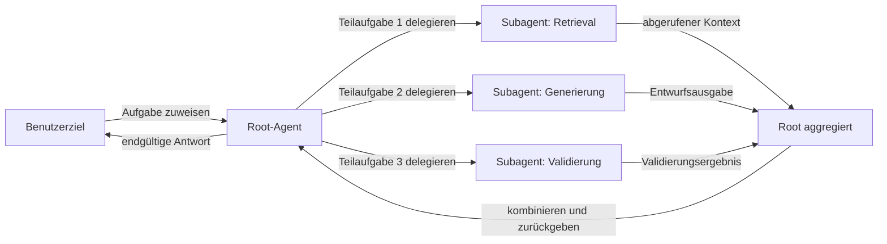
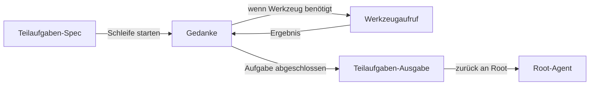

# Subagenten

## Definition

**Subagenten** sind Agenten, die innerhalb einer Hierarchie sitzen: Ein Elternagenannt delegiert Teilaufgaben an Kindagenten (Subagenten), die ihrerseits an weitere Subagenten delegieren können. Diese hierarchische Struktur hält jeden Agenten auf einer engen, klar definierten Verantwortung fokussiert, anstatt alles in einer einzigen Schleife zu versuchen.

Sie sind eine Möglichkeit, [Multi-Agenten](/docs/agents/multi-agent-systems)-Systeme mit einer klaren Verantwortungs- und Eigentumskette zu implementieren. Der Root-[Agent](/docs/agents) besitzt das benutzerseitige Ziel und ist für die endgültige Antwort verantwortlich; Subagenten handhaben fokussierte Teilaufgaben wie [Retrieval](/docs/rag), Code-Ausführung, Validierung oder Formatierung. Der Root-Agent koordiniert das Timing, aggregiert Ergebnisse und entscheidet, wann erneut versucht oder eskaliert werden soll.

Oft mit [Spec-Driven Development](/docs/spec-driven-development) oder [RDD](/docs/reasoning-patterns/rdd) verwendet, sodass Subagenten explizite, testbare Spezifikationen für ihre Ausgaben erhalten. Das Subagenten-Muster skaliert natürlich: Wenn ein Workflow komplexer wird, können neue Subagenten für neue Verantwortlichkeiten hinzugefügt werden, ohne die Logik des Root-Agenten umstrukturieren zu müssen.

## Funktionsweise

### Hierarchische Delegation



### Subagent-Interne Schleife



Der **Root**-Agent empfängt die Aufgabe, zerlegt sie in Teilaufgaben und weist sie **Subagenten 1**, **Subagenten 2** usw. zu (nach Rolle oder Fähigkeit). Jeder Subagent führt seine eigene Schleife aus (möglicherweise mit Werkzeugen und einem LLM) und gibt **Ergebnisse** an den Root zurück. Der Root **aggregiert** Ergebnisse (z. B. zusammenführen, auswählen oder an einen anderen Subagenten weitergeben) und setzt entweder die Schleife fort oder gibt an den Benutzer zurück. Subagenten können spezialisiert sein (z. B. Retrieval, Code, Kritik) und gleiche oder verschiedene Modelle verwenden. Klare Verträge (Eingaben/Ausgaben oder Werkzeug-Schemas) und Fehlerbehandlung machen die Hierarchie debuggbar und wiederverwendbar.

## Wann verwenden / Wann NICHT verwenden

| Szenario | Subagenten verwenden | Subagenten nicht verwenden |
|---|---|---|
| Aufgabe zerlegt sich in parallele, unabhängige Teilaufgaben | Ja — Subagenten können gleichzeitig laufen | Nein — wenn Teilaufgaben eng gekoppelt und sequenziell sind, kann der Root sie inline handhaben |
| Dieselbe Fähigkeit über Workflows hinweg wiederverwenden | Ja — derselbe Subagent kann von verschiedenen Roots aufgerufen werden | Nein — einmalige Aufgaben profitieren nicht von der Abstraktion |
| Teilaufgaben erfordern unterschiedliche Werkzeuge oder Modelle | Ja — jeder Subagent kann seine eigene Konfiguration haben | Nein — wenn ein Modell mit allen Werkzeugen ausreicht |
| Debugging und Testen individueller Teilaufgaben-Logik | Ja — Subagenten haben klare Eingaben/Ausgaben, leicht unit-testbar | Nein — wenn die Aufgabe einfach genug für End-to-End-Tests ist |
| Schnelles Prototyping oder einfache Workflows | Nein — Hierarchie fügt Koordinations-Overhead hinzu | Ja — eine einzelne Agentenschleife ist einfacher und schneller zu iterieren |

## Vergleiche

| Ansatz | Struktur | Delegation | Wiederverwendbarkeit | Debugging |
|---|---|---|---|---|
| Einzelner Agent | Flache Schleife | Keine | Niedrig | Eine Schleife verfolgen |
| Multi-Agent (Peer) | Flach / Mesh | Peer-to-Peer | Mittel | Mehrere Schleifen verfolgen |
| Subagent (hierarchisch) | Baum | Root → Kinder | Hoch | Pro Ebene verfolgen |
| Pipeline / Kette | Sequenziell | Schritt-zu-Schritt | Mittel | Schritt-Ausgabe-Inspektion |

## Vor- und Nachteile

| Vorteile | Nachteile |
|---|---|
| Klare Trennung von Belangen — jeder Subagent tut eine Sache | Koordinations-Overhead (Latenz, Token-Kosten, Zustandsübergabe) |
| Skalierbar — neue Subagenten für neue Verantwortlichkeiten hinzufügen | Klare Eingabe/Ausgabe-Verträge und Fehlerbehandlung erforderlich |
| Wiederverwendbar — derselbe Subagent in verschiedene Root-Workflows eingebunden | Debugging über Hierarchie-Ebenen hinweg kann komplex sein |
| Root-Agent-Logik bleibt sauber und hochrangig | Mehrere LLM-Aufrufe erhöhen Gesamtkosten |

## Code-Beispiele

```python
from langchain_openai import ChatOpenAI
from langchain_core.messages import HumanMessage, SystemMessage

llm = ChatOpenAI(model="gpt-4o-mini")

# --- Define subagents ---

def retrieval_subagent(query: str) -> str:
    """Retrieve relevant context (simulated here)."""
    # In production: query a vector store
    return f"[Context for '{query}': RAG stands for Retrieval-Augmented Generation...]"

def generation_subagent(query: str, context: str) -> str:
    """Generate an answer given context."""
    response = llm.invoke([
        SystemMessage(content="Answer the question using only the provided context."),
        HumanMessage(content=f"Context:\n{context}\n\nQuestion: {query}"),
    ])
    return response.content

def validation_subagent(answer: str, context: str) -> str:
    """Check if the answer is grounded in the context."""
    response = llm.invoke([
        SystemMessage(content="Check if the answer is fully supported by the context. Reply PASS or FAIL with a reason."),
        HumanMessage(content=f"Context:\n{context}\n\nAnswer:\n{answer}"),
    ])
    return response.content

# --- Root agent orchestrates ---

def root_agent(user_query: str) -> str:
    context = retrieval_subagent(user_query)
    draft = generation_subagent(user_query, context)
    validation = validation_subagent(draft, context)

    if "FAIL" in validation.upper():
        # Retry once with explicit instruction
        draft = generation_subagent(
            user_query + " (be precise and grounded)",
            context,
        )

    return draft

print(root_agent("What is RAG?"))
```

## Praktische Ressourcen

- [From Prototypes to Agents with ADK – Google Codelabs](https://codelabs.developers.google.com/your-first-agent-with-adk#0) — ADK Multi-Agenten-Systeme mit hierarchischer Agenten-Komposition
- [LangChain – Multi-Agent Workflows](https://python.langchain.com/docs/concepts/multi_agent/) — Workflow- und Subagenten-Muster mit LangGraph
- [Anthropic – Multi-Agent Frameworks](https://docs.anthropic.com/en/docs/build-with-claude/tool-use#multi-agent-frameworks) — Anleitung zum Aufbau hierarchischer Agenten-Systeme mit Claude

## Siehe auch

- [Agenten](/docs/agents)
- [Multi-Agenten-Systeme](/docs/agents/multi-agent-systems)
- [RDD](/docs/reasoning-patterns/rdd)
- [Spec-Driven Development](/docs/spec-driven-development)
