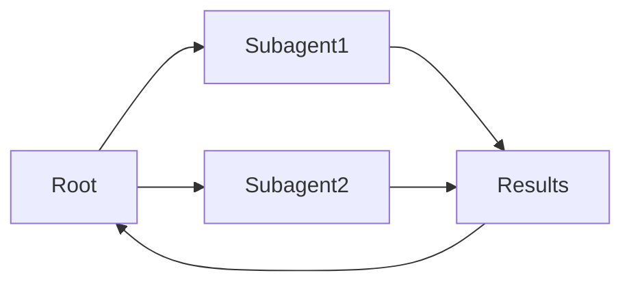

# Subagenten

## Definition

**Subagenten** sind Agenten, die innerhalb einer Hierarchie sitzen: a parent agent delegates sub-tasks to child agents (Subagenten), die wiederum an weitere Subagenten delegieren können. Dies strukturiert komplex work and keeps each agent focused.

Sie sind eine Möglichkeit, [Multi-Agenten](/docs/agents/multi-agent-systems)-Systeme mit einer klaren Verantwortungskette zu implementierenty. The root [agent](/docs/agents) owns the user-facing goal; subagents handle focused sub-tasks (z. B. [Abruf](/docs/rag), code execution, validation). Often used with [spec-driven development](/docs/spec-driven-development) or [RDD](/docs/reasoning-patterns/rdd) so subagents receive and follow specs.

## Funktionsweise

Der **Wurzel**-Agent empfängt die Aufgabe, teilt sie in Teilaufgaben auf und weist sie **Subagent1**, **Subagent2** usw. zu (nach Rolle oder Fähigkeit). Jeder Subagent führt seine eigene Schleife aus (möglicherweise mit Tools und einem LLM) and returns **results** to the root. The root **aggregates** results (z. B. merges, selects, or passes to another subagent) and either continues the loop or returns to the user. Subagents can be specialized (z. B. Abruf, code, critique) and use the same or different models. Clear contracts (inputs/outputs or tools) and error handling make the hierarchy debuggable and reusable.

## Anwendungsfälle

Subagents helfen, wenn sich eine Aufgabe natürlich in fokussierte Teilaufgaben aufteilen lässt, die delegiert und aggregiert werden können.

- Root agent delegating Abruf, generation, and validation to subagents
- Complex workflows (z. B. research, code review) with focused sub-tasks
- Reusing the same subagent in different parent workflows

## Externe Dokumentation

- [From Prototypes to Agents with ADK – Google Codelabs](https://codelabs.developers.google.com/your-first-agent-with-adk#0) — ADK multi-agent systems with hierarchy
- [LangChain – Multi-agent workflows](https://python.langchain.com/docs/concepts/multi_agent/) — Workflow and subagent patterns

## Vor- und Nachteile

| Pros | Cons |
|------|------|
| Clear separation of concerns | Coordination and latency |
| Scalable to complex tasks | Need clear contracts and error handling |
| Reusable subagent capabilities | Debugging across hierarchy can be hard |

## Siehe auch

- [Agents](/docs/agents)
- [Multi-agent systems](/docs/agents/multi-agent-systems)
- [RDD](/docs/reasoning-patterns/rdd)
- [Spec-driven development](/docs/spec-driven-development)
