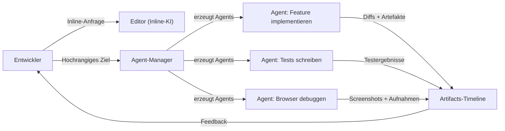
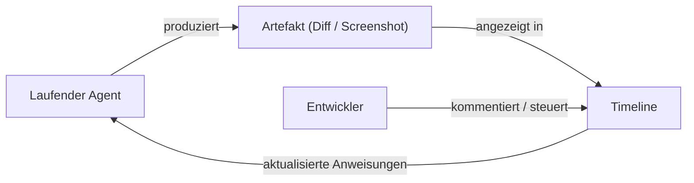

# Antigravity

## Definition

Antigravity ist eine **Agent-first-IDE**, die auf der Prämisse aufgebaut ist, dass autonome [LLM](/docs/llms)-gesteuerte [Agents](/docs/agents) erstklassige Bürger der Entwicklungsumgebung sein sollten, keine aufgesetzten Features. Anstatt Vervollständigungen beim Tippen anzuzeigen, stellt Antigravity einen **Agent-Manager** bereit, der mehrere parallel über Editor-, Terminal- und Browser-Bereiche laufende Agents erzeugt, koordiniert und überwacht. Jeder Agent kann ein Feature implementieren, eine Testsuite ausführen, einen Fehler debuggen oder mit einer Web-Oberfläche interagieren, während der Entwickler beobachtet und steuert.

Ein unterscheidendes Merkmal ist die **Artifacts-Timeline**: Jede bedeutende Agent-Aktion — Pläne, Code-Diffs, Screenshots, Browser-Aufnahmen und Testergebnisse — wird erfasst und in einer chronologischen Timeline angezeigt. Dieser Prüfpfad macht autonome Ausführung verifizierbar: Sie können wiederabrufbar, welche Zwischenzustände vorhanden waren, und können spezifische Artefakte kommentieren, um die nächsten Schritte des Agents umzuleiten. Dieses Design macht Antigravity besonders geeignet für [spec-driven development](/docs/spec-driven-development)-Workflows, bei denen Rückverfolgbarkeit und menschliche Aufsicht wichtig sind.

Die Plattform unterstützt große Kontextfenster-Modelle (Gemini und andere), läuft auf Windows, macOS und Linux und bietet sowohl Inline-KI-Unterstützung (ähnlich Cursors Cmd+K) als auch manager-gesteuerte Autonomie in einer einzigen Umgebung. Die Kombination aus granularer Artefakt-Protokollierung und paralleler Agent-Ausführung positioniert es als eine "Vibe-Coding"-Plattform, bei der Entwickler die Absicht auf hohem Niveau spezifizieren und Ergebnisse über den Artefakt-Record überprüfen.

## Funktionsweise

### Dual-Interface-Architektur



### Human-in-the-loop-Feedback-Schleife



### Hauptfunktionen

**Agent-Manager** — mehrere Agents gleichzeitig erzeugen und überwachen. **Artifacts-Timeline** — chronologisches Protokoll von Plänen, Diffs, Screenshots und Aufnahmen. **Inline-KI** — direkte Editor-Unterstützung für Refactoring und Generierung. **Feedback-Schleife** — Artefakte kommentieren, um Agents in Echtzeit zu steuern. **Multi-Plattform** — Windows, macOS, Linux. **Großer Kontext** — unterstützt Modelle mit großen Kontextfenstern für repo-weites Verständnis.

## Wann verwenden / Wann NICHT verwenden

| Szenario | Antigravity verwenden | Antigravity NICHT verwenden |
|----------|----------------|------------------------|
| Autonome Multi-Agent-Implementierung mit Aufsicht | Ja — Agent-Manager + Artifacts-Timeline | |
| Spec-driven-Workflows mit Prüfpfaden | Ja — jedes Artefakt wird protokolliert und ist inspizierbar | |
| Parallele Arbeitsströme (implementieren + testen + debuggen gleichzeitig) | Ja — parallele Agent-Erzeugung | |
| Leichte Inline-Vervollständigungen mit minimalem Setup | | [GitHub Copilot](/docs/tools/github-copilot) oder [Cursor](/docs/tools/cursor) sind leichter |
| Tiefe Integration mit GitHub Issues und PRs | | [GitHub Copilot Workspace](/docs/tools/github-copilot) ist besser integriert |
| Terminal-first oder CLI-basierte Entwicklung | | [Claude Code](/docs/tools/claude-code) ist dafür entwickelt |

## Vor- und Nachteile

| Vorteile | Nachteile |
|------|------|
| Parallele Agent-Ausführung über Editor, Terminal und Browser | Neuere Plattform mit kleinerer Community als VS Code-Tools |
| Artifacts-Timeline bietet verifizierbare, inspizierbare Agent-Ausgaben | Hohe Autonomie erhöht das Risiko großer unüberprüfter Änderungen |
| Unterstützt Vibe-Coding auf einem höheren Abstraktionsniveau | Erfordert Vertrautheit mit Agent-first-Entwicklungsmustern |
| Echtzeit-Steuerung über Artefakt-Kommentare | Plattformreife und Stabilität noch in Entwicklung |

## Codebeispiele

```yaml
# Antigravity-Steuerungsdatei — Agent-Verhalten und Projektstandards definieren
project:
  name: my-web-app
  stack: [TypeScript, React, Node.js, PostgreSQL]

agents:
  default_model: gemini-2.0-flash
  context_window: large

standards:
  - "Follow existing file and folder structure conventions"
  - "Add tests for every new function using Vitest"
  - "Document all exported functions with JSDoc"
  - "Never modify database schema without a migration file"

artifacts:
  retain: 30d           # Artifact-Timeline 30 Tage aufbewahren
  require_approval:     # menschliche Genehmigung vor dem Anwenden erfordern
    - schema_changes
    - dependency_additions
```

## Tipps für effektive Nutzung

- Mit einer klaren Zielangabe für jeden Agent beginnen — vage Ziele produzieren vage Artefakte.
- Die Artifacts-Timeline nach jedem Agent-Durchlauf überprüfen, bevor Änderungen akzeptiert werden; Kommentare verwenden, um die nächste Iteration zu steuern.
- Genehmigungsgates in der Steuerungsdatei für risikoreiche Operationen (Schema-Änderungen, neue Abhängigkeiten) konfigurieren.
- Agents auf isolierten Branches ausführen, damit der Hauptbranch während paralleler Agent-Arbeit stabil bleibt.
- Die Inline-KI für kleine, präzise Bearbeitungen verwenden und den Agent-Manager für größere, mehrstufige Aufgaben reservieren.

## Praktische Ressourcen

- [Antigravity — Agent-first IDE](https://www.antigravityai.io/) — Produktübersicht, Funktionen und Download
- [Antigravity IDE](https://antigravityaiide.com/) — Plattformfähigkeiten und Dokumentation

## Siehe auch

- [Agents](/docs/agents)
- [Spec-driven development](/docs/spec-driven-development)
- [Cursor](/docs/tools/cursor)
- [Kiro](/docs/tools/kiro)
- [Claude Code](/docs/tools/claude-code)
- [LLMs](/docs/llms)
