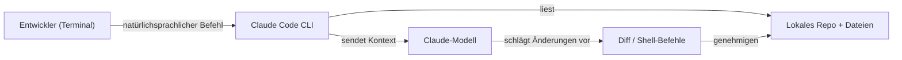
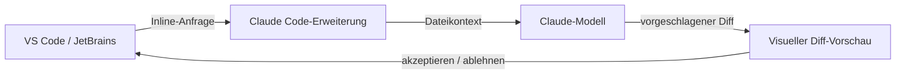

# Claude Code

## Definition

Claude Code ist Anthropics KI-gesteuerter Coding-Assistent, der [Claude](/docs/case-studies/claude) in jede Schicht des Entwicklungs-Workflows bringt. Anders als Editor-Erweiterungen, die KI auf eine bestehende IDE aufsetzen, ist Claude Code als **Multi-Umgebungs-Tool** konzipiert: Es läuft als CLI im Terminal, als Erweiterung in VS Code und JetBrains, im Browser, auf iOS und in Slack. Dies macht es zur natürlichen Wahl, wenn die Entwicklung mehrere Umgebungen umfasst oder wenn terminal-first-Workflows wichtig sind.

Das Tool gibt Claude direkten Zugriff auf das lokale Dateisystem, Shell-Befehle und Projektkontext. Im Terminal können Sie Claude bitten, eine Codebasis zu erkunden, Architektur zu erklären, Code zu generieren, Tests auszuführen und Diffs anzuwenden — alles ohne die Kommandozeile zu verlassen. In der IDE stellt Claude Code Inline-Bearbeitungen und visuelle Diffs bereit, die denen in Cursor identisch sind. Die `CLAUDE.md`-Datei (oder `.claude/CLAUDE.md`) dient der gleichen Rolle wie `.cursorrules`: Sie stellt persistente projektweite Anweisungen bereit, die Claudes Stil, Konventionen und Wissen über die Codebasis steuern.

Verglichen mit [Cursor](/docs/tools/cursor) ist Claude Code modellgebunden an Claude, fügt jedoch Terminal-Tiefe und mobilen/Web-Zugang hinzu. Verglichen mit [GitHub Copilot](/docs/tools/github-copilot) bietet es tiefere Multi-Datei-Agent-Bearbeitung und CLI-first-Workflows, erfordert jedoch ein Claude-Abonnement (Pro, Teams oder Enterprise) oder API-Zugang über Amazon Bedrock oder Google Vertex AI.

## Funktionsweise

### Terminal-Workflow



### IDE-Workflow



### Hauptfunktionen

**CLI** — `claude` in einem beliebigen Terminal ausführen, um Fragen zu stellen oder Änderungen anzuwenden. **IDE-Erweiterung** — Inline-Bearbeitungen und Diffs in VS Code und JetBrains. **`CLAUDE.md`** — persistente Projektanweisungen zur Steuerung von Claude. **Subagents** — Hintergrundaufgaben, die autonom über das Anthropic Agent SDK ausgeführt werden. **MCP** — Model Context Protocol für Tool-Nutzung (Datenbanken, APIs). **Skills** — wiederverwendbare Prompt-Programme für wiederkehrende Aufgaben.

## Wann verwenden / Wann NICHT verwenden

| Szenario | Claude Code verwenden | Claude Code NICHT verwenden |
|----------|----------------|------------------------|
| Terminal-first-Entwicklung und CLI-Workflows | Ja — zweckgebaut CLI-Agent | |
| Cross-Umgebungs-Nutzung (Terminal, IDE, Web, Mobil) | Ja — einzelnes Tool über alle Umgebungen | |
| Tiefes Multi-Datei-Refactoring mit Diffs | Ja — Terminal + IDE unterstützen dies | |
| JetBrains oder VS Code Inline-KI | Ja — offizielle Erweiterungen verfügbar | |
| In einem bestehenden VS Code-Setup mit weniger Aufwand bleiben | | [GitHub Copilot](/docs/tools/github-copilot) hat geringere Umschaltkosten |
| Neovim oder Nicht-VS Code / Nicht-JetBrains-IDEs | | [GitHub Copilot](/docs/tools/github-copilot) deckt mehr Editoren ab |
| Multi-Modell-Backend-Auswahl | | [Cursor](/docs/tools/cursor) ermöglicht den Wechsel zwischen Claude, GPT-4o und lokalen Modellen |

## Vergleiche

| Funktion | Claude Code | Cursor | GitHub Copilot |
|---------|------------|--------|---------------|
| Primäre Oberfläche | Terminal + IDE-Erweiterung | VS Code-Fork | IDE-Erweiterung |
| Terminal / CLI | Ja (primär) | Nein | Nein |
| IDE-Unterstützung | VS Code, JetBrains | Nur VS Code | VS Code, JetBrains, Neovim |
| Modell | Claude (Anthropic) | Mehrere (Claude, GPT-4o) | OpenAI / GitHub |
| Projektregeln | `CLAUDE.md` | `.cursorrules` | Keine |
| Agent-Tiefe | Hoch (Subagents, SDK) | Composer | Copilot Workspace (Vorschau) |
| Zugang | Abonnement oder Bedrock/Vertex | Abonnement | Abonnement |

## Vor- und Nachteile

| Vorteile | Nachteile |
|------|------|
| CLI-first ermöglicht Scripting und headless-Automatisierung | Modellgebunden an Claude; keine Multi-Modell-Auswahl |
| Multi-Umgebung (Terminal, IDE, Web, iOS, Slack) | Erfordert Claude-Abonnement oder API-Zugang |
| `CLAUDE.md` stellt persistenten Projektkontext bereit | Weniger reifes Ökosystem vs. VS Code-Erweiterungen |
| Subagents ermöglichen autonome Hintergrundaufgaben | CLI-Lernkurve für Entwickler, die neu in Terminal-Workflows sind |

## Codebeispiele

```bash
# Terminal-Workflow: eine Codebasis erkunden und eine Änderung anwenden
claude "Explain the authentication flow in this project"

# Refactoring generieren und anwenden
claude "Refactor the UserService class to use dependency injection"

# Mit einem spezifischen CLAUDE.md-Kontext bereits geladen ausführen
# CLAUDE.md-Beispiel:
# This is a Python FastAPI project using PostgreSQL and SQLAlchemy.
# Follow PEP 8, use type hints everywhere, and write tests with pytest.
# The database session is managed via get_db() in app/database.py.
claude "Add an endpoint to list users with pagination"
```

## Tipps für effektive Nutzung

- Eine `CLAUDE.md` im Repo-Root schreiben, die den Stack, die Konventionen und die Schlüsseldateien beschreibt — Claude liest sie zu Beginn jeder Sitzung.
- `claude --dangerously-skip-permissions` nur in sandboxed CI-Umgebungen verwenden, niemals auf Produktionsmaschinen.
- Für große Codebasen explizit Dateipfade in der Anfrage nennen (`"In src/auth/service.ts, refactoriere..."`) um den Kontext zu fokussieren.
- Terminal Claude Code mit der IDE-Erweiterung kombinieren: im Terminal erkunden und planen, Diffs visuell in VS Code anwenden.
- Subagents für Hintergrundaufgaben verwenden (z.B. Tests ausführen, Docs generieren), während andere Arbeit fortgesetzt wird.

## Praktische Ressourcen

- [Anthropic — Claude Code](https://www.anthropic.com/claude-code) — Produktübersicht und Feature-Highlights
- [Claude Code — Schnellstart](https://docs.anthropic.com/en/docs/claude-code/quickstart) — Installation, Setup und erste Befehle
- [Claude Code — IDE-Integrationen](https://docs.anthropic.com/en/docs/claude-code/ide-integrations) — VS Code und JetBrains Setup
- [Claude Code — CLAUDE.md](https://docs.anthropic.com/en/docs/claude-code/memory) — Projektweite Anweisungen und Speicher
- [Anthropic Agent SDK](https://docs.anthropic.com/en/docs/agents) — Subagents und autonome Workflows erstellen
- [Skills-Repository](https://github.com/EmersonBraun/skills) — Kuratierte Sammlung wiederverwendbarer KI-Skills für Claude Code und andere KI-Coding-Assistenten

## Siehe auch

- [Claude](/docs/case-studies/claude)
- [Cursor](/docs/tools/cursor)
- [GitHub Copilot](/docs/tools/github-copilot)
- [Agents](/docs/agents)
- [Spec-driven development](/docs/spec-driven-development)
- [LLMs](/docs/llms)
