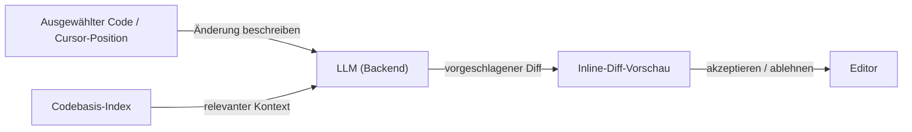

# Cursor

## Definition

Cursor ist ein KI-gesteuerter Code-Editor, der von VS Code abgegabelt wurde und [LLMs](/docs/llms) direkt in jeden Teil der Editiererfahrung einbettet. Anders als Erweiterungen, die auf einen bestehenden Editor aufgesetzt werden, besitzt Cursor die gesamte Editor-Oberfläche, was es ermöglicht, Funktionen wie Multi-Datei-Diff-Vorschauen, codebasis-weite semantische Suche und Chat mit vollem Projektkontext zu erstellen, die über Erweiterungs-APIs allein schwer zu replizieren sind.

Der Editor unterstützt mehrere Modell-Backends (Claude 3.5/3.7, GPT-4o, lokale Modelle über Ollama) und ermöglicht es Benutzern, projektweite Anweisungen über `.cursorrules`-Dateien zu definieren, die den Stil, die Konventionen und die Tooling-Annahmen des Modells steuern. Der Kontext wird durch einen embedding-basierten Codebasis-Index verwaltet, der relevante Dateien ohne manuelle Auswahl für das Modell verfügbar macht, was Workflows ermöglicht, die näher am Pair-Programming als an der Inline-Autovervollständigung liegen.

Verglichen mit [GitHub Copilot](/docs/tools/github-copilot) bietet Cursor tieferen Projektkontext, inline diff-basierte Bearbeitungen und ein vollständiges Chat-Panel; verglichen mit [Claude Code](/docs/tools/claude-code) ist es eine GUI-first-Erfahrung, die sich auf den Editor statt auf das Terminal konzentriert. Alle drei Tools verwenden [LLMs](/docs/llms) zur Code-Generierung, unterscheiden sich jedoch in Oberfläche, Kontextverwaltung und Agent-Tiefe.

## Funktionsweise

### Inline-Bearbeitung (Cmd+K)



### Chat-Panel (Cmd+L)


### Hauptfunktionen

**Codebasis-Index** — bettet das Repo für semantische Suche ein. **Composer** — Agent-ähnliche Bearbeitungen über mehrere Dateien. **Tab-Vervollständigung** — kontextbewusste Vervollständigung für nächste Zeile und Block. **`.cursorrules`** — persistente Projektanweisungen für das Modell. **MCP-Unterstützung** — Tool-Nutzung über das Model Context Protocol.

## Wann verwenden / Wann NICHT verwenden

| Szenario | Cursor verwenden | Cursor NICHT verwenden |
|----------|-----------|-------------------|
| In-Editor-Coding mit vollem Projektkontext | Ja — Codebasis-Indizierung bietet tiefen Kontext | |
| Multi-Datei-Refactoring mit visuellen Diffs | Ja — Composer und Diff-Ansichten | |
| Pair-Programming mit Erklärungen im Chat | Ja — persistentes Chat-Panel | |
| Terminal-first oder headless-Umgebungen | | [Claude Code](/docs/tools/claude-code) CLI stattdessen verwenden |
| IDE-agnostische Vervollständigung in JetBrains oder Neovim | | [GitHub Copilot](/docs/tools/github-copilot) für breitere IDE-Abdeckung verwenden |
| Leichte Erweiterung auf bestehendem VS Code | | Copilot oder Codeium Add-ons haben weniger Overhead |

## Vergleiche

| Funktion | Cursor | GitHub Copilot | Claude Code |
|---------|--------|---------------|-------------|
| Basisoberfläche | Vollständiger VS Code-Fork | IDE-Erweiterung | Terminal + IDE-Erweiterung |
| Projektkontext | Codebasis-Index (Embeddings) | Nur geöffnete Dateien | Vollständiges Repo über CLI |
| Multi-Datei-Bearbeitungen | Ja (Composer) | Begrenzt | Ja (Terminal + IDE) |
| Agent-Fähigkeiten | Composer, MCP | Copilot Workspace | Claude-Agents |
| Modellauswahl | Mehrere (Claude, GPT-4o, lokal) | OpenAI / GitHub | Claude (Anthropic) |
| Regeln / Konfiguration | `.cursorrules`-Datei | Keine Projektregeln | `CLAUDE.md` |
| Preisgestaltung | Abonnement (Hobby-Gratis-Stufe) | Abonnement | Abonnement (Pro+) |

## Vor- und Nachteile

| Vorteile | Nachteile |
|------|------|
| Tiefer Projektkontext durch Codebasis-Indizierung | Erfordert Wechsel vom bestehenden VS Code-Setup |
| Unterstützt mehrere LLM-Backends | Codebasis-Indizierung kann Code an Drittanbieter-Server übermitteln |
| Projektweite Regeln steuern das Modellverhalten | Hoher Ressourcenverbrauch verglichen mit leichten Erweiterungen |
| Visuelle Diff-Vorschauen machen Bearbeitungen überprüfbar | Kontextlimits gelten weiterhin; sehr große Repos benötigen selektive Einbeziehung |

## Codebeispiele

```jsonc
// .cursorrules — Projektanweisungen für das Modell
{
  "rules": [
    "This is a TypeScript/React project using Tailwind CSS.",
    "Prefer functional components and hooks over class components.",
    "Always add JSDoc comments to exported functions.",
    "Use the existing `api/` client for all HTTP calls; do not use fetch directly.",
    "Tests are written with Vitest; always add a test for new utility functions."
  ]
}
```

## Tipps für effektive Nutzung

- `.cursorrules` kurz und spezifisch halten — lange Regeln verwässern die Aufmerksamkeit des Modells.
- `@file`- oder `@folder`-Erwähnungen im Chat verwenden, um relevanten Kontext anzuheften.
- Für große Repos generierte Dateien (`node_modules`, `dist`, `.next`) aus dem Codebasis-Index ausschließen, um Rauschen zu reduzieren.
- Composer-Vorschläge inkrementell akzeptieren — jeden Diff überprüfen, bevor die nächste Änderung akzeptiert wird.
- Cursor mit einem Linter und Typ-Checker kombinieren, damit das Modell sofortiges Feedback zur generierten Code-Qualität erhält.

## Praktische Ressourcen

- [Cursor — Dokumentation](https://docs.cursor.com/) — Offizielle Anleitungen einschließlich Setup, Funktionen und `.cursorrules`
- [Cursor — Modelle](https://docs.cursor.com/settings/models) — LLM-Backends und API-Schlüssel konfigurieren
- [Cursor — MCP](https://docs.cursor.com/context/mcp) — Model Context Protocol Tool-Integrationen
- [Cursor-Änderungsprotokoll](https://cursor.com/changelog) — Funktions-Releases und Updates

## Siehe auch

- [Agents](/docs/agents)
- [GitHub Copilot](/docs/tools/github-copilot)
- [Claude Code](/docs/tools/claude-code)
- [Spec-driven development](/docs/spec-driven-development)
- [LLMs](/docs/llms)
